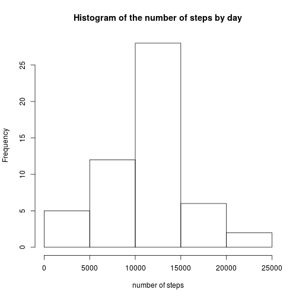
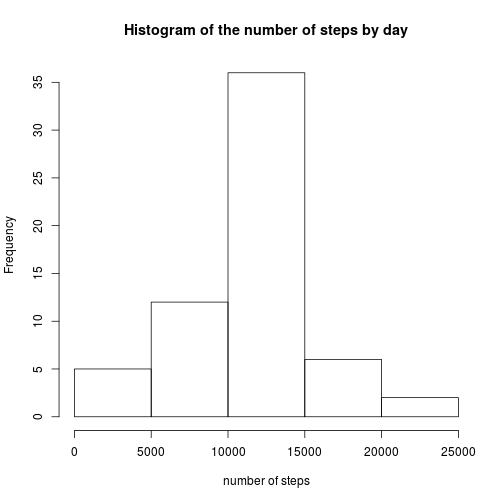

## Loading and preprocessing the data

The data file is in the working directory as a compressed file. We first have to unzip the file `activity.zip`.
It generates the file `activity.csv`.

Then, we can load the data thanks to the read.csv() command.

The call to the `summary` function should show that the data are correctly loaded.


```r
unzip("activity.zip")
data <- read.csv("activity.csv")
summary(data)
```

```
##      steps                date          interval     
##  Min.   :  0.00   2012-10-01:  288   Min.   :   0.0  
##  1st Qu.:  0.00   2012-10-02:  288   1st Qu.: 588.8  
##  Median :  0.00   2012-10-03:  288   Median :1177.5  
##  Mean   : 37.38   2012-10-04:  288   Mean   :1177.5  
##  3rd Qu.: 12.00   2012-10-05:  288   3rd Qu.:1766.2  
##  Max.   :806.00   2012-10-06:  288   Max.   :2355.0  
##  NA's   :2304     (Other)   :15840
```

As the `date` field is a factor, we transform into a date thanks to the `lubridate` package.


```r
library(lubridate)
data$date<-ymd(as.character(data$date))
```

## What is mean total number of steps taken per day?

In order to aswer this question, we first have to sum the number of steps for each day.

`temp` is a dataframe which accumulates the number of steps for each day.

```r
temp<-aggregate(data$steps, by=list(data = data$date),  FUN = sum)
print(temp)
```

```
##          data     x
## 1  2012-10-01    NA
## 2  2012-10-02   126
## 3  2012-10-03 11352
## 4  2012-10-04 12116
## 5  2012-10-05 13294
## 6  2012-10-06 15420
## 7  2012-10-07 11015
## 8  2012-10-08    NA
## 9  2012-10-09 12811
## 10 2012-10-10  9900
## 11 2012-10-11 10304
## 12 2012-10-12 17382
## 13 2012-10-13 12426
## 14 2012-10-14 15098
## 15 2012-10-15 10139
## 16 2012-10-16 15084
## 17 2012-10-17 13452
## 18 2012-10-18 10056
## 19 2012-10-19 11829
## 20 2012-10-20 10395
## 21 2012-10-21  8821
## 22 2012-10-22 13460
## 23 2012-10-23  8918
## 24 2012-10-24  8355
## 25 2012-10-25  2492
## 26 2012-10-26  6778
## 27 2012-10-27 10119
## 28 2012-10-28 11458
## 29 2012-10-29  5018
## 30 2012-10-30  9819
## 31 2012-10-31 15414
## 32 2012-11-01    NA
## 33 2012-11-02 10600
## 34 2012-11-03 10571
## 35 2012-11-04    NA
## 36 2012-11-05 10439
## 37 2012-11-06  8334
## 38 2012-11-07 12883
## 39 2012-11-08  3219
## 40 2012-11-09    NA
## 41 2012-11-10    NA
## 42 2012-11-11 12608
## 43 2012-11-12 10765
## 44 2012-11-13  7336
## 45 2012-11-14    NA
## 46 2012-11-15    41
## 47 2012-11-16  5441
## 48 2012-11-17 14339
## 49 2012-11-18 15110
## 50 2012-11-19  8841
## 51 2012-11-20  4472
## 52 2012-11-21 12787
## 53 2012-11-22 20427
## 54 2012-11-23 21194
## 55 2012-11-24 14478
## 56 2012-11-25 11834
## 57 2012-11-26 11162
## 58 2012-11-27 13646
## 59 2012-11-28 10183
## 60 2012-11-29  7047
## 61 2012-11-30    NA
```

Let's plot a histogram for the number of steps in each day.

```r
hist(temp$x, xlab="number of steps", main="Histogram of the number of steps by day")
```

 


Then, we have to compute the mean and the median, without taking into account NA values.

```r
mean<-mean(temp$x, na.rm=TRUE)
mean
```

```
## [1] 10766.19
```

```r
median<-median(temp$x, na.rm=TRUE)
median
```

```
## [1] 10765
```


## What is the average daily activity pattern?

Let us now show a time serie plot of the average number of steps for each five minute interval.

First of all, We have to aggregate the number of steps for each five minute interval.


```r
temp<-aggregate(data$steps, by=list(interval=data$interval), FUN=mean, na.rm = TRUE)
plot(temp$interval,temp$x,type="l",ylab="Average number of steps", xlab="Five minute interval of the day")
```

 

Let us find the interval for the maximum average number of steps.


```r
m <- max(temp$x);
m
```

```
## [1] 206.1698
```

```r
maxinterval<-temp[temp$x==m,]$interval
maxinterval
```

```
## [1] 835
```

```r
temp[temp$interval==maxinterval,]
```

```
##     interval        x
## 104      835 206.1698
```


## Imputing missing values


```r
summary(data)
```

```
##      steps             date               interval     
##  Min.   :  0.00   Min.   :2012-10-01   Min.   :   0.0  
##  1st Qu.:  0.00   1st Qu.:2012-10-16   1st Qu.: 588.8  
##  Median :  0.00   Median :2012-10-31   Median :1177.5  
##  Mean   : 37.38   Mean   :2012-10-31   Mean   :1177.5  
##  3rd Qu.: 12.00   3rd Qu.:2012-11-15   3rd Qu.:1766.2  
##  Max.   :806.00   Max.   :2012-11-30   Max.   :2355.0  
##  NA's   :2304
```

```r
sum(is.na(data$steps))
```

```
## [1] 2304
```

Let us copy the original data then fill the missing value with the average value for that interval. 


```r
cleandata<-data
rows<-which(is.na(cleandata$steps))
for(i in rows) {
  interval<-cleandata[i,"interval"]
  val<-temp[temp$interval==interval,"x"]
  cleandata[i,"steps"]<-val
}

summary(cleandata)
```

```
##      steps             date               interval     
##  Min.   :  0.00   Min.   :2012-10-01   Min.   :   0.0  
##  1st Qu.:  0.00   1st Qu.:2012-10-16   1st Qu.: 588.8  
##  Median :  0.00   Median :2012-10-31   Median :1177.5  
##  Mean   : 37.38   Mean   :2012-10-31   Mean   :1177.5  
##  3rd Qu.: 27.00   3rd Qu.:2012-11-15   3rd Qu.:1766.2  
##  Max.   :806.00   Max.   :2012-11-30   Max.   :2355.0
```

Now lets us compute the histogram, mean and median for the imputed data.


```r
temp<-aggregate(cleandata$steps, by=list(data = cleandata$date),  FUN = sum)
hist(temp$x, xlab="number of steps", main="Histogram of the number of steps by day")
```

 

```r
mean<-mean(temp$x, na.rm=TRUE)
mean
```

```
## [1] 10766.19
```

```r
median<-median(temp$x, na.rm=TRUE)
median
```

```
## [1] 10766.19
```

