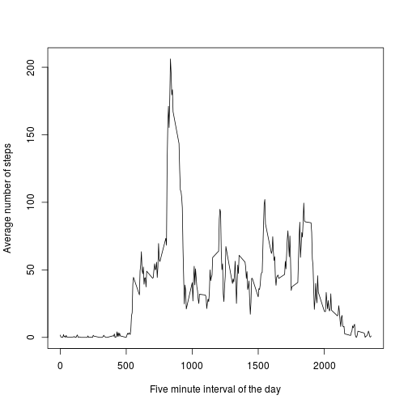

## Loading and preprocessing the data

The data file is in the working directory as a compressed file. We first have to unzip the file `activity.zip`.
It generates the file `activity.csv`.

Then, we can load the data thanks to the read.csv() command.

The call to the `summary` function should show that the data are correctly loaded.


```r
unzip("activity.zip")
data <- read.csv("activity.csv")
summary(data)
```

```
##      steps                date          interval     
##  Min.   :  0.00   2012-10-01:  288   Min.   :   0.0  
##  1st Qu.:  0.00   2012-10-02:  288   1st Qu.: 588.8  
##  Median :  0.00   2012-10-03:  288   Median :1177.5  
##  Mean   : 37.38   2012-10-04:  288   Mean   :1177.5  
##  3rd Qu.: 12.00   2012-10-05:  288   3rd Qu.:1766.2  
##  Max.   :806.00   2012-10-06:  288   Max.   :2355.0  
##  NA's   :2304     (Other)   :15840
```

As the `date` field is a factor, we transform into a date thanks to the `lubridate` package.


```r
library(lubridate)
data$date<-ymd(as.character(data$date))
```

## What is mean total number of steps taken per day?

In order to aswer this question, we first have to sum the number of steps for each day.

`temp` is a dataframe which accumulates the number of steps for each day.

```r
temp<-aggregate(data$steps, by=list(data = data$date),  FUN = sum)
print(temp)
```

```
##          data     x
## 1  2012-10-01    NA
## 2  2012-10-02   126
## 3  2012-10-03 11352
## 4  2012-10-04 12116
## 5  2012-10-05 13294
## 6  2012-10-06 15420
## 7  2012-10-07 11015
## 8  2012-10-08    NA
## 9  2012-10-09 12811
## 10 2012-10-10  9900
## 11 2012-10-11 10304
## 12 2012-10-12 17382
## 13 2012-10-13 12426
## 14 2012-10-14 15098
## 15 2012-10-15 10139
## 16 2012-10-16 15084
## 17 2012-10-17 13452
## 18 2012-10-18 10056
## 19 2012-10-19 11829
## 20 2012-10-20 10395
## 21 2012-10-21  8821
## 22 2012-10-22 13460
## 23 2012-10-23  8918
## 24 2012-10-24  8355
## 25 2012-10-25  2492
## 26 2012-10-26  6778
## 27 2012-10-27 10119
## 28 2012-10-28 11458
## 29 2012-10-29  5018
## 30 2012-10-30  9819
## 31 2012-10-31 15414
## 32 2012-11-01    NA
## 33 2012-11-02 10600
## 34 2012-11-03 10571
## 35 2012-11-04    NA
## 36 2012-11-05 10439
## 37 2012-11-06  8334
## 38 2012-11-07 12883
## 39 2012-11-08  3219
## 40 2012-11-09    NA
## 41 2012-11-10    NA
## 42 2012-11-11 12608
## 43 2012-11-12 10765
## 44 2012-11-13  7336
## 45 2012-11-14    NA
## 46 2012-11-15    41
## 47 2012-11-16  5441
## 48 2012-11-17 14339
## 49 2012-11-18 15110
## 50 2012-11-19  8841
## 51 2012-11-20  4472
## 52 2012-11-21 12787
## 53 2012-11-22 20427
## 54 2012-11-23 21194
## 55 2012-11-24 14478
## 56 2012-11-25 11834
## 57 2012-11-26 11162
## 58 2012-11-27 13646
## 59 2012-11-28 10183
## 60 2012-11-29  7047
## 61 2012-11-30    NA
```

Let's plot a histogram for the number of steps in each day.

```r
hist(temp$x, xlab="number of steps", main="Histogram of the number of steps by day")
```

 


Then, we have to compute the mean and the median, without taking into account NA values.

```r
mean<-mean(temp$x, na.rm=TRUE)
mean
```

```
## [1] 10766.19
```

```r
median<-median(temp$x, na.rm=TRUE)
median
```

```
## [1] 10765
```


## What is the average daily activity pattern?

Let us now show a time serie plot of the average number of steps for each five minute interval.

First of all, We have to aggregate the number of steps for each five minute interval.


```r
temp<-aggregate(data$steps, by=list(interval=data$interval), FUN=mean, na.rm = TRUE)
plot(temp$interval,temp$x,type="l",ylab="Average number of steps", xlab="Five minute interval of the day")
```

 

Let us find the interval for the maximum average number of steps.


```r
m <- max(temp$x);
m
```

```
## [1] 206.1698
```

```r
maxinterval<-temp[temp$x==m,]$interval
maxinterval
```

```
## [1] 835
```

```r
temp[temp$interval==maxinterval,]
```

```
##     interval        x
## 104      835 206.1698
```


## Imputing missing values


```r
summary(data)
```

```
##      steps             date               interval     
##  Min.   :  0.00   Min.   :2012-10-01   Min.   :   0.0  
##  1st Qu.:  0.00   1st Qu.:2012-10-16   1st Qu.: 588.8  
##  Median :  0.00   Median :2012-10-31   Median :1177.5  
##  Mean   : 37.38   Mean   :2012-10-31   Mean   :1177.5  
##  3rd Qu.: 12.00   3rd Qu.:2012-11-15   3rd Qu.:1766.2  
##  Max.   :806.00   Max.   :2012-11-30   Max.   :2355.0  
##  NA's   :2304
```

```r
sum(is.na(data$steps))
```

```
## [1] 2304
```

Let us copy the original data then fill the missing value with the average value for that interval. 


```r
cleandata<-data
rows<-which(is.na(cleandata$steps))
for(i in rows) {
  interval<-cleandata[i,"interval"]
  val<-temp[temp$interval==interval,"x"]
  cleandata[i,"steps"]<-val
}

summary(cleandata)
```

```
##      steps             date               interval     
##  Min.   :  0.00   Min.   :2012-10-01   Min.   :   0.0  
##  1st Qu.:  0.00   1st Qu.:2012-10-16   1st Qu.: 588.8  
##  Median :  0.00   Median :2012-10-31   Median :1177.5  
##  Mean   : 37.38   Mean   :2012-10-31   Mean   :1177.5  
##  3rd Qu.: 27.00   3rd Qu.:2012-11-15   3rd Qu.:1766.2  
##  Max.   :806.00   Max.   :2012-11-30   Max.   :2355.0
```

Now lets us compute the histogram, mean and median for the imputed data.


```r
temp<-aggregate(cleandata$steps, by=list(data = cleandata$date),  FUN = sum)
hist(temp$x, xlab="number of steps", main="Histogram of the number of steps by day")
```

 

```r
mean<-mean(temp$x, na.rm=TRUE)
mean
```

```
## [1] 10766.19
```

```r
median<-median(temp$x, na.rm=TRUE)
median
```

```
## [1] 10766.19
```

## Are there differences in activity patterns between weekdays and weekends?

Let us add a column wd which equals weekday or weekend.


```r
cleandata$wd=ifelse(weekdays(ymd(as.character(cleandata$date)))=="samedi"|weekdays(ymd(as.character(cleandata$date)))=="dimanche","weekend","weekday")
cleandata$wd = as.factor(cleandata$wd)

wd<-cleandata[cleandata$wd=="weekday",]
wd
```

```
##             steps       date interval      wd
## 1       1.7169811 2012-10-01        0 weekday
## 2       0.3396226 2012-10-01        5 weekday
## 3       0.1320755 2012-10-01       10 weekday
## 4       0.1509434 2012-10-01       15 weekday
## 5       0.0754717 2012-10-01       20 weekday
## 6       2.0943396 2012-10-01       25 weekday
## 7       0.5283019 2012-10-01       30 weekday
## 8       0.8679245 2012-10-01       35 weekday
## 9       0.0000000 2012-10-01       40 weekday
## 10      1.4716981 2012-10-01       45 weekday
## 11      0.3018868 2012-10-01       50 weekday
## 12      0.1320755 2012-10-01       55 weekday
## 13      0.3207547 2012-10-01      100 weekday
## 14      0.6792453 2012-10-01      105 weekday
## 15      0.1509434 2012-10-01      110 weekday
## 16      0.3396226 2012-10-01      115 weekday
## 17      0.0000000 2012-10-01      120 weekday
## 18      1.1132075 2012-10-01      125 weekday
## 19      1.8301887 2012-10-01      130 weekday
## 20      0.1698113 2012-10-01      135 weekday
## 21      0.1698113 2012-10-01      140 weekday
## 22      0.3773585 2012-10-01      145 weekday
## 23      0.2641509 2012-10-01      150 weekday
## 24      0.0000000 2012-10-01      155 weekday
## 25      0.0000000 2012-10-01      200 weekday
## 26      0.0000000 2012-10-01      205 weekday
## 27      1.1320755 2012-10-01      210 weekday
## 28      0.0000000 2012-10-01      215 weekday
## 29      0.0000000 2012-10-01      220 weekday
## 30      0.1320755 2012-10-01      225 weekday
## 31      0.0000000 2012-10-01      230 weekday
## 32      0.2264151 2012-10-01      235 weekday
## 33      0.0000000 2012-10-01      240 weekday
## 34      0.0000000 2012-10-01      245 weekday
## 35      1.5471698 2012-10-01      250 weekday
## 36      0.9433962 2012-10-01      255 weekday
## 37      0.0000000 2012-10-01      300 weekday
## 38      0.0000000 2012-10-01      305 weekday
## 39      0.0000000 2012-10-01      310 weekday
## 40      0.0000000 2012-10-01      315 weekday
## 41      0.2075472 2012-10-01      320 weekday
## 42      0.6226415 2012-10-01      325 weekday
## 43      1.6226415 2012-10-01      330 weekday
## 44      0.5849057 2012-10-01      335 weekday
## 45      0.4905660 2012-10-01      340 weekday
## 46      0.0754717 2012-10-01      345 weekday
## 47      0.0000000 2012-10-01      350 weekday
## 48      0.0000000 2012-10-01      355 weekday
## 49      1.1886792 2012-10-01      400 weekday
## 50      0.9433962 2012-10-01      405 weekday
## 51      2.5660377 2012-10-01      410 weekday
## 52      0.0000000 2012-10-01      415 weekday
## 53      0.3396226 2012-10-01      420 weekday
## 54      0.3584906 2012-10-01      425 weekday
## 55      4.1132075 2012-10-01      430 weekday
## 56      0.6603774 2012-10-01      435 weekday
## 57      3.4905660 2012-10-01      440 weekday
## 58      0.8301887 2012-10-01      445 weekday
## 59      3.1132075 2012-10-01      450 weekday
## 60      1.1132075 2012-10-01      455 weekday
## 61      0.0000000 2012-10-01      500 weekday
## 62      1.5660377 2012-10-01      505 weekday
## 63      3.0000000 2012-10-01      510 weekday
## 64      2.2452830 2012-10-01      515 weekday
## 65      3.3207547 2012-10-01      520 weekday
## 66      2.9622642 2012-10-01      525 weekday
## 67      2.0943396 2012-10-01      530 weekday
## 68      6.0566038 2012-10-01      535 weekday
## 69     16.0188679 2012-10-01      540 weekday
## 70     18.3396226 2012-10-01      545 weekday
## 71     39.4528302 2012-10-01      550 weekday
## 72     44.4905660 2012-10-01      555 weekday
## 73     31.4905660 2012-10-01      600 weekday
## 74     49.2641509 2012-10-01      605 weekday
## 75     53.7735849 2012-10-01      610 weekday
## 76     63.4528302 2012-10-01      615 weekday
## 77     49.9622642 2012-10-01      620 weekday
## 78     47.0754717 2012-10-01      625 weekday
## 79     52.1509434 2012-10-01      630 weekday
## 80     39.3396226 2012-10-01      635 weekday
## 81     44.0188679 2012-10-01      640 weekday
## 82     44.1698113 2012-10-01      645 weekday
## 83     37.3584906 2012-10-01      650 weekday
## 84     49.0377358 2012-10-01      655 weekday
## 85     43.8113208 2012-10-01      700 weekday
## 86     44.3773585 2012-10-01      705 weekday
## 87     50.5094340 2012-10-01      710 weekday
## 88     54.5094340 2012-10-01      715 weekday
## 89     49.9245283 2012-10-01      720 weekday
## 90     50.9811321 2012-10-01      725 weekday
## 91     55.6792453 2012-10-01      730 weekday
## 92     44.3207547 2012-10-01      735 weekday
## 93     52.2641509 2012-10-01      740 weekday
## 94     69.5471698 2012-10-01      745 weekday
## 95     57.8490566 2012-10-01      750 weekday
## 96     56.1509434 2012-10-01      755 weekday
## 97     73.3773585 2012-10-01      800 weekday
## 98     68.2075472 2012-10-01      805 weekday
## 99    129.4339623 2012-10-01      810 weekday
## 100   157.5283019 2012-10-01      815 weekday
## 101   171.1509434 2012-10-01      820 weekday
## 102   155.3962264 2012-10-01      825 weekday
## 103   177.3018868 2012-10-01      830 weekday
## 104   206.1698113 2012-10-01      835 weekday
## 105   195.9245283 2012-10-01      840 weekday
## 106   179.5660377 2012-10-01      845 weekday
## 107   183.3962264 2012-10-01      850 weekday
## 108   167.0188679 2012-10-01      855 weekday
## 109   143.4528302 2012-10-01      900 weekday
## 110   124.0377358 2012-10-01      905 weekday
## 111   109.1132075 2012-10-01      910 weekday
## 112   108.1132075 2012-10-01      915 weekday
## 113   103.7169811 2012-10-01      920 weekday
## 114    95.9622642 2012-10-01      925 weekday
## 115    66.2075472 2012-10-01      930 weekday
## 116    45.2264151 2012-10-01      935 weekday
## 117    24.7924528 2012-10-01      940 weekday
## 118    38.7547170 2012-10-01      945 weekday
## 119    34.9811321 2012-10-01      950 weekday
## 120    21.0566038 2012-10-01      955 weekday
## 121    40.5660377 2012-10-01     1000 weekday
## 122    26.9811321 2012-10-01     1005 weekday
## 123    42.4150943 2012-10-01     1010 weekday
## 124    52.6603774 2012-10-01     1015 weekday
## 125    38.9245283 2012-10-01     1020 weekday
## 126    50.7924528 2012-10-01     1025 weekday
## 127    44.2830189 2012-10-01     1030 weekday
## 128    37.4150943 2012-10-01     1035 weekday
## 129    34.6981132 2012-10-01     1040 weekday
## 130    28.3396226 2012-10-01     1045 weekday
## 131    25.0943396 2012-10-01     1050 weekday
## 132    31.9433962 2012-10-01     1055 weekday
## 133    31.3584906 2012-10-01     1100 weekday
## 134    29.6792453 2012-10-01     1105 weekday
## 135    21.3207547 2012-10-01     1110 weekday
## 136    25.5471698 2012-10-01     1115 weekday
## 137    28.3773585 2012-10-01     1120 weekday
## 138    26.4716981 2012-10-01     1125 weekday
## 139    33.4339623 2012-10-01     1130 weekday
## 140    49.9811321 2012-10-01     1135 weekday
## 141    42.0377358 2012-10-01     1140 weekday
## 142    44.6037736 2012-10-01     1145 weekday
## 143    46.0377358 2012-10-01     1150 weekday
## 144    59.1886792 2012-10-01     1155 weekday
## 145    63.8679245 2012-10-01     1200 weekday
## 146    87.6981132 2012-10-01     1205 weekday
## 147    94.8490566 2012-10-01     1210 weekday
## 148    92.7735849 2012-10-01     1215 weekday
## 149    63.3962264 2012-10-01     1220 weekday
## 150    50.1698113 2012-10-01     1225 weekday
## 151    54.4716981 2012-10-01     1230 weekday
## 152    32.4150943 2012-10-01     1235 weekday
## 153    26.5283019 2012-10-01     1240 weekday
## 154    37.7358491 2012-10-01     1245 weekday
## 155    45.0566038 2012-10-01     1250 weekday
## 156    67.2830189 2012-10-01     1255 weekday
## 157    42.3396226 2012-10-01     1300 weekday
## 158    39.8867925 2012-10-01     1305 weekday
## 159    43.2641509 2012-10-01     1310 weekday
## 160    40.9811321 2012-10-01     1315 weekday
## 161    46.2452830 2012-10-01     1320 weekday
## 162    56.4339623 2012-10-01     1325 weekday
## 163    42.7547170 2012-10-01     1330 weekday
## 164    25.1320755 2012-10-01     1335 weekday
## 165    39.9622642 2012-10-01     1340 weekday
## 166    53.5471698 2012-10-01     1345 weekday
## 167    47.3207547 2012-10-01     1350 weekday
## 168    60.8113208 2012-10-01     1355 weekday
## 169    55.7547170 2012-10-01     1400 weekday
## 170    51.9622642 2012-10-01     1405 weekday
## 171    43.5849057 2012-10-01     1410 weekday
## 172    48.6981132 2012-10-01     1415 weekday
## 173    35.4716981 2012-10-01     1420 weekday
## 174    37.5471698 2012-10-01     1425 weekday
## 175    41.8490566 2012-10-01     1430 weekday
## 176    27.5094340 2012-10-01     1435 weekday
## 177    17.1132075 2012-10-01     1440 weekday
## 178    26.0754717 2012-10-01     1445 weekday
## 179    43.6226415 2012-10-01     1450 weekday
## 180    43.7735849 2012-10-01     1455 weekday
## 181    30.0188679 2012-10-01     1500 weekday
## 182    36.0754717 2012-10-01     1505 weekday
## 183    35.4905660 2012-10-01     1510 weekday
## 184    38.8490566 2012-10-01     1515 weekday
## 185    45.9622642 2012-10-01     1520 weekday
## 186    47.7547170 2012-10-01     1525 weekday
## 187    48.1320755 2012-10-01     1530 weekday
## 188    65.3207547 2012-10-01     1535 weekday
## 189    82.9056604 2012-10-01     1540 weekday
## 190    98.6603774 2012-10-01     1545 weekday
## 191   102.1132075 2012-10-01     1550 weekday
## 192    83.9622642 2012-10-01     1555 weekday
## 193    62.1320755 2012-10-01     1600 weekday
## 194    64.1320755 2012-10-01     1605 weekday
## 195    74.5471698 2012-10-01     1610 weekday
## 196    63.1698113 2012-10-01     1615 weekday
## 197    56.9056604 2012-10-01     1620 weekday
## 198    59.7735849 2012-10-01     1625 weekday
## 199    43.8679245 2012-10-01     1630 weekday
## 200    38.5660377 2012-10-01     1635 weekday
## 201    44.6603774 2012-10-01     1640 weekday
## 202    45.4528302 2012-10-01     1645 weekday
## 203    46.2075472 2012-10-01     1650 weekday
## 204    43.6792453 2012-10-01     1655 weekday
## 205    46.6226415 2012-10-01     1700 weekday
## 206    56.3018868 2012-10-01     1705 weekday
## 207    50.7169811 2012-10-01     1710 weekday
## 208    61.2264151 2012-10-01     1715 weekday
## 209    72.7169811 2012-10-01     1720 weekday
## 210    78.9433962 2012-10-01     1725 weekday
## 211    68.9433962 2012-10-01     1730 weekday
## 212    59.6603774 2012-10-01     1735 weekday
## 213    75.0943396 2012-10-01     1740 weekday
## 214    56.5094340 2012-10-01     1745 weekday
## 215    34.7735849 2012-10-01     1750 weekday
## 216    37.4528302 2012-10-01     1755 weekday
## 217    40.6792453 2012-10-01     1800 weekday
## 218    58.0188679 2012-10-01     1805 weekday
## 219    74.6981132 2012-10-01     1810 weekday
## 220    85.3207547 2012-10-01     1815 weekday
## 221    59.2641509 2012-10-01     1820 weekday
## 222    67.7735849 2012-10-01     1825 weekday
## 223    77.6981132 2012-10-01     1830 weekday
## 224    74.2452830 2012-10-01     1835 weekday
## 225    85.3396226 2012-10-01     1840 weekday
## 226    99.4528302 2012-10-01     1845 weekday
## 227    86.5849057 2012-10-01     1850 weekday
## 228    85.6037736 2012-10-01     1855 weekday
## 229    84.8679245 2012-10-01     1900 weekday
## 230    77.8301887 2012-10-01     1905 weekday
## 231    58.0377358 2012-10-01     1910 weekday
## 232    53.3584906 2012-10-01     1915 weekday
## 233    36.3207547 2012-10-01     1920 weekday
## 234    20.7169811 2012-10-01     1925 weekday
## 235    27.3962264 2012-10-01     1930 weekday
## 236    40.0188679 2012-10-01     1935 weekday
## 237    30.2075472 2012-10-01     1940 weekday
## 238    25.5471698 2012-10-01     1945 weekday
## 239    45.6603774 2012-10-01     1950 weekday
## 240    33.5283019 2012-10-01     1955 weekday
## 241    19.6226415 2012-10-01     2000 weekday
## 242    19.0188679 2012-10-01     2005 weekday
## 243    19.3396226 2012-10-01     2010 weekday
## 244    33.3396226 2012-10-01     2015 weekday
## 245    26.8113208 2012-10-01     2020 weekday
## 246    21.1698113 2012-10-01     2025 weekday
## 247    27.3018868 2012-10-01     2030 weekday
## 248    21.3396226 2012-10-01     2035 weekday
## 249    19.5471698 2012-10-01     2040 weekday
## 250    21.3207547 2012-10-01     2045 weekday
## 251    32.3018868 2012-10-01     2050 weekday
## 252    20.1509434 2012-10-01     2055 weekday
## 253    15.9433962 2012-10-01     2100 weekday
## 254    17.2264151 2012-10-01     2105 weekday
## 255    23.4528302 2012-10-01     2110 weekday
## 256    19.2452830 2012-10-01     2115 weekday
## 257    12.4528302 2012-10-01     2120 weekday
## 258     8.0188679 2012-10-01     2125 weekday
## 259    14.6603774 2012-10-01     2130 weekday
## 260    16.3018868 2012-10-01     2135 weekday
## 261     8.6792453 2012-10-01     2140 weekday
## 262     7.7924528 2012-10-01     2145 weekday
## 263     8.1320755 2012-10-01     2150 weekday
## 264     2.6226415 2012-10-01     2155 weekday
## 265     1.4528302 2012-10-01     2200 weekday
## 266     3.6792453 2012-10-01     2205 weekday
## 267     4.8113208 2012-10-01     2210 weekday
## 268     8.5094340 2012-10-01     2215 weekday
## 269     7.0754717 2012-10-01     2220 weekday
## 270     8.6981132 2012-10-01     2225 weekday
## 271     9.7547170 2012-10-01     2230 weekday
## 272     2.2075472 2012-10-01     2235 weekday
## 273     0.3207547 2012-10-01     2240 weekday
## 274     0.1132075 2012-10-01     2245 weekday
## 275     1.6037736 2012-10-01     2250 weekday
## 276     4.6037736 2012-10-01     2255 weekday
## 277     3.3018868 2012-10-01     2300 weekday
## 278     2.8490566 2012-10-01     2305 weekday
## 279     0.0000000 2012-10-01     2310 weekday
## 280     0.8301887 2012-10-01     2315 weekday
## 281     0.9622642 2012-10-01     2320 weekday
## 282     1.5849057 2012-10-01     2325 weekday
## 283     2.6037736 2012-10-01     2330 weekday
## 284     4.6981132 2012-10-01     2335 weekday
## 285     3.3018868 2012-10-01     2340 weekday
## 286     0.6415094 2012-10-01     2345 weekday
## 287     0.2264151 2012-10-01     2350 weekday
## 288     1.0754717 2012-10-01     2355 weekday
## 289     0.0000000 2012-10-02        0 weekday
## 290     0.0000000 2012-10-02        5 weekday
## 291     0.0000000 2012-10-02       10 weekday
## 292     0.0000000 2012-10-02       15 weekday
## 293     0.0000000 2012-10-02       20 weekday
## 294     0.0000000 2012-10-02       25 weekday
## 295     0.0000000 2012-10-02       30 weekday
## 296     0.0000000 2012-10-02       35 weekday
## 297     0.0000000 2012-10-02       40 weekday
## 298     0.0000000 2012-10-02       45 weekday
## 299     0.0000000 2012-10-02       50 weekday
## 300     0.0000000 2012-10-02       55 weekday
## 301     0.0000000 2012-10-02      100 weekday
## 302     0.0000000 2012-10-02      105 weekday
## 303     0.0000000 2012-10-02      110 weekday
## 304     0.0000000 2012-10-02      115 weekday
## 305     0.0000000 2012-10-02      120 weekday
## 306     0.0000000 2012-10-02      125 weekday
## 307     0.0000000 2012-10-02      130 weekday
## 308     0.0000000 2012-10-02      135 weekday
## 309     0.0000000 2012-10-02      140 weekday
## 310     0.0000000 2012-10-02      145 weekday
## 311     0.0000000 2012-10-02      150 weekday
## 312     0.0000000 2012-10-02      155 weekday
## 313     0.0000000 2012-10-02      200 weekday
## 314     0.0000000 2012-10-02      205 weekday
## 315     0.0000000 2012-10-02      210 weekday
## 316     0.0000000 2012-10-02      215 weekday
## 317     0.0000000 2012-10-02      220 weekday
## 318     0.0000000 2012-10-02      225 weekday
## 319     0.0000000 2012-10-02      230 weekday
## 320     0.0000000 2012-10-02      235 weekday
## 321     0.0000000 2012-10-02      240 weekday
## 322     0.0000000 2012-10-02      245 weekday
## 323     0.0000000 2012-10-02      250 weekday
## 324     0.0000000 2012-10-02      255 weekday
## 325     0.0000000 2012-10-02      300 weekday
## 326     0.0000000 2012-10-02      305 weekday
## 327     0.0000000 2012-10-02      310 weekday
## 328     0.0000000 2012-10-02      315 weekday
## 329     0.0000000 2012-10-02      320 weekday
## 330     0.0000000 2012-10-02      325 weekday
## 331     0.0000000 2012-10-02      330 weekday
## 332     0.0000000 2012-10-02      335 weekday
## 333     0.0000000 2012-10-02      340 weekday
## 334     0.0000000 2012-10-02      345 weekday
## 335     0.0000000 2012-10-02      350 weekday
## 336     0.0000000 2012-10-02      355 weekday
## 337     0.0000000 2012-10-02      400 weekday
## 338     0.0000000 2012-10-02      405 weekday
## 339     0.0000000 2012-10-02      410 weekday
## 340     0.0000000 2012-10-02      415 weekday
## 341     0.0000000 2012-10-02      420 weekday
## 342     0.0000000 2012-10-02      425 weekday
## 343     0.0000000 2012-10-02      430 weekday
## 344     0.0000000 2012-10-02      435 weekday
## 345     0.0000000 2012-10-02      440 weekday
## 346     0.0000000 2012-10-02      445 weekday
## 347     0.0000000 2012-10-02      450 weekday
## 348     0.0000000 2012-10-02      455 weekday
## 349     0.0000000 2012-10-02      500 weekday
## 350     0.0000000 2012-10-02      505 weekday
## 351     0.0000000 2012-10-02      510 weekday
## 352     0.0000000 2012-10-02      515 weekday
## 353     0.0000000 2012-10-02      520 weekday
## 354     0.0000000 2012-10-02      525 weekday
## 355     0.0000000 2012-10-02      530 weekday
## 356     0.0000000 2012-10-02      535 weekday
## 357     0.0000000 2012-10-02      540 weekday
## 358     0.0000000 2012-10-02      545 weekday
## 359     0.0000000 2012-10-02      550 weekday
## 360     0.0000000 2012-10-02      555 weekday
## 361     0.0000000 2012-10-02      600 weekday
## 362     0.0000000 2012-10-02      605 weekday
## 363     0.0000000 2012-10-02      610 weekday
## 364     0.0000000 2012-10-02      615 weekday
## 365     0.0000000 2012-10-02      620 weekday
## 366     0.0000000 2012-10-02      625 weekday
## 367     0.0000000 2012-10-02      630 weekday
## 368     0.0000000 2012-10-02      635 weekday
## 369     0.0000000 2012-10-02      640 weekday
## 370     0.0000000 2012-10-02      645 weekday
## 371     0.0000000 2012-10-02      650 weekday
## 372     0.0000000 2012-10-02      655 weekday
## 373     0.0000000 2012-10-02      700 weekday
## 374     0.0000000 2012-10-02      705 weekday
## 375     0.0000000 2012-10-02      710 weekday
## 376     0.0000000 2012-10-02      715 weekday
## 377     0.0000000 2012-10-02      720 weekday
## 378     0.0000000 2012-10-02      725 weekday
## 379     0.0000000 2012-10-02      730 weekday
## 380     0.0000000 2012-10-02      735 weekday
## 381     0.0000000 2012-10-02      740 weekday
## 382     0.0000000 2012-10-02      745 weekday
## 383     0.0000000 2012-10-02      750 weekday
## 384     0.0000000 2012-10-02      755 weekday
## 385     0.0000000 2012-10-02      800 weekday
## 386     0.0000000 2012-10-02      805 weekday
## 387     0.0000000 2012-10-02      810 weekday
## 388     0.0000000 2012-10-02      815 weekday
## 389     0.0000000 2012-10-02      820 weekday
## 390     0.0000000 2012-10-02      825 weekday
## 391     0.0000000 2012-10-02      830 weekday
## 392     0.0000000 2012-10-02      835 weekday
## 393     0.0000000 2012-10-02      840 weekday
## 394     0.0000000 2012-10-02      845 weekday
## 395     0.0000000 2012-10-02      850 weekday
## 396     0.0000000 2012-10-02      855 weekday
## 397     0.0000000 2012-10-02      900 weekday
## 398     0.0000000 2012-10-02      905 weekday
## 399     0.0000000 2012-10-02      910 weekday
## 400     0.0000000 2012-10-02      915 weekday
## 401     0.0000000 2012-10-02      920 weekday
## 402     0.0000000 2012-10-02      925 weekday
## 403     0.0000000 2012-10-02      930 weekday
## 404     0.0000000 2012-10-02      935 weekday
## 405     0.0000000 2012-10-02      940 weekday
## 406     0.0000000 2012-10-02      945 weekday
## 407     0.0000000 2012-10-02      950 weekday
## 408     0.0000000 2012-10-02      955 weekday
## 409     0.0000000 2012-10-02     1000 weekday
## 410     0.0000000 2012-10-02     1005 weekday
## 411     0.0000000 2012-10-02     1010 weekday
## 412     0.0000000 2012-10-02     1015 weekday
## 413     0.0000000 2012-10-02     1020 weekday
## 414     0.0000000 2012-10-02     1025 weekday
## 415     0.0000000 2012-10-02     1030 weekday
## 416     0.0000000 2012-10-02     1035 weekday
## 417     0.0000000 2012-10-02     1040 weekday
## 418     0.0000000 2012-10-02     1045 weekday
## 419     0.0000000 2012-10-02     1050 weekday
## 420     0.0000000 2012-10-02     1055 weekday
## 421     0.0000000 2012-10-02     1100 weekday
## 422     0.0000000 2012-10-02     1105 weekday
## 423     0.0000000 2012-10-02     1110 weekday
## 424     0.0000000 2012-10-02     1115 weekday
## 425     0.0000000 2012-10-02     1120 weekday
## 426     0.0000000 2012-10-02     1125 weekday
## 427     0.0000000 2012-10-02     1130 weekday
## 428     0.0000000 2012-10-02     1135 weekday
## 429     0.0000000 2012-10-02     1140 weekday
## 430     0.0000000 2012-10-02     1145 weekday
## 431     0.0000000 2012-10-02     1150 weekday
## 432     0.0000000 2012-10-02     1155 weekday
## 433     0.0000000 2012-10-02     1200 weekday
## 434     0.0000000 2012-10-02     1205 weekday
## 435     0.0000000 2012-10-02     1210 weekday
## 436     0.0000000 2012-10-02     1215 weekday
## 437     0.0000000 2012-10-02     1220 weekday
## 438     0.0000000 2012-10-02     1225 weekday
## 439     0.0000000 2012-10-02     1230 weekday
## 440     0.0000000 2012-10-02     1235 weekday
## 441     0.0000000 2012-10-02     1240 weekday
## 442     0.0000000 2012-10-02     1245 weekday
## 443     0.0000000 2012-10-02     1250 weekday
## 444     0.0000000 2012-10-02     1255 weekday
## 445     0.0000000 2012-10-02     1300 weekday
## 446     0.0000000 2012-10-02     1305 weekday
## 447     0.0000000 2012-10-02     1310 weekday
## 448     0.0000000 2012-10-02     1315 weekday
## 449     0.0000000 2012-10-02     1320 weekday
## 450     0.0000000 2012-10-02     1325 weekday
## 451     0.0000000 2012-10-02     1330 weekday
## 452     0.0000000 2012-10-02     1335 weekday
## 453     0.0000000 2012-10-02     1340 weekday
## 454     0.0000000 2012-10-02     1345 weekday
## 455     0.0000000 2012-10-02     1350 weekday
## 456     0.0000000 2012-10-02     1355 weekday
## 457     0.0000000 2012-10-02     1400 weekday
## 458     0.0000000 2012-10-02     1405 weekday
## 459     0.0000000 2012-10-02     1410 weekday
## 460     0.0000000 2012-10-02     1415 weekday
## 461     0.0000000 2012-10-02     1420 weekday
## 462     0.0000000 2012-10-02     1425 weekday
## 463     0.0000000 2012-10-02     1430 weekday
## 464     0.0000000 2012-10-02     1435 weekday
## 465     0.0000000 2012-10-02     1440 weekday
## 466     0.0000000 2012-10-02     1445 weekday
## 467     0.0000000 2012-10-02     1450 weekday
## 468     0.0000000 2012-10-02     1455 weekday
## 469     0.0000000 2012-10-02     1500 weekday
## 470     0.0000000 2012-10-02     1505 weekday
## 471     0.0000000 2012-10-02     1510 weekday
## 472     0.0000000 2012-10-02     1515 weekday
## 473     0.0000000 2012-10-02     1520 weekday
## 474     0.0000000 2012-10-02     1525 weekday
## 475     0.0000000 2012-10-02     1530 weekday
## 476     0.0000000 2012-10-02     1535 weekday
## 477     0.0000000 2012-10-02     1540 weekday
## 478     0.0000000 2012-10-02     1545 weekday
## 479     0.0000000 2012-10-02     1550 weekday
## 480     0.0000000 2012-10-02     1555 weekday
## 481     0.0000000 2012-10-02     1600 weekday
## 482     0.0000000 2012-10-02     1605 weekday
## 483     0.0000000 2012-10-02     1610 weekday
## 484     0.0000000 2012-10-02     1615 weekday
## 485     0.0000000 2012-10-02     1620 weekday
## 486     0.0000000 2012-10-02     1625 weekday
## 487     0.0000000 2012-10-02     1630 weekday
## 488     0.0000000 2012-10-02     1635 weekday
## 489     0.0000000 2012-10-02     1640 weekday
## 490     0.0000000 2012-10-02     1645 weekday
## 491     0.0000000 2012-10-02     1650 weekday
## 492     0.0000000 2012-10-02     1655 weekday
## 493     0.0000000 2012-10-02     1700 weekday
## 494     0.0000000 2012-10-02     1705 weekday
## 495     0.0000000 2012-10-02     1710 weekday
## 496     0.0000000 2012-10-02     1715 weekday
## 497     0.0000000 2012-10-02     1720 weekday
## 498     0.0000000 2012-10-02     1725 weekday
## 499     0.0000000 2012-10-02     1730 weekday
## 500     0.0000000 2012-10-02     1735 weekday
## 501     0.0000000 2012-10-02     1740 weekday
## 502     0.0000000 2012-10-02     1745 weekday
## 503     0.0000000 2012-10-02     1750 weekday
## 504     0.0000000 2012-10-02     1755 weekday
## 505     0.0000000 2012-10-02     1800 weekday
## 506     0.0000000 2012-10-02     1805 weekday
## 507     0.0000000 2012-10-02     1810 weekday
## 508     0.0000000 2012-10-02     1815 weekday
## 509     0.0000000 2012-10-02     1820 weekday
## 510     0.0000000 2012-10-02     1825 weekday
## 511     0.0000000 2012-10-02     1830 weekday
## 512     0.0000000 2012-10-02     1835 weekday
## 513     0.0000000 2012-10-02     1840 weekday
## 514     0.0000000 2012-10-02     1845 weekday
## 515     0.0000000 2012-10-02     1850 weekday
## 516     0.0000000 2012-10-02     1855 weekday
## 517     0.0000000 2012-10-02     1900 weekday
## 518     0.0000000 2012-10-02     1905 weekday
## 519     0.0000000 2012-10-02     1910 weekday
## 520     0.0000000 2012-10-02     1915 weekday
## 521     0.0000000 2012-10-02     1920 weekday
## 522     0.0000000 2012-10-02     1925 weekday
## 523     0.0000000 2012-10-02     1930 weekday
## 524     0.0000000 2012-10-02     1935 weekday
## 525     0.0000000 2012-10-02     1940 weekday
## 526     0.0000000 2012-10-02     1945 weekday
## 527     0.0000000 2012-10-02     1950 weekday
## 528     0.0000000 2012-10-02     1955 weekday
## 529     0.0000000 2012-10-02     2000 weekday
## 530     0.0000000 2012-10-02     2005 weekday
## 531     0.0000000 2012-10-02     2010 weekday
## 532     0.0000000 2012-10-02     2015 weekday
## 533     0.0000000 2012-10-02     2020 weekday
## 534     0.0000000 2012-10-02     2025 weekday
## 535     0.0000000 2012-10-02     2030 weekday
## 536     0.0000000 2012-10-02     2035 weekday
## 537     0.0000000 2012-10-02     2040 weekday
## 538     0.0000000 2012-10-02     2045 weekday
## 539     0.0000000 2012-10-02     2050 weekday
## 540     0.0000000 2012-10-02     2055 weekday
## 541     0.0000000 2012-10-02     2100 weekday
## 542     0.0000000 2012-10-02     2105 weekday
## 543     0.0000000 2012-10-02     2110 weekday
## 544     0.0000000 2012-10-02     2115 weekday
## 545     0.0000000 2012-10-02     2120 weekday
## 546     0.0000000 2012-10-02     2125 weekday
## 547     0.0000000 2012-10-02     2130 weekday
## 548     0.0000000 2012-10-02     2135 weekday
## 549     0.0000000 2012-10-02     2140 weekday
## 550     0.0000000 2012-10-02     2145 weekday
## 551     0.0000000 2012-10-02     2150 weekday
## 552     0.0000000 2012-10-02     2155 weekday
## 553     0.0000000 2012-10-02     2200 weekday
## 554     0.0000000 2012-10-02     2205 weekday
## 555   117.0000000 2012-10-02     2210 weekday
## 556     9.0000000 2012-10-02     2215 weekday
## 557     0.0000000 2012-10-02     2220 weekday
## 558     0.0000000 2012-10-02     2225 weekday
## 559     0.0000000 2012-10-02     2230 weekday
## 560     0.0000000 2012-10-02     2235 weekday
## 561     0.0000000 2012-10-02     2240 weekday
## 562     0.0000000 2012-10-02     2245 weekday
## 563     0.0000000 2012-10-02     2250 weekday
## 564     0.0000000 2012-10-02     2255 weekday
## 565     0.0000000 2012-10-02     2300 weekday
## 566     0.0000000 2012-10-02     2305 weekday
## 567     0.0000000 2012-10-02     2310 weekday
## 568     0.0000000 2012-10-02     2315 weekday
## 569     0.0000000 2012-10-02     2320 weekday
## 570     0.0000000 2012-10-02     2325 weekday
## 571     0.0000000 2012-10-02     2330 weekday
## 572     0.0000000 2012-10-02     2335 weekday
## 573     0.0000000 2012-10-02     2340 weekday
## 574     0.0000000 2012-10-02     2345 weekday
## 575     0.0000000 2012-10-02     2350 weekday
## 576     0.0000000 2012-10-02     2355 weekday
## 577     0.0000000 2012-10-03        0 weekday
## 578     0.0000000 2012-10-03        5 weekday
## 579     0.0000000 2012-10-03       10 weekday
## 580     0.0000000 2012-10-03       15 weekday
## 581     0.0000000 2012-10-03       20 weekday
## 582     0.0000000 2012-10-03       25 weekday
## 583     0.0000000 2012-10-03       30 weekday
## 584     0.0000000 2012-10-03       35 weekday
## 585     0.0000000 2012-10-03       40 weekday
## 586     0.0000000 2012-10-03       45 weekday
## 587     0.0000000 2012-10-03       50 weekday
## 588     0.0000000 2012-10-03       55 weekday
## 589     0.0000000 2012-10-03      100 weekday
## 590     0.0000000 2012-10-03      105 weekday
## 591     0.0000000 2012-10-03      110 weekday
## 592     0.0000000 2012-10-03      115 weekday
## 593     0.0000000 2012-10-03      120 weekday
## 594     0.0000000 2012-10-03      125 weekday
## 595     0.0000000 2012-10-03      130 weekday
## 596     0.0000000 2012-10-03      135 weekday
## 597     0.0000000 2012-10-03      140 weekday
## 598     0.0000000 2012-10-03      145 weekday
## 599     0.0000000 2012-10-03      150 weekday
## 600     0.0000000 2012-10-03      155 weekday
## 601     0.0000000 2012-10-03      200 weekday
## 602     0.0000000 2012-10-03      205 weekday
## 603     0.0000000 2012-10-03      210 weekday
## 604     0.0000000 2012-10-03      215 weekday
## 605     0.0000000 2012-10-03      220 weekday
## 606     0.0000000 2012-10-03      225 weekday
## 607     0.0000000 2012-10-03      230 weekday
## 608     0.0000000 2012-10-03      235 weekday
## 609     0.0000000 2012-10-03      240 weekday
## 610     0.0000000 2012-10-03      245 weekday
## 611     0.0000000 2012-10-03      250 weekday
## 612     0.0000000 2012-10-03      255 weekday
## 613     0.0000000 2012-10-03      300 weekday
## 614     0.0000000 2012-10-03      305 weekday
## 615     0.0000000 2012-10-03      310 weekday
## 616     0.0000000 2012-10-03      315 weekday
## 617     0.0000000 2012-10-03      320 weekday
## 618     0.0000000 2012-10-03      325 weekday
## 619     0.0000000 2012-10-03      330 weekday
## 620     0.0000000 2012-10-03      335 weekday
## 621     0.0000000 2012-10-03      340 weekday
## 622     0.0000000 2012-10-03      345 weekday
## 623     0.0000000 2012-10-03      350 weekday
## 624     0.0000000 2012-10-03      355 weekday
## 625     0.0000000 2012-10-03      400 weekday
## 626     0.0000000 2012-10-03      405 weekday
## 627     4.0000000 2012-10-03      410 weekday
## 628     0.0000000 2012-10-03      415 weekday
## 629     0.0000000 2012-10-03      420 weekday
## 630     0.0000000 2012-10-03      425 weekday
## 631    36.0000000 2012-10-03      430 weekday
## 632     0.0000000 2012-10-03      435 weekday
## 633     0.0000000 2012-10-03      440 weekday
## 634     0.0000000 2012-10-03      445 weekday
## 635     0.0000000 2012-10-03      450 weekday
## 636     0.0000000 2012-10-03      455 weekday
## 637     0.0000000 2012-10-03      500 weekday
## 638     0.0000000 2012-10-03      505 weekday
## 639     0.0000000 2012-10-03      510 weekday
## 640     0.0000000 2012-10-03      515 weekday
## 641     0.0000000 2012-10-03      520 weekday
## 642     0.0000000 2012-10-03      525 weekday
## 643     0.0000000 2012-10-03      530 weekday
## 644    25.0000000 2012-10-03      535 weekday
## 645     0.0000000 2012-10-03      540 weekday
## 646     0.0000000 2012-10-03      545 weekday
## 647    90.0000000 2012-10-03      550 weekday
## 648   411.0000000 2012-10-03      555 weekday
## 649   413.0000000 2012-10-03      600 weekday
## 650   415.0000000 2012-10-03      605 weekday
## 651   519.0000000 2012-10-03      610 weekday
## 652   529.0000000 2012-10-03      615 weekday
## 653   613.0000000 2012-10-03      620 weekday
## 654   562.0000000 2012-10-03      625 weekday
## 655   612.0000000 2012-10-03      630 weekday
## 656   534.0000000 2012-10-03      635 weekday
## 657   323.0000000 2012-10-03      640 weekday
## 658   600.0000000 2012-10-03      645 weekday
## 659   533.0000000 2012-10-03      650 weekday
## 660   251.0000000 2012-10-03      655 weekday
## 661    56.0000000 2012-10-03      700 weekday
## 662     0.0000000 2012-10-03      705 weekday
## 663    32.0000000 2012-10-03      710 weekday
## 664    80.0000000 2012-10-03      715 weekday
## 665    10.0000000 2012-10-03      720 weekday
## 666     9.0000000 2012-10-03      725 weekday
## 667   145.0000000 2012-10-03      730 weekday
## 668    46.0000000 2012-10-03      735 weekday
## 669     0.0000000 2012-10-03      740 weekday
## 670    44.0000000 2012-10-03      745 weekday
## 671   126.0000000 2012-10-03      750 weekday
## 672    42.0000000 2012-10-03      755 weekday
## 673   138.0000000 2012-10-03      800 weekday
## 674    53.0000000 2012-10-03      805 weekday
## 675     0.0000000 2012-10-03      810 weekday
## 676     0.0000000 2012-10-03      815 weekday
## 677    22.0000000 2012-10-03      820 weekday
## 678    57.0000000 2012-10-03      825 weekday
## 679   161.0000000 2012-10-03      830 weekday
## 680    19.0000000 2012-10-03      835 weekday
## 681    15.0000000 2012-10-03      840 weekday
## 682     0.0000000 2012-10-03      845 weekday
## 683    16.0000000 2012-10-03      850 weekday
## 684     0.0000000 2012-10-03      855 weekday
## 685     0.0000000 2012-10-03      900 weekday
## 686     8.0000000 2012-10-03      905 weekday
## 687     0.0000000 2012-10-03      910 weekday
## 688    51.0000000 2012-10-03      915 weekday
## 689   516.0000000 2012-10-03      920 weekday
## 690   245.0000000 2012-10-03      925 weekday
## 691     0.0000000 2012-10-03      930 weekday
## 692   161.0000000 2012-10-03      935 weekday
## 693     7.0000000 2012-10-03      940 weekday
## 694     0.0000000 2012-10-03      945 weekday
## 695     0.0000000 2012-10-03      950 weekday
## 696     0.0000000 2012-10-03      955 weekday
## 697     0.0000000 2012-10-03     1000 weekday
## 698     0.0000000 2012-10-03     1005 weekday
## 699     0.0000000 2012-10-03     1010 weekday
## 700     0.0000000 2012-10-03     1015 weekday
## 701     0.0000000 2012-10-03     1020 weekday
## 702     0.0000000 2012-10-03     1025 weekday
## 703     0.0000000 2012-10-03     1030 weekday
## 704     0.0000000 2012-10-03     1035 weekday
## 705     0.0000000 2012-10-03     1040 weekday
## 706     0.0000000 2012-10-03     1045 weekday
## 707     0.0000000 2012-10-03     1050 weekday
## 708     0.0000000 2012-10-03     1055 weekday
## 709     0.0000000 2012-10-03     1100 weekday
## 710     0.0000000 2012-10-03     1105 weekday
## 711     0.0000000 2012-10-03     1110 weekday
## 712     0.0000000 2012-10-03     1115 weekday
## 713     0.0000000 2012-10-03     1120 weekday
## 714     0.0000000 2012-10-03     1125 weekday
## 715     0.0000000 2012-10-03     1130 weekday
## 716    72.0000000 2012-10-03     1135 weekday
## 717    73.0000000 2012-10-03     1140 weekday
## 718     0.0000000 2012-10-03     1145 weekday
## 719     0.0000000 2012-10-03     1150 weekday
## 720   116.0000000 2012-10-03     1155 weekday
## 721    97.0000000 2012-10-03     1200 weekday
## 722     0.0000000 2012-10-03     1205 weekday
## 723     0.0000000 2012-10-03     1210 weekday
## 724     0.0000000 2012-10-03     1215 weekday
## 725     0.0000000 2012-10-03     1220 weekday
## 726     0.0000000 2012-10-03     1225 weekday
## 727    15.0000000 2012-10-03     1230 weekday
## 728     0.0000000 2012-10-03     1235 weekday
## 729     0.0000000 2012-10-03     1240 weekday
## 730     0.0000000 2012-10-03     1245 weekday
## 731     0.0000000 2012-10-03     1250 weekday
## 732     0.0000000 2012-10-03     1255 weekday
## 733    80.0000000 2012-10-03     1300 weekday
## 734    69.0000000 2012-10-03     1305 weekday
## 735     0.0000000 2012-10-03     1310 weekday
## 736     0.0000000 2012-10-03     1315 weekday
## 737     0.0000000 2012-10-03     1320 weekday
## 738     0.0000000 2012-10-03     1325 weekday
## 739     0.0000000 2012-10-03     1330 weekday
## 740     0.0000000 2012-10-03     1335 weekday
## 741     0.0000000 2012-10-03     1340 weekday
## 742    99.0000000 2012-10-03     1345 weekday
## 743   100.0000000 2012-10-03     1350 weekday
## 744     0.0000000 2012-10-03     1355 weekday
## 745     0.0000000 2012-10-03     1400 weekday
## 746    33.0000000 2012-10-03     1405 weekday
## 747     0.0000000 2012-10-03     1410 weekday
## 748     0.0000000 2012-10-03     1415 weekday
## 749     7.0000000 2012-10-03     1420 weekday
## 750     0.0000000 2012-10-03     1425 weekday
## 751     0.0000000 2012-10-03     1430 weekday
## 752     0.0000000 2012-10-03     1435 weekday
## 753     0.0000000 2012-10-03     1440 weekday
## 754     0.0000000 2012-10-03     1445 weekday
## 755     0.0000000 2012-10-03     1450 weekday
## 756     0.0000000 2012-10-03     1455 weekday
## 757     0.0000000 2012-10-03     1500 weekday
## 758     0.0000000 2012-10-03     1505 weekday
## 759     0.0000000 2012-10-03     1510 weekday
## 760     0.0000000 2012-10-03     1515 weekday
## 761     0.0000000 2012-10-03     1520 weekday
## 762     0.0000000 2012-10-03     1525 weekday
## 763     0.0000000 2012-10-03     1530 weekday
## 764     0.0000000 2012-10-03     1535 weekday
## 765     0.0000000 2012-10-03     1540 weekday
## 766    88.0000000 2012-10-03     1545 weekday
## 767   154.0000000 2012-10-03     1550 weekday
## 768     0.0000000 2012-10-03     1555 weekday
## 769    20.0000000 2012-10-03     1600 weekday
## 770     0.0000000 2012-10-03     1605 weekday
## 771     0.0000000 2012-10-03     1610 weekday
## 772     0.0000000 2012-10-03     1615 weekday
## 773     0.0000000 2012-10-03     1620 weekday
## 774     0.0000000 2012-10-03     1625 weekday
## 775     0.0000000 2012-10-03     1630 weekday
## 776     0.0000000 2012-10-03     1635 weekday
## 777     0.0000000 2012-10-03     1640 weekday
## 778     0.0000000 2012-10-03     1645 weekday
## 779     0.0000000 2012-10-03     1650 weekday
## 780     0.0000000 2012-10-03     1655 weekday
## 781     0.0000000 2012-10-03     1700 weekday
## 782     0.0000000 2012-10-03     1705 weekday
## 783   198.0000000 2012-10-03     1710 weekday
## 784    61.0000000 2012-10-03     1715 weekday
## 785    75.0000000 2012-10-03     1720 weekday
## 786     0.0000000 2012-10-03     1725 weekday
## 787     0.0000000 2012-10-03     1730 weekday
## 788   193.0000000 2012-10-03     1735 weekday
## 789   298.0000000 2012-10-03     1740 weekday
## 790     0.0000000 2012-10-03     1745 weekday
## 791    15.0000000 2012-10-03     1750 weekday
## 792    21.0000000 2012-10-03     1755 weekday
## 793     0.0000000 2012-10-03     1800 weekday
## 794     0.0000000 2012-10-03     1805 weekday
## 795     0.0000000 2012-10-03     1810 weekday
## 796     0.0000000 2012-10-03     1815 weekday
## 797    51.0000000 2012-10-03     1820 weekday
## 798    36.0000000 2012-10-03     1825 weekday
## 799     0.0000000 2012-10-03     1830 weekday
## 800    26.0000000 2012-10-03     1835 weekday
## 801    22.0000000 2012-10-03     1840 weekday
## 802     0.0000000 2012-10-03     1845 weekday
## 803    39.0000000 2012-10-03     1850 weekday
## 804    52.0000000 2012-10-03     1855 weekday
## 805    15.0000000 2012-10-03     1900 weekday
## 806    41.0000000 2012-10-03     1905 weekday
## 807     0.0000000 2012-10-03     1910 weekday
## 808    42.0000000 2012-10-03     1915 weekday
## 809     0.0000000 2012-10-03     1920 weekday
## 810     0.0000000 2012-10-03     1925 weekday
## 811   159.0000000 2012-10-03     1930 weekday
## 812    32.0000000 2012-10-03     1935 weekday
## 813     0.0000000 2012-10-03     1940 weekday
## 814     0.0000000 2012-10-03     1945 weekday
## 815     0.0000000 2012-10-03     1950 weekday
## 816     0.0000000 2012-10-03     1955 weekday
## 817    34.0000000 2012-10-03     2000 weekday
## 818     0.0000000 2012-10-03     2005 weekday
## 819     0.0000000 2012-10-03     2010 weekday
## 820     0.0000000 2012-10-03     2015 weekday
## 821     0.0000000 2012-10-03     2020 weekday
## 822    36.0000000 2012-10-03     2025 weekday
## 823    73.0000000 2012-10-03     2030 weekday
## 824     9.0000000 2012-10-03     2035 weekday
## 825     0.0000000 2012-10-03     2040 weekday
## 826     0.0000000 2012-10-03     2045 weekday
## 827     0.0000000 2012-10-03     2050 weekday
## 828     0.0000000 2012-10-03     2055 weekday
## 829     0.0000000 2012-10-03     2100 weekday
## 830     0.0000000 2012-10-03     2105 weekday
## 831     0.0000000 2012-10-03     2110 weekday
## 832     0.0000000 2012-10-03     2115 weekday
## 833     0.0000000 2012-10-03     2120 weekday
## 834     0.0000000 2012-10-03     2125 weekday
## 835    90.0000000 2012-10-03     2130 weekday
## 836   128.0000000 2012-10-03     2135 weekday
## 837    46.0000000 2012-10-03     2140 weekday
## 838     0.0000000 2012-10-03     2145 weekday
## 839     0.0000000 2012-10-03     2150 weekday
## 840     0.0000000 2012-10-03     2155 weekday
## 841     0.0000000 2012-10-03     2200 weekday
## 842     0.0000000 2012-10-03     2205 weekday
## 843     0.0000000 2012-10-03     2210 weekday
## 844     0.0000000 2012-10-03     2215 weekday
## 845     0.0000000 2012-10-03     2220 weekday
## 846     0.0000000 2012-10-03     2225 weekday
## 847     0.0000000 2012-10-03     2230 weekday
## 848     0.0000000 2012-10-03     2235 weekday
## 849     0.0000000 2012-10-03     2240 weekday
## 850     0.0000000 2012-10-03     2245 weekday
## 851     0.0000000 2012-10-03     2250 weekday
## 852     0.0000000 2012-10-03     2255 weekday
## 853     0.0000000 2012-10-03     2300 weekday
## 854     0.0000000 2012-10-03     2305 weekday
## 855     0.0000000 2012-10-03     2310 weekday
## 856     0.0000000 2012-10-03     2315 weekday
## 857     0.0000000 2012-10-03     2320 weekday
## 858     0.0000000 2012-10-03     2325 weekday
## 859     0.0000000 2012-10-03     2330 weekday
## 860     0.0000000 2012-10-03     2335 weekday
## 861     0.0000000 2012-10-03     2340 weekday
## 862     8.0000000 2012-10-03     2345 weekday
## 863     0.0000000 2012-10-03     2350 weekday
## 864     0.0000000 2012-10-03     2355 weekday
## 865    47.0000000 2012-10-04        0 weekday
## 866     0.0000000 2012-10-04        5 weekday
## 867     0.0000000 2012-10-04       10 weekday
## 868     0.0000000 2012-10-04       15 weekday
## 869     0.0000000 2012-10-04       20 weekday
## 870     0.0000000 2012-10-04       25 weekday
## 871     0.0000000 2012-10-04       30 weekday
## 872     0.0000000 2012-10-04       35 weekday
## 873     0.0000000 2012-10-04       40 weekday
## 874     0.0000000 2012-10-04       45 weekday
## 875     0.0000000 2012-10-04       50 weekday
## 876     0.0000000 2012-10-04       55 weekday
## 877     0.0000000 2012-10-04      100 weekday
## 878     0.0000000 2012-10-04      105 weekday
## 879     0.0000000 2012-10-04      110 weekday
## 880     0.0000000 2012-10-04      115 weekday
## 881     0.0000000 2012-10-04      120 weekday
## 882     0.0000000 2012-10-04      125 weekday
## 883     0.0000000 2012-10-04      130 weekday
## 884     0.0000000 2012-10-04      135 weekday
## 885     0.0000000 2012-10-04      140 weekday
## 886     0.0000000 2012-10-04      145 weekday
## 887     0.0000000 2012-10-04      150 weekday
## 888     0.0000000 2012-10-04      155 weekday
## 889     0.0000000 2012-10-04      200 weekday
## 890     0.0000000 2012-10-04      205 weekday
## 891     0.0000000 2012-10-04      210 weekday
## 892     0.0000000 2012-10-04      215 weekday
## 893     0.0000000 2012-10-04      220 weekday
## 894     0.0000000 2012-10-04      225 weekday
## 895     0.0000000 2012-10-04      230 weekday
## 896     0.0000000 2012-10-04      235 weekday
## 897     0.0000000 2012-10-04      240 weekday
## 898     0.0000000 2012-10-04      245 weekday
## 899     0.0000000 2012-10-04      250 weekday
## 900     0.0000000 2012-10-04      255 weekday
## 901     0.0000000 2012-10-04      300 weekday
## 902     0.0000000 2012-10-04      305 weekday
## 903     0.0000000 2012-10-04      310 weekday
## 904     0.0000000 2012-10-04      315 weekday
## 905     0.0000000 2012-10-04      320 weekday
## 906     0.0000000 2012-10-04      325 weekday
## 907     0.0000000 2012-10-04      330 weekday
## 908     0.0000000 2012-10-04      335 weekday
## 909     0.0000000 2012-10-04      340 weekday
## 910     0.0000000 2012-10-04      345 weekday
## 911     0.0000000 2012-10-04      350 weekday
## 912     0.0000000 2012-10-04      355 weekday
## 913     0.0000000 2012-10-04      400 weekday
## 914     0.0000000 2012-10-04      405 weekday
## 915     0.0000000 2012-10-04      410 weekday
## 916     0.0000000 2012-10-04      415 weekday
## 917     0.0000000 2012-10-04      420 weekday
## 918     0.0000000 2012-10-04      425 weekday
## 919     0.0000000 2012-10-04      430 weekday
## 920     0.0000000 2012-10-04      435 weekday
## 921     0.0000000 2012-10-04      440 weekday
## 922     0.0000000 2012-10-04      445 weekday
## 923     0.0000000 2012-10-04      450 weekday
## 924     0.0000000 2012-10-04      455 weekday
## 925     0.0000000 2012-10-04      500 weekday
## 926     0.0000000 2012-10-04      505 weekday
## 927     7.0000000 2012-10-04      510 weekday
## 928    18.0000000 2012-10-04      515 weekday
## 929    57.0000000 2012-10-04      520 weekday
## 930    40.0000000 2012-10-04      525 weekday
## 931     0.0000000 2012-10-04      530 weekday
## 932     0.0000000 2012-10-04      535 weekday
## 933     0.0000000 2012-10-04      540 weekday
## 934     0.0000000 2012-10-04      545 weekday
## 935    16.0000000 2012-10-04      550 weekday
## 936     1.0000000 2012-10-04      555 weekday
## 937     0.0000000 2012-10-04      600 weekday
## 938    18.0000000 2012-10-04      605 weekday
## 939    20.0000000 2012-10-04      610 weekday
## 940    40.0000000 2012-10-04      615 weekday
## 941    36.0000000 2012-10-04      620 weekday
## 942    17.0000000 2012-10-04      625 weekday
## 943    49.0000000 2012-10-04      630 weekday
## 944    86.0000000 2012-10-04      635 weekday
## 945    49.0000000 2012-10-04      640 weekday
## 946     0.0000000 2012-10-04      645 weekday
## 947    29.0000000 2012-10-04      650 weekday
## 948    59.0000000 2012-10-04      655 weekday
## 949     7.0000000 2012-10-04      700 weekday
## 950    25.0000000 2012-10-04      705 weekday
## 951    30.0000000 2012-10-04      710 weekday
## 952    31.0000000 2012-10-04      715 weekday
## 953     7.0000000 2012-10-04      720 weekday
## 954    18.0000000 2012-10-04      725 weekday
## 955   113.0000000 2012-10-04      730 weekday
## 956   181.0000000 2012-10-04      735 weekday
## 957    87.0000000 2012-10-04      740 weekday
## 958     0.0000000 2012-10-04      745 weekday
## 959     0.0000000 2012-10-04      750 weekday
## 960     0.0000000 2012-10-04      755 weekday
## 961    57.0000000 2012-10-04      800 weekday
## 962    99.0000000 2012-10-04      805 weekday
## 963   507.0000000 2012-10-04      810 weekday
## 964   522.0000000 2012-10-04      815 weekday
## 965   510.0000000 2012-10-04      820 weekday
## 966   519.0000000 2012-10-04      825 weekday
## 967   508.0000000 2012-10-04      830 weekday
## 968   423.0000000 2012-10-04      835 weekday
## 969   499.0000000 2012-10-04      840 weekday
## 970   259.0000000 2012-10-04      845 weekday
## 971    31.0000000 2012-10-04      850 weekday
## 972    17.0000000 2012-10-04      855 weekday
## 973     0.0000000 2012-10-04      900 weekday
## 974     0.0000000 2012-10-04      905 weekday
## 975     0.0000000 2012-10-04      910 weekday
## 976     0.0000000 2012-10-04      915 weekday
## 977     0.0000000 2012-10-04      920 weekday
## 978    17.0000000 2012-10-04      925 weekday
## 979     0.0000000 2012-10-04      930 weekday
## 980   145.0000000 2012-10-04      935 weekday
## 981   453.0000000 2012-10-04      940 weekday
## 982   229.0000000 2012-10-04      945 weekday
## 983   144.0000000 2012-10-04      950 weekday
## 984     0.0000000 2012-10-04      955 weekday
## 985     0.0000000 2012-10-04     1000 weekday
## 986     0.0000000 2012-10-04     1005 weekday
## 987    82.0000000 2012-10-04     1010 weekday
## 988     0.0000000 2012-10-04     1015 weekday
## 989     0.0000000 2012-10-04     1020 weekday
## 990     0.0000000 2012-10-04     1025 weekday
## 991     0.0000000 2012-10-04     1030 weekday
## 992     0.0000000 2012-10-04     1035 weekday
## 993     0.0000000 2012-10-04     1040 weekday
## 994     0.0000000 2012-10-04     1045 weekday
## 995     0.0000000 2012-10-04     1050 weekday
## 996     0.0000000 2012-10-04     1055 weekday
## 997     0.0000000 2012-10-04     1100 weekday
## 998     0.0000000 2012-10-04     1105 weekday
## 999     0.0000000 2012-10-04     1110 weekday
## 1000    0.0000000 2012-10-04     1115 weekday
## 1001    0.0000000 2012-10-04     1120 weekday
## 1002  180.0000000 2012-10-04     1125 weekday
## 1003   21.0000000 2012-10-04     1130 weekday
## 1004    0.0000000 2012-10-04     1135 weekday
## 1005    0.0000000 2012-10-04     1140 weekday
## 1006    0.0000000 2012-10-04     1145 weekday
## 1007    0.0000000 2012-10-04     1150 weekday
## 1008    0.0000000 2012-10-04     1155 weekday
## 1009  160.0000000 2012-10-04     1200 weekday
## 1010   79.0000000 2012-10-04     1205 weekday
## 1011    0.0000000 2012-10-04     1210 weekday
## 1012    0.0000000 2012-10-04     1215 weekday
## 1013    0.0000000 2012-10-04     1220 weekday
## 1014   46.0000000 2012-10-04     1225 weekday
## 1015   66.0000000 2012-10-04     1230 weekday
## 1016  127.0000000 2012-10-04     1235 weekday
## 1017    0.0000000 2012-10-04     1240 weekday
## 1018    0.0000000 2012-10-04     1245 weekday
## 1019    0.0000000 2012-10-04     1250 weekday
## 1020    0.0000000 2012-10-04     1255 weekday
## 1021    0.0000000 2012-10-04     1300 weekday
## 1022    0.0000000 2012-10-04     1305 weekday
## 1023   31.0000000 2012-10-04     1310 weekday
## 1024    0.0000000 2012-10-04     1315 weekday
## 1025    0.0000000 2012-10-04     1320 weekday
## 1026    0.0000000 2012-10-04     1325 weekday
## 1027    0.0000000 2012-10-04     1330 weekday
## 1028    0.0000000 2012-10-04     1335 weekday
## 1029   28.0000000 2012-10-04     1340 weekday
## 1030  496.0000000 2012-10-04     1345 weekday
## 1031   78.0000000 2012-10-04     1350 weekday
## 1032    0.0000000 2012-10-04     1355 weekday
## 1033    0.0000000 2012-10-04     1400 weekday
## 1034    0.0000000 2012-10-04     1405 weekday
## 1035    0.0000000 2012-10-04     1410 weekday
## 1036    0.0000000 2012-10-04     1415 weekday
## 1037    0.0000000 2012-10-04     1420 weekday
## 1038    0.0000000 2012-10-04     1425 weekday
## 1039    0.0000000 2012-10-04     1430 weekday
## 1040   77.0000000 2012-10-04     1435 weekday
## 1041   20.0000000 2012-10-04     1440 weekday
## 1042    7.0000000 2012-10-04     1445 weekday
## 1043    1.0000000 2012-10-04     1450 weekday
## 1044  128.0000000 2012-10-04     1455 weekday
## 1045  354.0000000 2012-10-04     1500 weekday
## 1046  310.0000000 2012-10-04     1505 weekday
## 1047    0.0000000 2012-10-04     1510 weekday
## 1048    0.0000000 2012-10-04     1515 weekday
## 1049   25.0000000 2012-10-04     1520 weekday
## 1050   15.0000000 2012-10-04     1525 weekday
## 1051    0.0000000 2012-10-04     1530 weekday
## 1052    0.0000000 2012-10-04     1535 weekday
## 1053    0.0000000 2012-10-04     1540 weekday
## 1054    0.0000000 2012-10-04     1545 weekday
## 1055   33.0000000 2012-10-04     1550 weekday
## 1056   33.0000000 2012-10-04     1555 weekday
## 1057   32.0000000 2012-10-04     1600 weekday
## 1058   66.0000000 2012-10-04     1605 weekday
## 1059   77.0000000 2012-10-04     1610 weekday
## 1060    0.0000000 2012-10-04     1615 weekday
## 1061   44.0000000 2012-10-04     1620 weekday
## 1062    0.0000000 2012-10-04     1625 weekday
## 1063    0.0000000 2012-10-04     1630 weekday
## 1064    0.0000000 2012-10-04     1635 weekday
## 1065    0.0000000 2012-10-04     1640 weekday
## 1066    0.0000000 2012-10-04     1645 weekday
## 1067    0.0000000 2012-10-04     1650 weekday
## 1068    0.0000000 2012-10-04     1655 weekday
## 1069    0.0000000 2012-10-04     1700 weekday
## 1070    0.0000000 2012-10-04     1705 weekday
## 1071    0.0000000 2012-10-04     1710 weekday
## 1072    0.0000000 2012-10-04     1715 weekday
## 1073    0.0000000 2012-10-04     1720 weekday
## 1074   40.0000000 2012-10-04     1725 weekday
## 1075    0.0000000 2012-10-04     1730 weekday
## 1076   37.0000000 2012-10-04     1735 weekday
## 1077   90.0000000 2012-10-04     1740 weekday
## 1078   53.0000000 2012-10-04     1745 weekday
## 1079   73.0000000 2012-10-04     1750 weekday
## 1080   92.0000000 2012-10-04     1755 weekday
## 1081  285.0000000 2012-10-04     1800 weekday
## 1082  527.0000000 2012-10-04     1805 weekday
## 1083  531.0000000 2012-10-04     1810 weekday
## 1084  547.0000000 2012-10-04     1815 weekday
## 1085  175.0000000 2012-10-04     1820 weekday
## 1086  114.0000000 2012-10-04     1825 weekday
## 1087   62.0000000 2012-10-04     1830 weekday
## 1088    0.0000000 2012-10-04     1835 weekday
## 1089   59.0000000 2012-10-04     1840 weekday
## 1090   65.0000000 2012-10-04     1845 weekday
## 1091    0.0000000 2012-10-04     1850 weekday
## 1092  101.0000000 2012-10-04     1855 weekday
## 1093   43.0000000 2012-10-04     1900 weekday
## 1094    0.0000000 2012-10-04     1905 weekday
## 1095    0.0000000 2012-10-04     1910 weekday
## 1096    0.0000000 2012-10-04     1915 weekday
## 1097   49.0000000 2012-10-04     1920 weekday
## 1098   21.0000000 2012-10-04     1925 weekday
## 1099    0.0000000 2012-10-04     1930 weekday
## 1100   16.0000000 2012-10-04     1935 weekday
## 1101   56.0000000 2012-10-04     1940 weekday
## 1102    0.0000000 2012-10-04     1945 weekday
## 1103    0.0000000 2012-10-04     1950 weekday
## 1104    0.0000000 2012-10-04     1955 weekday
## 1105    0.0000000 2012-10-04     2000 weekday
## 1106    0.0000000 2012-10-04     2005 weekday
## 1107    0.0000000 2012-10-04     2010 weekday
## 1108    0.0000000 2012-10-04     2015 weekday
## 1109    0.0000000 2012-10-04     2020 weekday
## 1110    0.0000000 2012-10-04     2025 weekday
## 1111    0.0000000 2012-10-04     2030 weekday
## 1112    0.0000000 2012-10-04     2035 weekday
## 1113   17.0000000 2012-10-04     2040 weekday
## 1114   15.0000000 2012-10-04     2045 weekday
## 1115    0.0000000 2012-10-04     2050 weekday
## 1116    0.0000000 2012-10-04     2055 weekday
## 1117   27.0000000 2012-10-04     2100 weekday
## 1118  106.0000000 2012-10-04     2105 weekday
## 1119  122.0000000 2012-10-04     2110 weekday
## 1120   41.0000000 2012-10-04     2115 weekday
## 1121   35.0000000 2012-10-04     2120 weekday
## 1122    6.0000000 2012-10-04     2125 weekday
## 1123    0.0000000 2012-10-04     2130 weekday
## 1124    0.0000000 2012-10-04     2135 weekday
## 1125   68.0000000 2012-10-04     2140 weekday
## 1126    0.0000000 2012-10-04     2145 weekday
## 1127    0.0000000 2012-10-04     2150 weekday
## 1128    0.0000000 2012-10-04     2155 weekday
## 1129    0.0000000 2012-10-04     2200 weekday
## 1130    0.0000000 2012-10-04     2205 weekday
## 1131    0.0000000 2012-10-04     2210 weekday
## 1132    0.0000000 2012-10-04     2215 weekday
## 1133    0.0000000 2012-10-04     2220 weekday
## 1134    0.0000000 2012-10-04     2225 weekday
## 1135    0.0000000 2012-10-04     2230 weekday
## 1136    0.0000000 2012-10-04     2235 weekday
## 1137    0.0000000 2012-10-04     2240 weekday
## 1138    0.0000000 2012-10-04     2245 weekday
## 1139    0.0000000 2012-10-04     2250 weekday
## 1140    0.0000000 2012-10-04     2255 weekday
## 1141    0.0000000 2012-10-04     2300 weekday
## 1142    0.0000000 2012-10-04     2305 weekday
## 1143    0.0000000 2012-10-04     2310 weekday
## 1144    0.0000000 2012-10-04     2315 weekday
## 1145    0.0000000 2012-10-04     2320 weekday
## 1146    0.0000000 2012-10-04     2325 weekday
## 1147    0.0000000 2012-10-04     2330 weekday
## 1148    0.0000000 2012-10-04     2335 weekday
## 1149    0.0000000 2012-10-04     2340 weekday
## 1150    0.0000000 2012-10-04     2345 weekday
## 1151    0.0000000 2012-10-04     2350 weekday
## 1152    0.0000000 2012-10-04     2355 weekday
## 1153    0.0000000 2012-10-05        0 weekday
## 1154    0.0000000 2012-10-05        5 weekday
## 1155    0.0000000 2012-10-05       10 weekday
## 1156    0.0000000 2012-10-05       15 weekday
## 1157    0.0000000 2012-10-05       20 weekday
## 1158    0.0000000 2012-10-05       25 weekday
## 1159    0.0000000 2012-10-05       30 weekday
## 1160    0.0000000 2012-10-05       35 weekday
## 1161    0.0000000 2012-10-05       40 weekday
## 1162    0.0000000 2012-10-05       45 weekday
## 1163    0.0000000 2012-10-05       50 weekday
## 1164    0.0000000 2012-10-05       55 weekday
## 1165    0.0000000 2012-10-05      100 weekday
## 1166    0.0000000 2012-10-05      105 weekday
## 1167    0.0000000 2012-10-05      110 weekday
## 1168    0.0000000 2012-10-05      115 weekday
## 1169    0.0000000 2012-10-05      120 weekday
## 1170    0.0000000 2012-10-05      125 weekday
## 1171    0.0000000 2012-10-05      130 weekday
## 1172    0.0000000 2012-10-05      135 weekday
## 1173    0.0000000 2012-10-05      140 weekday
## 1174    9.0000000 2012-10-05      145 weekday
## 1175   14.0000000 2012-10-05      150 weekday
## 1176    0.0000000 2012-10-05      155 weekday
## 1177    0.0000000 2012-10-05      200 weekday
## 1178    0.0000000 2012-10-05      205 weekday
## 1179    0.0000000 2012-10-05      210 weekday
## 1180    0.0000000 2012-10-05      215 weekday
## 1181    0.0000000 2012-10-05      220 weekday
## 1182    7.0000000 2012-10-05      225 weekday
## 1183    0.0000000 2012-10-05      230 weekday
## 1184    0.0000000 2012-10-05      235 weekday
## 1185    0.0000000 2012-10-05      240 weekday
## 1186    0.0000000 2012-10-05      245 weekday
## 1187   27.0000000 2012-10-05      250 weekday
## 1188    0.0000000 2012-10-05      255 weekday
## 1189    0.0000000 2012-10-05      300 weekday
## 1190    0.0000000 2012-10-05      305 weekday
## 1191    0.0000000 2012-10-05      310 weekday
## 1192    0.0000000 2012-10-05      315 weekday
## 1193    0.0000000 2012-10-05      320 weekday
## 1194    0.0000000 2012-10-05      325 weekday
## 1195    0.0000000 2012-10-05      330 weekday
## 1196    0.0000000 2012-10-05      335 weekday
## 1197    0.0000000 2012-10-05      340 weekday
## 1198    0.0000000 2012-10-05      345 weekday
## 1199    0.0000000 2012-10-05      350 weekday
## 1200    0.0000000 2012-10-05      355 weekday
## 1201    0.0000000 2012-10-05      400 weekday
## 1202   39.0000000 2012-10-05      405 weekday
## 1203    0.0000000 2012-10-05      410 weekday
## 1204    0.0000000 2012-10-05      415 weekday
## 1205    0.0000000 2012-10-05      420 weekday
## 1206    0.0000000 2012-10-05      425 weekday
## 1207    0.0000000 2012-10-05      430 weekday
## 1208    0.0000000 2012-10-05      435 weekday
## 1209    0.0000000 2012-10-05      440 weekday
## 1210    0.0000000 2012-10-05      445 weekday
## 1211    0.0000000 2012-10-05      450 weekday
## 1212    0.0000000 2012-10-05      455 weekday
## 1213    0.0000000 2012-10-05      500 weekday
## 1214   27.0000000 2012-10-05      505 weekday
## 1215    0.0000000 2012-10-05      510 weekday
## 1216    0.0000000 2012-10-05      515 weekday
## 1217    0.0000000 2012-10-05      520 weekday
## 1218    0.0000000 2012-10-05      525 weekday
## 1219    0.0000000 2012-10-05      530 weekday
## 1220    0.0000000 2012-10-05      535 weekday
## 1221    0.0000000 2012-10-05      540 weekday
## 1222    0.0000000 2012-10-05      545 weekday
## 1223    0.0000000 2012-10-05      550 weekday
## 1224   52.0000000 2012-10-05      555 weekday
## 1225   36.0000000 2012-10-05      600 weekday
## 1226    0.0000000 2012-10-05      605 weekday
## 1227    0.0000000 2012-10-05      610 weekday
## 1228   28.0000000 2012-10-05      615 weekday
## 1229   67.0000000 2012-10-05      620 weekday
## 1230  119.0000000 2012-10-05      625 weekday
## 1231    7.0000000 2012-10-05      630 weekday
## 1232   21.0000000 2012-10-05      635 weekday
## 1233   29.0000000 2012-10-05      640 weekday
## 1234   68.0000000 2012-10-05      645 weekday
## 1235   29.0000000 2012-10-05      650 weekday
## 1236    0.0000000 2012-10-05      655 weekday
## 1237   11.0000000 2012-10-05      700 weekday
## 1238   19.0000000 2012-10-05      705 weekday
## 1239   84.0000000 2012-10-05      710 weekday
## 1240   50.0000000 2012-10-05      715 weekday
## 1241    2.0000000 2012-10-05      720 weekday
## 1242   43.0000000 2012-10-05      725 weekday
## 1243  126.0000000 2012-10-05      730 weekday
## 1244   30.0000000 2012-10-05      735 weekday
## 1245   19.0000000 2012-10-05      740 weekday
## 1246    8.0000000 2012-10-05      745 weekday
## 1247  171.0000000 2012-10-05      750 weekday
## 1248   68.0000000 2012-10-05      755 weekday
## 1249  114.0000000 2012-10-05      800 weekday
## 1250    0.0000000 2012-10-05      805 weekday
## 1251    9.0000000 2012-10-05      810 weekday
## 1252  122.0000000 2012-10-05      815 weekday
## 1253  400.0000000 2012-10-05      820 weekday
## 1254  451.0000000 2012-10-05      825 weekday
## 1255  371.0000000 2012-10-05      830 weekday
## 1256  470.0000000 2012-10-05      835 weekday
## 1257  473.0000000 2012-10-05      840 weekday
## 1258  512.0000000 2012-10-05      845 weekday
## 1259  449.0000000 2012-10-05      850 weekday
## 1260  496.0000000 2012-10-05      855 weekday
## 1261  530.0000000 2012-10-05      900 weekday
## 1262  509.0000000 2012-10-05      905 weekday
## 1263  252.0000000 2012-10-05      910 weekday
## 1264   84.0000000 2012-10-05      915 weekday
## 1265   16.0000000 2012-10-05      920 weekday
## 1266    0.0000000 2012-10-05      925 weekday
## 1267    6.0000000 2012-10-05      930 weekday
## 1268   46.0000000 2012-10-05      935 weekday
## 1269   39.0000000 2012-10-05      940 weekday
## 1270    0.0000000 2012-10-05      945 weekday
## 1271    0.0000000 2012-10-05      950 weekday
## 1272    0.0000000 2012-10-05      955 weekday
## 1273    0.0000000 2012-10-05     1000 weekday
## 1274    0.0000000 2012-10-05     1005 weekday
## 1275    0.0000000 2012-10-05     1010 weekday
## 1276    0.0000000 2012-10-05     1015 weekday
## 1277    0.0000000 2012-10-05     1020 weekday
## 1278    0.0000000 2012-10-05     1025 weekday
## 1279    0.0000000 2012-10-05     1030 weekday
## 1280    0.0000000 2012-10-05     1035 weekday
## 1281    0.0000000 2012-10-05     1040 weekday
## 1282    0.0000000 2012-10-05     1045 weekday
## 1283    0.0000000 2012-10-05     1050 weekday
## 1284    0.0000000 2012-10-05     1055 weekday
## 1285    0.0000000 2012-10-05     1100 weekday
## 1286    0.0000000 2012-10-05     1105 weekday
## 1287    0.0000000 2012-10-05     1110 weekday
## 1288    0.0000000 2012-10-05     1115 weekday
## 1289    0.0000000 2012-10-05     1120 weekday
## 1290    0.0000000 2012-10-05     1125 weekday
## 1291    0.0000000 2012-10-05     1130 weekday
## 1292    0.0000000 2012-10-05     1135 weekday
## 1293    0.0000000 2012-10-05     1140 weekday
## 1294    0.0000000 2012-10-05     1145 weekday
## 1295    0.0000000 2012-10-05     1150 weekday
## 1296    0.0000000 2012-10-05     1155 weekday
## 1297  138.0000000 2012-10-05     1200 weekday
## 1298  541.0000000 2012-10-05     1205 weekday
## 1299  555.0000000 2012-10-05     1210 weekday
## 1300  345.0000000 2012-10-05     1215 weekday
## 1301  345.0000000 2012-10-05     1220 weekday
## 1302   10.0000000 2012-10-05     1225 weekday
## 1303  485.0000000 2012-10-05     1230 weekday
## 1304  515.0000000 2012-10-05     1235 weekday
## 1305  168.0000000 2012-10-05     1240 weekday
## 1306    0.0000000 2012-10-05     1245 weekday
## 1307    0.0000000 2012-10-05     1250 weekday
## 1308    0.0000000 2012-10-05     1255 weekday
## 1309    0.0000000 2012-10-05     1300 weekday
## 1310    0.0000000 2012-10-05     1305 weekday
## 1311    0.0000000 2012-10-05     1310 weekday
## 1312    0.0000000 2012-10-05     1315 weekday
## 1313  349.0000000 2012-10-05     1320 weekday
## 1314  341.0000000 2012-10-05     1325 weekday
## 1315    0.0000000 2012-10-05     1330 weekday
## 1316    0.0000000 2012-10-05     1335 weekday
## 1317    0.0000000 2012-10-05     1340 weekday
## 1318    0.0000000 2012-10-05     1345 weekday
## 1319    0.0000000 2012-10-05     1350 weekday
## 1320  158.0000000 2012-10-05     1355 weekday
## 1321  545.0000000 2012-10-05     1400 weekday
## 1322   82.0000000 2012-10-05     1405 weekday
## 1323    0.0000000 2012-10-05     1410 weekday
## 1324  105.0000000 2012-10-05     1415 weekday
## 1325    0.0000000 2012-10-05     1420 weekday
## 1326    0.0000000 2012-10-05     1425 weekday
## 1327    0.0000000 2012-10-05     1430 weekday
## 1328    0.0000000 2012-10-05     1435 weekday
## 1329    0.0000000 2012-10-05     1440 weekday
## 1330    0.0000000 2012-10-05     1445 weekday
## 1331    0.0000000 2012-10-05     1450 weekday
## 1332    0.0000000 2012-10-05     1455 weekday
## 1333    0.0000000 2012-10-05     1500 weekday
## 1334    0.0000000 2012-10-05     1505 weekday
## 1335    0.0000000 2012-10-05     1510 weekday
## 1336    0.0000000 2012-10-05     1515 weekday
## 1337    0.0000000 2012-10-05     1520 weekday
## 1338    0.0000000 2012-10-05     1525 weekday
## 1339    0.0000000 2012-10-05     1530 weekday
## 1340    0.0000000 2012-10-05     1535 weekday
## 1341  326.0000000 2012-10-05     1540 weekday
## 1342  172.0000000 2012-10-05     1545 weekday
## 1343  332.0000000 2012-10-05     1550 weekday
## 1344  402.0000000 2012-10-05     1555 weekday
## 1345   70.0000000 2012-10-05     1600 weekday
## 1346    0.0000000 2012-10-05     1605 weekday
## 1347    0.0000000 2012-10-05     1610 weekday
## 1348    0.0000000 2012-10-05     1615 weekday
## 1349    0.0000000 2012-10-05     1620 weekday
## 1350    0.0000000 2012-10-05     1625 weekday
## 1351    0.0000000 2012-10-05     1630 weekday
## 1352    0.0000000 2012-10-05     1635 weekday
## 1353    0.0000000 2012-10-05     1640 weekday
## 1354    0.0000000 2012-10-05     1645 weekday
## 1355    0.0000000 2012-10-05     1650 weekday
## 1356    0.0000000 2012-10-05     1655 weekday
## 1357    0.0000000 2012-10-05     1700 weekday
## 1358    0.0000000 2012-10-05     1705 weekday
## 1359    0.0000000 2012-10-05     1710 weekday
## 1360   53.0000000 2012-10-05     1715 weekday
## 1361    0.0000000 2012-10-05     1720 weekday
## 1362    0.0000000 2012-10-05     1725 weekday
## 1363    0.0000000 2012-10-05     1730 weekday
## 1364    0.0000000 2012-10-05     1735 weekday
## 1365    0.0000000 2012-10-05     1740 weekday
## 1366    0.0000000 2012-10-05     1745 weekday
## 1367    7.0000000 2012-10-05     1750 weekday
## 1368   10.0000000 2012-10-05     1755 weekday
## 1369   65.0000000 2012-10-05     1800 weekday
## 1370   40.0000000 2012-10-05     1805 weekday
## 1371   15.0000000 2012-10-05     1810 weekday
## 1372   29.0000000 2012-10-05     1815 weekday
## 1373    0.0000000 2012-10-05     1820 weekday
## 1374   20.0000000 2012-10-05     1825 weekday
## 1375   35.0000000 2012-10-05     1830 weekday
## 1376   69.0000000 2012-10-05     1835 weekday
## 1377   25.0000000 2012-10-05     1840 weekday
## 1378   46.0000000 2012-10-05     1845 weekday
## 1379   15.0000000 2012-10-05     1850 weekday
## 1380   26.0000000 2012-10-05     1855 weekday
## 1381   33.0000000 2012-10-05     1900 weekday
## 1382   58.0000000 2012-10-05     1905 weekday
## 1383   75.0000000 2012-10-05     1910 weekday
## 1384   59.0000000 2012-10-05     1915 weekday
## 1385    0.0000000 2012-10-05     1920 weekday
## 1386    0.0000000 2012-10-05     1925 weekday
## 1387    0.0000000 2012-10-05     1930 weekday
## 1388    0.0000000 2012-10-05     1935 weekday
## 1389    0.0000000 2012-10-05     1940 weekday
## 1390    0.0000000 2012-10-05     1945 weekday
## 1391    0.0000000 2012-10-05     1950 weekday
## 1392    0.0000000 2012-10-05     1955 weekday
## 1393    0.0000000 2012-10-05     2000 weekday
## 1394    0.0000000 2012-10-05     2005 weekday
## 1395    0.0000000 2012-10-05     2010 weekday
## 1396    0.0000000 2012-10-05     2015 weekday
## 1397    0.0000000 2012-10-05     2020 weekday
## 1398    0.0000000 2012-10-05     2025 weekday
## 1399    0.0000000 2012-10-05     2030 weekday
## 1400   71.0000000 2012-10-05     2035 weekday
## 1401    0.0000000 2012-10-05     2040 weekday
## 1402    0.0000000 2012-10-05     2045 weekday
## 1403    0.0000000 2012-10-05     2050 weekday
## 1404    0.0000000 2012-10-05     2055 weekday
## 1405    0.0000000 2012-10-05     2100 weekday
## 1406    0.0000000 2012-10-05     2105 weekday
## 1407    0.0000000 2012-10-05     2110 weekday
## 1408    0.0000000 2012-10-05     2115 weekday
## 1409    0.0000000 2012-10-05     2120 weekday
## 1410    0.0000000 2012-10-05     2125 weekday
## 1411    0.0000000 2012-10-05     2130 weekday
## 1412    0.0000000 2012-10-05     2135 weekday
## 1413    0.0000000 2012-10-05     2140 weekday
## 1414    0.0000000 2012-10-05     2145 weekday
## 1415    0.0000000 2012-10-05     2150 weekday
## 1416    0.0000000 2012-10-05     2155 weekday
## 1417    0.0000000 2012-10-05     2200 weekday
## 1418    0.0000000 2012-10-05     2205 weekday
## 1419    0.0000000 2012-10-05     2210 weekday
## 1420    0.0000000 2012-10-05     2215 weekday
## 1421    0.0000000 2012-10-05     2220 weekday
## 1422    0.0000000 2012-10-05     2225 weekday
## 1423    0.0000000 2012-10-05     2230 weekday
## 1424    0.0000000 2012-10-05     2235 weekday
## 1425    0.0000000 2012-10-05     2240 weekday
## 1426    0.0000000 2012-10-05     2245 weekday
## 1427    0.0000000 2012-10-05     2250 weekday
## 1428    0.0000000 2012-10-05     2255 weekday
## 1429    0.0000000 2012-10-05     2300 weekday
## 1430    0.0000000 2012-10-05     2305 weekday
## 1431    0.0000000 2012-10-05     2310 weekday
## 1432    0.0000000 2012-10-05     2315 weekday
## 1433    0.0000000 2012-10-05     2320 weekday
## 1434    0.0000000 2012-10-05     2325 weekday
## 1435    0.0000000 2012-10-05     2330 weekday
## 1436    0.0000000 2012-10-05     2335 weekday
## 1437    0.0000000 2012-10-05     2340 weekday
## 1438    0.0000000 2012-10-05     2345 weekday
## 1439    0.0000000 2012-10-05     2350 weekday
## 1440    0.0000000 2012-10-05     2355 weekday
## 2017    1.7169811 2012-10-08        0 weekday
## 2018    0.3396226 2012-10-08        5 weekday
## 2019    0.1320755 2012-10-08       10 weekday
## 2020    0.1509434 2012-10-08       15 weekday
## 2021    0.0754717 2012-10-08       20 weekday
## 2022    2.0943396 2012-10-08       25 weekday
## 2023    0.5283019 2012-10-08       30 weekday
## 2024    0.8679245 2012-10-08       35 weekday
## 2025    0.0000000 2012-10-08       40 weekday
## 2026    1.4716981 2012-10-08       45 weekday
## 2027    0.3018868 2012-10-08       50 weekday
## 2028    0.1320755 2012-10-08       55 weekday
## 2029    0.3207547 2012-10-08      100 weekday
## 2030    0.6792453 2012-10-08      105 weekday
## 2031    0.1509434 2012-10-08      110 weekday
## 2032    0.3396226 2012-10-08      115 weekday
## 2033    0.0000000 2012-10-08      120 weekday
## 2034    1.1132075 2012-10-08      125 weekday
## 2035    1.8301887 2012-10-08      130 weekday
## 2036    0.1698113 2012-10-08      135 weekday
## 2037    0.1698113 2012-10-08      140 weekday
## 2038    0.3773585 2012-10-08      145 weekday
## 2039    0.2641509 2012-10-08      150 weekday
## 2040    0.0000000 2012-10-08      155 weekday
## 2041    0.0000000 2012-10-08      200 weekday
## 2042    0.0000000 2012-10-08      205 weekday
## 2043    1.1320755 2012-10-08      210 weekday
## 2044    0.0000000 2012-10-08      215 weekday
## 2045    0.0000000 2012-10-08      220 weekday
## 2046    0.1320755 2012-10-08      225 weekday
## 2047    0.0000000 2012-10-08      230 weekday
## 2048    0.2264151 2012-10-08      235 weekday
## 2049    0.0000000 2012-10-08      240 weekday
## 2050    0.0000000 2012-10-08      245 weekday
## 2051    1.5471698 2012-10-08      250 weekday
## 2052    0.9433962 2012-10-08      255 weekday
## 2053    0.0000000 2012-10-08      300 weekday
## 2054    0.0000000 2012-10-08      305 weekday
## 2055    0.0000000 2012-10-08      310 weekday
## 2056    0.0000000 2012-10-08      315 weekday
## 2057    0.2075472 2012-10-08      320 weekday
## 2058    0.6226415 2012-10-08      325 weekday
## 2059    1.6226415 2012-10-08      330 weekday
## 2060    0.5849057 2012-10-08      335 weekday
## 2061    0.4905660 2012-10-08      340 weekday
## 2062    0.0754717 2012-10-08      345 weekday
## 2063    0.0000000 2012-10-08      350 weekday
## 2064    0.0000000 2012-10-08      355 weekday
## 2065    1.1886792 2012-10-08      400 weekday
## 2066    0.9433962 2012-10-08      405 weekday
## 2067    2.5660377 2012-10-08      410 weekday
## 2068    0.0000000 2012-10-08      415 weekday
## 2069    0.3396226 2012-10-08      420 weekday
## 2070    0.3584906 2012-10-08      425 weekday
## 2071    4.1132075 2012-10-08      430 weekday
## 2072    0.6603774 2012-10-08      435 weekday
## 2073    3.4905660 2012-10-08      440 weekday
## 2074    0.8301887 2012-10-08      445 weekday
## 2075    3.1132075 2012-10-08      450 weekday
## 2076    1.1132075 2012-10-08      455 weekday
## 2077    0.0000000 2012-10-08      500 weekday
## 2078    1.5660377 2012-10-08      505 weekday
## 2079    3.0000000 2012-10-08      510 weekday
## 2080    2.2452830 2012-10-08      515 weekday
## 2081    3.3207547 2012-10-08      520 weekday
## 2082    2.9622642 2012-10-08      525 weekday
## 2083    2.0943396 2012-10-08      530 weekday
## 2084    6.0566038 2012-10-08      535 weekday
## 2085   16.0188679 2012-10-08      540 weekday
## 2086   18.3396226 2012-10-08      545 weekday
## 2087   39.4528302 2012-10-08      550 weekday
## 2088   44.4905660 2012-10-08      555 weekday
## 2089   31.4905660 2012-10-08      600 weekday
## 2090   49.2641509 2012-10-08      605 weekday
## 2091   53.7735849 2012-10-08      610 weekday
## 2092   63.4528302 2012-10-08      615 weekday
## 2093   49.9622642 2012-10-08      620 weekday
## 2094   47.0754717 2012-10-08      625 weekday
## 2095   52.1509434 2012-10-08      630 weekday
## 2096   39.3396226 2012-10-08      635 weekday
## 2097   44.0188679 2012-10-08      640 weekday
## 2098   44.1698113 2012-10-08      645 weekday
## 2099   37.3584906 2012-10-08      650 weekday
## 2100   49.0377358 2012-10-08      655 weekday
## 2101   43.8113208 2012-10-08      700 weekday
## 2102   44.3773585 2012-10-08      705 weekday
## 2103   50.5094340 2012-10-08      710 weekday
## 2104   54.5094340 2012-10-08      715 weekday
## 2105   49.9245283 2012-10-08      720 weekday
## 2106   50.9811321 2012-10-08      725 weekday
## 2107   55.6792453 2012-10-08      730 weekday
## 2108   44.3207547 2012-10-08      735 weekday
## 2109   52.2641509 2012-10-08      740 weekday
## 2110   69.5471698 2012-10-08      745 weekday
## 2111   57.8490566 2012-10-08      750 weekday
## 2112   56.1509434 2012-10-08      755 weekday
## 2113   73.3773585 2012-10-08      800 weekday
## 2114   68.2075472 2012-10-08      805 weekday
## 2115  129.4339623 2012-10-08      810 weekday
## 2116  157.5283019 2012-10-08      815 weekday
## 2117  171.1509434 2012-10-08      820 weekday
## 2118  155.3962264 2012-10-08      825 weekday
## 2119  177.3018868 2012-10-08      830 weekday
## 2120  206.1698113 2012-10-08      835 weekday
## 2121  195.9245283 2012-10-08      840 weekday
## 2122  179.5660377 2012-10-08      845 weekday
## 2123  183.3962264 2012-10-08      850 weekday
## 2124  167.0188679 2012-10-08      855 weekday
## 2125  143.4528302 2012-10-08      900 weekday
## 2126  124.0377358 2012-10-08      905 weekday
## 2127  109.1132075 2012-10-08      910 weekday
## 2128  108.1132075 2012-10-08      915 weekday
## 2129  103.7169811 2012-10-08      920 weekday
## 2130   95.9622642 2012-10-08      925 weekday
## 2131   66.2075472 2012-10-08      930 weekday
## 2132   45.2264151 2012-10-08      935 weekday
## 2133   24.7924528 2012-10-08      940 weekday
## 2134   38.7547170 2012-10-08      945 weekday
## 2135   34.9811321 2012-10-08      950 weekday
## 2136   21.0566038 2012-10-08      955 weekday
## 2137   40.5660377 2012-10-08     1000 weekday
## 2138   26.9811321 2012-10-08     1005 weekday
## 2139   42.4150943 2012-10-08     1010 weekday
## 2140   52.6603774 2012-10-08     1015 weekday
## 2141   38.9245283 2012-10-08     1020 weekday
## 2142   50.7924528 2012-10-08     1025 weekday
## 2143   44.2830189 2012-10-08     1030 weekday
## 2144   37.4150943 2012-10-08     1035 weekday
## 2145   34.6981132 2012-10-08     1040 weekday
## 2146   28.3396226 2012-10-08     1045 weekday
## 2147   25.0943396 2012-10-08     1050 weekday
## 2148   31.9433962 2012-10-08     1055 weekday
## 2149   31.3584906 2012-10-08     1100 weekday
## 2150   29.6792453 2012-10-08     1105 weekday
## 2151   21.3207547 2012-10-08     1110 weekday
## 2152   25.5471698 2012-10-08     1115 weekday
## 2153   28.3773585 2012-10-08     1120 weekday
## 2154   26.4716981 2012-10-08     1125 weekday
## 2155   33.4339623 2012-10-08     1130 weekday
## 2156   49.9811321 2012-10-08     1135 weekday
## 2157   42.0377358 2012-10-08     1140 weekday
## 2158   44.6037736 2012-10-08     1145 weekday
## 2159   46.0377358 2012-10-08     1150 weekday
## 2160   59.1886792 2012-10-08     1155 weekday
## 2161   63.8679245 2012-10-08     1200 weekday
## 2162   87.6981132 2012-10-08     1205 weekday
## 2163   94.8490566 2012-10-08     1210 weekday
## 2164   92.7735849 2012-10-08     1215 weekday
## 2165   63.3962264 2012-10-08     1220 weekday
## 2166   50.1698113 2012-10-08     1225 weekday
## 2167   54.4716981 2012-10-08     1230 weekday
## 2168   32.4150943 2012-10-08     1235 weekday
## 2169   26.5283019 2012-10-08     1240 weekday
## 2170   37.7358491 2012-10-08     1245 weekday
## 2171   45.0566038 2012-10-08     1250 weekday
## 2172   67.2830189 2012-10-08     1255 weekday
## 2173   42.3396226 2012-10-08     1300 weekday
## 2174   39.8867925 2012-10-08     1305 weekday
## 2175   43.2641509 2012-10-08     1310 weekday
## 2176   40.9811321 2012-10-08     1315 weekday
## 2177   46.2452830 2012-10-08     1320 weekday
## 2178   56.4339623 2012-10-08     1325 weekday
## 2179   42.7547170 2012-10-08     1330 weekday
## 2180   25.1320755 2012-10-08     1335 weekday
## 2181   39.9622642 2012-10-08     1340 weekday
## 2182   53.5471698 2012-10-08     1345 weekday
## 2183   47.3207547 2012-10-08     1350 weekday
## 2184   60.8113208 2012-10-08     1355 weekday
## 2185   55.7547170 2012-10-08     1400 weekday
## 2186   51.9622642 2012-10-08     1405 weekday
## 2187   43.5849057 2012-10-08     1410 weekday
## 2188   48.6981132 2012-10-08     1415 weekday
## 2189   35.4716981 2012-10-08     1420 weekday
## 2190   37.5471698 2012-10-08     1425 weekday
## 2191   41.8490566 2012-10-08     1430 weekday
## 2192   27.5094340 2012-10-08     1435 weekday
## 2193   17.1132075 2012-10-08     1440 weekday
## 2194   26.0754717 2012-10-08     1445 weekday
## 2195   43.6226415 2012-10-08     1450 weekday
## 2196   43.7735849 2012-10-08     1455 weekday
## 2197   30.0188679 2012-10-08     1500 weekday
## 2198   36.0754717 2012-10-08     1505 weekday
## 2199   35.4905660 2012-10-08     1510 weekday
## 2200   38.8490566 2012-10-08     1515 weekday
## 2201   45.9622642 2012-10-08     1520 weekday
## 2202   47.7547170 2012-10-08     1525 weekday
## 2203   48.1320755 2012-10-08     1530 weekday
## 2204   65.3207547 2012-10-08     1535 weekday
## 2205   82.9056604 2012-10-08     1540 weekday
## 2206   98.6603774 2012-10-08     1545 weekday
## 2207  102.1132075 2012-10-08     1550 weekday
## 2208   83.9622642 2012-10-08     1555 weekday
## 2209   62.1320755 2012-10-08     1600 weekday
## 2210   64.1320755 2012-10-08     1605 weekday
## 2211   74.5471698 2012-10-08     1610 weekday
## 2212   63.1698113 2012-10-08     1615 weekday
## 2213   56.9056604 2012-10-08     1620 weekday
## 2214   59.7735849 2012-10-08     1625 weekday
## 2215   43.8679245 2012-10-08     1630 weekday
## 2216   38.5660377 2012-10-08     1635 weekday
## 2217   44.6603774 2012-10-08     1640 weekday
## 2218   45.4528302 2012-10-08     1645 weekday
## 2219   46.2075472 2012-10-08     1650 weekday
## 2220   43.6792453 2012-10-08     1655 weekday
## 2221   46.6226415 2012-10-08     1700 weekday
## 2222   56.3018868 2012-10-08     1705 weekday
## 2223   50.7169811 2012-10-08     1710 weekday
## 2224   61.2264151 2012-10-08     1715 weekday
## 2225   72.7169811 2012-10-08     1720 weekday
## 2226   78.9433962 2012-10-08     1725 weekday
## 2227   68.9433962 2012-10-08     1730 weekday
## 2228   59.6603774 2012-10-08     1735 weekday
## 2229   75.0943396 2012-10-08     1740 weekday
## 2230   56.5094340 2012-10-08     1745 weekday
## 2231   34.7735849 2012-10-08     1750 weekday
## 2232   37.4528302 2012-10-08     1755 weekday
## 2233   40.6792453 2012-10-08     1800 weekday
## 2234   58.0188679 2012-10-08     1805 weekday
## 2235   74.6981132 2012-10-08     1810 weekday
## 2236   85.3207547 2012-10-08     1815 weekday
## 2237   59.2641509 2012-10-08     1820 weekday
## 2238   67.7735849 2012-10-08     1825 weekday
## 2239   77.6981132 2012-10-08     1830 weekday
## 2240   74.2452830 2012-10-08     1835 weekday
## 2241   85.3396226 2012-10-08     1840 weekday
## 2242   99.4528302 2012-10-08     1845 weekday
## 2243   86.5849057 2012-10-08     1850 weekday
## 2244   85.6037736 2012-10-08     1855 weekday
## 2245   84.8679245 2012-10-08     1900 weekday
## 2246   77.8301887 2012-10-08     1905 weekday
## 2247   58.0377358 2012-10-08     1910 weekday
## 2248   53.3584906 2012-10-08     1915 weekday
## 2249   36.3207547 2012-10-08     1920 weekday
## 2250   20.7169811 2012-10-08     1925 weekday
## 2251   27.3962264 2012-10-08     1930 weekday
## 2252   40.0188679 2012-10-08     1935 weekday
## 2253   30.2075472 2012-10-08     1940 weekday
## 2254   25.5471698 2012-10-08     1945 weekday
## 2255   45.6603774 2012-10-08     1950 weekday
## 2256   33.5283019 2012-10-08     1955 weekday
## 2257   19.6226415 2012-10-08     2000 weekday
## 2258   19.0188679 2012-10-08     2005 weekday
## 2259   19.3396226 2012-10-08     2010 weekday
## 2260   33.3396226 2012-10-08     2015 weekday
## 2261   26.8113208 2012-10-08     2020 weekday
## 2262   21.1698113 2012-10-08     2025 weekday
## 2263   27.3018868 2012-10-08     2030 weekday
## 2264   21.3396226 2012-10-08     2035 weekday
## 2265   19.5471698 2012-10-08     2040 weekday
## 2266   21.3207547 2012-10-08     2045 weekday
## 2267   32.3018868 2012-10-08     2050 weekday
## 2268   20.1509434 2012-10-08     2055 weekday
## 2269   15.9433962 2012-10-08     2100 weekday
## 2270   17.2264151 2012-10-08     2105 weekday
## 2271   23.4528302 2012-10-08     2110 weekday
## 2272   19.2452830 2012-10-08     2115 weekday
## 2273   12.4528302 2012-10-08     2120 weekday
## 2274    8.0188679 2012-10-08     2125 weekday
## 2275   14.6603774 2012-10-08     2130 weekday
## 2276   16.3018868 2012-10-08     2135 weekday
## 2277    8.6792453 2012-10-08     2140 weekday
## 2278    7.7924528 2012-10-08     2145 weekday
## 2279    8.1320755 2012-10-08     2150 weekday
## 2280    2.6226415 2012-10-08     2155 weekday
## 2281    1.4528302 2012-10-08     2200 weekday
## 2282    3.6792453 2012-10-08     2205 weekday
## 2283    4.8113208 2012-10-08     2210 weekday
## 2284    8.5094340 2012-10-08     2215 weekday
## 2285    7.0754717 2012-10-08     2220 weekday
## 2286    8.6981132 2012-10-08     2225 weekday
## 2287    9.7547170 2012-10-08     2230 weekday
## 2288    2.2075472 2012-10-08     2235 weekday
## 2289    0.3207547 2012-10-08     2240 weekday
## 2290    0.1132075 2012-10-08     2245 weekday
## 2291    1.6037736 2012-10-08     2250 weekday
## 2292    4.6037736 2012-10-08     2255 weekday
## 2293    3.3018868 2012-10-08     2300 weekday
## 2294    2.8490566 2012-10-08     2305 weekday
## 2295    0.0000000 2012-10-08     2310 weekday
## 2296    0.8301887 2012-10-08     2315 weekday
## 2297    0.9622642 2012-10-08     2320 weekday
## 2298    1.5849057 2012-10-08     2325 weekday
## 2299    2.6037736 2012-10-08     2330 weekday
## 2300    4.6981132 2012-10-08     2335 weekday
## 2301    3.3018868 2012-10-08     2340 weekday
## 2302    0.6415094 2012-10-08     2345 weekday
## 2303    0.2264151 2012-10-08     2350 weekday
## 2304    1.0754717 2012-10-08     2355 weekday
## 2305    0.0000000 2012-10-09        0 weekday
## 2306    0.0000000 2012-10-09        5 weekday
## 2307    0.0000000 2012-10-09       10 weekday
## 2308    0.0000000 2012-10-09       15 weekday
## 2309    0.0000000 2012-10-09       20 weekday
## 2310   13.0000000 2012-10-09       25 weekday
## 2311   28.0000000 2012-10-09       30 weekday
## 2312    0.0000000 2012-10-09       35 weekday
## 2313    0.0000000 2012-10-09       40 weekday
## 2314    0.0000000 2012-10-09       45 weekday
## 2315    0.0000000 2012-10-09       50 weekday
## 2316    0.0000000 2012-10-09       55 weekday
## 2317    0.0000000 2012-10-09      100 weekday
## 2318    0.0000000 2012-10-09      105 weekday
## 2319    0.0000000 2012-10-09      110 weekday
## 2320    0.0000000 2012-10-09      115 weekday
## 2321    0.0000000 2012-10-09      120 weekday
## 2322    0.0000000 2012-10-09      125 weekday
## 2323    0.0000000 2012-10-09      130 weekday
## 2324    0.0000000 2012-10-09      135 weekday
## 2325    0.0000000 2012-10-09      140 weekday
## 2326    0.0000000 2012-10-09      145 weekday
## 2327    0.0000000 2012-10-09      150 weekday
## 2328    0.0000000 2012-10-09      155 weekday
## 2329    0.0000000 2012-10-09      200 weekday
## 2330    0.0000000 2012-10-09      205 weekday
## 2331   56.0000000 2012-10-09      210 weekday
## 2332    0.0000000 2012-10-09      215 weekday
## 2333    0.0000000 2012-10-09      220 weekday
## 2334    0.0000000 2012-10-09      225 weekday
## 2335    0.0000000 2012-10-09      230 weekday
## 2336    0.0000000 2012-10-09      235 weekday
## 2337    0.0000000 2012-10-09      240 weekday
## 2338    0.0000000 2012-10-09      245 weekday
## 2339    0.0000000 2012-10-09      250 weekday
## 2340   50.0000000 2012-10-09      255 weekday
## 2341    0.0000000 2012-10-09      300 weekday
## 2342    0.0000000 2012-10-09      305 weekday
## 2343    0.0000000 2012-10-09      310 weekday
## 2344    0.0000000 2012-10-09      315 weekday
## 2345    0.0000000 2012-10-09      320 weekday
## 2346    0.0000000 2012-10-09      325 weekday
## 2347    0.0000000 2012-10-09      330 weekday
## 2348    0.0000000 2012-10-09      335 weekday
## 2349    0.0000000 2012-10-09      340 weekday
## 2350    0.0000000 2012-10-09      345 weekday
## 2351    0.0000000 2012-10-09      350 weekday
## 2352    0.0000000 2012-10-09      355 weekday
## 2353    0.0000000 2012-10-09      400 weekday
## 2354    0.0000000 2012-10-09      405 weekday
## 2355   57.0000000 2012-10-09      410 weekday
## 2356    0.0000000 2012-10-09      415 weekday
## 2357    0.0000000 2012-10-09      420 weekday
## 2358    0.0000000 2012-10-09      425 weekday
## 2359    0.0000000 2012-10-09      430 weekday
## 2360    0.0000000 2012-10-09      435 weekday
## 2361    0.0000000 2012-10-09      440 weekday
## 2362    0.0000000 2012-10-09      445 weekday
## 2363    0.0000000 2012-10-09      450 weekday
## 2364    0.0000000 2012-10-09      455 weekday
## 2365    0.0000000 2012-10-09      500 weekday
## 2366    0.0000000 2012-10-09      505 weekday
## 2367    0.0000000 2012-10-09      510 weekday
## 2368    0.0000000 2012-10-09      515 weekday
## 2369    0.0000000 2012-10-09      520 weekday
## 2370    0.0000000 2012-10-09      525 weekday
## 2371    0.0000000 2012-10-09      530 weekday
## 2372    0.0000000 2012-10-09      535 weekday
## 2373    0.0000000 2012-10-09      540 weekday
## 2374    4.0000000 2012-10-09      545 weekday
## 2375    0.0000000 2012-10-09      550 weekday
## 2376    0.0000000 2012-10-09      555 weekday
## 2377    0.0000000 2012-10-09      600 weekday
## 2378    0.0000000 2012-10-09      605 weekday
## 2379    0.0000000 2012-10-09      610 weekday
## 2380    8.0000000 2012-10-09      615 weekday
## 2381    0.0000000 2012-10-09      620 weekday
## 2382   13.0000000 2012-10-09      625 weekday
## 2383   45.0000000 2012-10-09      630 weekday
## 2384   25.0000000 2012-10-09      635 weekday
## 2385   28.0000000 2012-10-09      640 weekday
## 2386   15.0000000 2012-10-09      645 weekday
## 2387   34.0000000 2012-10-09      650 weekday
## 2388   63.0000000 2012-10-09      655 weekday
## 2389   18.0000000 2012-10-09      700 weekday
## 2390   62.0000000 2012-10-09      705 weekday
## 2391   22.0000000 2012-10-09      710 weekday
## 2392    0.0000000 2012-10-09      715 weekday
## 2393   26.0000000 2012-10-09      720 weekday
## 2394   19.0000000 2012-10-09      725 weekday
## 2395    0.0000000 2012-10-09      730 weekday
## 2396   10.0000000 2012-10-09      735 weekday
## 2397   22.0000000 2012-10-09      740 weekday
## 2398   18.0000000 2012-10-09      745 weekday
## 2399  161.0000000 2012-10-09      750 weekday
## 2400  146.0000000 2012-10-09      755 weekday
## 2401   26.0000000 2012-10-09      800 weekday
## 2402  257.0000000 2012-10-09      805 weekday
## 2403  748.0000000 2012-10-09      810 weekday
## 2404  743.0000000 2012-10-09      815 weekday
## 2405  727.0000000 2012-10-09      820 weekday
## 2406  393.0000000 2012-10-09      825 weekday
## 2407  667.0000000 2012-10-09      830 weekday
## 2408  635.0000000 2012-10-09      835 weekday
## 2409  732.0000000 2012-10-09      840 weekday
## 2410  613.0000000 2012-10-09      845 weekday
## 2411  530.0000000 2012-10-09      850 weekday
## 2412  655.0000000 2012-10-09      855 weekday
## 2413  134.0000000 2012-10-09      900 weekday
## 2414    0.0000000 2012-10-09      905 weekday
## 2415    0.0000000 2012-10-09      910 weekday
## 2416   32.0000000 2012-10-09      915 weekday
## 2417   75.0000000 2012-10-09      920 weekday
## 2418  182.0000000 2012-10-09      925 weekday
## 2419    0.0000000 2012-10-09      930 weekday
## 2420    6.0000000 2012-10-09      935 weekday
## 2421    0.0000000 2012-10-09      940 weekday
## 2422   41.0000000 2012-10-09      945 weekday
## 2423    0.0000000 2012-10-09      950 weekday
## 2424    0.0000000 2012-10-09      955 weekday
## 2425   23.0000000 2012-10-09     1000 weekday
## 2426    0.0000000 2012-10-09     1005 weekday
## 2427   35.0000000 2012-10-09     1010 weekday
## 2428  526.0000000 2012-10-09     1015 weekday
## 2429    0.0000000 2012-10-09     1020 weekday
## 2430    0.0000000 2012-10-09     1025 weekday
## 2431  133.0000000 2012-10-09     1030 weekday
## 2432   45.0000000 2012-10-09     1035 weekday
## 2433    0.0000000 2012-10-09     1040 weekday
## 2434    0.0000000 2012-10-09     1045 weekday
## 2435    0.0000000 2012-10-09     1050 weekday
## 2436   57.0000000 2012-10-09     1055 weekday
## 2437    0.0000000 2012-10-09     1100 weekday
## 2438    0.0000000 2012-10-09     1105 weekday
## 2439    0.0000000 2012-10-09     1110 weekday
## 2440    0.0000000 2012-10-09     1115 weekday
## 2441    0.0000000 2012-10-09     1120 weekday
## 2442    0.0000000 2012-10-09     1125 weekday
## 2443    0.0000000 2012-10-09     1130 weekday
## 2444    0.0000000 2012-10-09     1135 weekday
## 2445    0.0000000 2012-10-09     1140 weekday
## 2446    0.0000000 2012-10-09     1145 weekday
## 2447    0.0000000 2012-10-09     1150 weekday
## 2448   38.0000000 2012-10-09     1155 weekday
## 2449  211.0000000 2012-10-09     1200 weekday
## 2450  279.0000000 2012-10-09     1205 weekday
## 2451   19.0000000 2012-10-09     1210 weekday
## 2452   20.0000000 2012-10-09     1215 weekday
## 2453   19.0000000 2012-10-09     1220 weekday
## 2454    0.0000000 2012-10-09     1225 weekday
## 2455    0.0000000 2012-10-09     1230 weekday
## 2456    0.0000000 2012-10-09     1235 weekday
## 2457    0.0000000 2012-10-09     1240 weekday
## 2458    0.0000000 2012-10-09     1245 weekday
## 2459    0.0000000 2012-10-09     1250 weekday
## 2460    0.0000000 2012-10-09     1255 weekday
## 2461    0.0000000 2012-10-09     1300 weekday
## 2462    0.0000000 2012-10-09     1305 weekday
## 2463    0.0000000 2012-10-09     1310 weekday
## 2464    0.0000000 2012-10-09     1315 weekday
## 2465    0.0000000 2012-10-09     1320 weekday
## 2466    0.0000000 2012-10-09     1325 weekday
## 2467  247.0000000 2012-10-09     1330 weekday
## 2468  196.0000000 2012-10-09     1335 weekday
## 2469  108.0000000 2012-10-09     1340 weekday
## 2470  137.0000000 2012-10-09     1345 weekday
## 2471    0.0000000 2012-10-09     1350 weekday
## 2472    0.0000000 2012-10-09     1355 weekday
## 2473    0.0000000 2012-10-09     1400 weekday
## 2474   10.0000000 2012-10-09     1405 weekday
## 2475    0.0000000 2012-10-09     1410 weekday
## 2476    0.0000000 2012-10-09     1415 weekday
## 2477    0.0000000 2012-10-09     1420 weekday
## 2478    0.0000000 2012-10-09     1425 weekday
## 2479    0.0000000 2012-10-09     1430 weekday
## 2480    0.0000000 2012-10-09     1435 weekday
## 2481    0.0000000 2012-10-09     1440 weekday
## 2482    0.0000000 2012-10-09     1445 weekday
## 2483    0.0000000 2012-10-09     1450 weekday
## 2484    0.0000000 2012-10-09     1455 weekday
## 2485    0.0000000 2012-10-09     1500 weekday
## 2486    0.0000000 2012-10-09     1505 weekday
## 2487    0.0000000 2012-10-09     1510 weekday
## 2488    0.0000000 2012-10-09     1515 weekday
## 2489    0.0000000 2012-10-09     1520 weekday
## 2490    0.0000000 2012-10-09     1525 weekday
## 2491    0.0000000 2012-10-09     1530 weekday
## 2492    0.0000000 2012-10-09     1535 weekday
## 2493    0.0000000 2012-10-09     1540 weekday
## 2494   76.0000000 2012-10-09     1545 weekday
## 2495    0.0000000 2012-10-09     1550 weekday
## 2496    0.0000000 2012-10-09     1555 weekday
## 2497    0.0000000 2012-10-09     1600 weekday
## 2498   61.0000000 2012-10-09     1605 weekday
## 2499   58.0000000 2012-10-09     1610 weekday
## 2500    0.0000000 2012-10-09     1615 weekday
## 2501    0.0000000 2012-10-09     1620 weekday
## 2502    0.0000000 2012-10-09     1625 weekday
## 2503    0.0000000 2012-10-09     1630 weekday
## 2504    0.0000000 2012-10-09     1635 weekday
## 2505    0.0000000 2012-10-09     1640 weekday
## 2506    0.0000000 2012-10-09     1645 weekday
## 2507   43.0000000 2012-10-09     1650 weekday
## 2508    3.0000000 2012-10-09     1655 weekday
## 2509    0.0000000 2012-10-09     1700 weekday
## 2510    7.0000000 2012-10-09     1705 weekday
## 2511   34.0000000 2012-10-09     1710 weekday
## 2512   46.0000000 2012-10-09     1715 weekday
## 2513  336.0000000 2012-10-09     1720 weekday
## 2514  283.0000000 2012-10-09     1725 weekday
## 2515    0.0000000 2012-10-09     1730 weekday
## 2516    7.0000000 2012-10-09     1735 weekday
## 2517    0.0000000 2012-10-09     1740 weekday
## 2518    0.0000000 2012-10-09     1745 weekday
## 2519    0.0000000 2012-10-09     1750 weekday
## 2520    0.0000000 2012-10-09     1755 weekday
## 2521    0.0000000 2012-10-09     1800 weekday
## 2522    0.0000000 2012-10-09     1805 weekday
## 2523   75.0000000 2012-10-09     1810 weekday
## 2524   82.0000000 2012-10-09     1815 weekday
## 2525    0.0000000 2012-10-09     1820 weekday
## 2526   33.0000000 2012-10-09     1825 weekday
## 2527   24.0000000 2012-10-09     1830 weekday
## 2528   61.0000000 2012-10-09     1835 weekday
## 2529   16.0000000 2012-10-09     1840 weekday
## 2530   76.0000000 2012-10-09     1845 weekday
## 2531   33.0000000 2012-10-09     1850 weekday
## 2532    0.0000000 2012-10-09     1855 weekday
## 2533    0.0000000 2012-10-09     1900 weekday
## 2534   57.0000000 2012-10-09     1905 weekday
## 2535    0.0000000 2012-10-09     1910 weekday
## 2536    0.0000000 2012-10-09     1915 weekday
## 2537    0.0000000 2012-10-09     1920 weekday
## 2538    0.0000000 2012-10-09     1925 weekday
## 2539    0.0000000 2012-10-09     1930 weekday
## 2540    0.0000000 2012-10-09     1935 weekday
## 2541    0.0000000 2012-10-09     1940 weekday
## 2542    0.0000000 2012-10-09     1945 weekday
## 2543    0.0000000 2012-10-09     1950 weekday
## 2544    0.0000000 2012-10-09     1955 weekday
## 2545    0.0000000 2012-10-09     2000 weekday
## 2546    0.0000000 2012-10-09     2005 weekday
## 2547    0.0000000 2012-10-09     2010 weekday
## 2548   81.0000000 2012-10-09     2015 weekday
## 2549   48.0000000 2012-10-09     2020 weekday
## 2550    0.0000000 2012-10-09     2025 weekday
## 2551    0.0000000 2012-10-09     2030 weekday
## 2552    0.0000000 2012-10-09     2035 weekday
## 2553    0.0000000 2012-10-09     2040 weekday
## 2554    0.0000000 2012-10-09     2045 weekday
## 2555    0.0000000 2012-10-09     2050 weekday
## 2556    0.0000000 2012-10-09     2055 weekday
## 2557   31.0000000 2012-10-09     2100 weekday
## 2558   15.0000000 2012-10-09     2105 weekday
## 2559  138.0000000 2012-10-09     2110 weekday
## 2560   88.0000000 2012-10-09     2115 weekday
## 2561    0.0000000 2012-10-09     2120 weekday
## 2562   14.0000000 2012-10-09     2125 weekday
## 2563   36.0000000 2012-10-09     2130 weekday
## 2564  102.0000000 2012-10-09     2135 weekday
## 2565   14.0000000 2012-10-09     2140 weekday
## 2566  279.0000000 2012-10-09     2145 weekday
## 2567  153.0000000 2012-10-09     2150 weekday
## 2568    0.0000000 2012-10-09     2155 weekday
## 2569    0.0000000 2012-10-09     2200 weekday
## 2570  109.0000000 2012-10-09     2205 weekday
## 2571    0.0000000 2012-10-09     2210 weekday
## 2572    0.0000000 2012-10-09     2215 weekday
## 2573    0.0000000 2012-10-09     2220 weekday
## 2574   14.0000000 2012-10-09     2225 weekday
## 2575   16.0000000 2012-10-09     2230 weekday
## 2576    0.0000000 2012-10-09     2235 weekday
## 2577    0.0000000 2012-10-09     2240 weekday
## 2578    0.0000000 2012-10-09     2245 weekday
## 2579    0.0000000 2012-10-09     2250 weekday
## 2580    0.0000000 2012-10-09     2255 weekday
## 2581    0.0000000 2012-10-09     2300 weekday
## 2582    0.0000000 2012-10-09     2305 weekday
## 2583    0.0000000 2012-10-09     2310 weekday
## 2584    0.0000000 2012-10-09     2315 weekday
## 2585    0.0000000 2012-10-09     2320 weekday
## 2586    0.0000000 2012-10-09     2325 weekday
## 2587    0.0000000 2012-10-09     2330 weekday
## 2588    0.0000000 2012-10-09     2335 weekday
## 2589    0.0000000 2012-10-09     2340 weekday
## 2590    0.0000000 2012-10-09     2345 weekday
## 2591    0.0000000 2012-10-09     2350 weekday
## 2592   20.0000000 2012-10-09     2355 weekday
## 2593   34.0000000 2012-10-10        0 weekday
## 2594   18.0000000 2012-10-10        5 weekday
## 2595    7.0000000 2012-10-10       10 weekday
## 2596    0.0000000 2012-10-10       15 weekday
## 2597    0.0000000 2012-10-10       20 weekday
## 2598    0.0000000 2012-10-10       25 weekday
## 2599    0.0000000 2012-10-10       30 weekday
## 2600    0.0000000 2012-10-10       35 weekday
## 2601    0.0000000 2012-10-10       40 weekday
## 2602    0.0000000 2012-10-10       45 weekday
## 2603    0.0000000 2012-10-10       50 weekday
## 2604    0.0000000 2012-10-10       55 weekday
## 2605    0.0000000 2012-10-10      100 weekday
## 2606    0.0000000 2012-10-10      105 weekday
## 2607    0.0000000 2012-10-10      110 weekday
## 2608    0.0000000 2012-10-10      115 weekday
## 2609    0.0000000 2012-10-10      120 weekday
## 2610    0.0000000 2012-10-10      125 weekday
## 2611    0.0000000 2012-10-10      130 weekday
## 2612    0.0000000 2012-10-10      135 weekday
## 2613    0.0000000 2012-10-10      140 weekday
## 2614    0.0000000 2012-10-10      145 weekday
## 2615    0.0000000 2012-10-10      150 weekday
## 2616    0.0000000 2012-10-10      155 weekday
## 2617    0.0000000 2012-10-10      200 weekday
## 2618    0.0000000 2012-10-10      205 weekday
## 2619    0.0000000 2012-10-10      210 weekday
## 2620    0.0000000 2012-10-10      215 weekday
## 2621    0.0000000 2012-10-10      220 weekday
## 2622    0.0000000 2012-10-10      225 weekday
## 2623    0.0000000 2012-10-10      230 weekday
## 2624    0.0000000 2012-10-10      235 weekday
## 2625    0.0000000 2012-10-10      240 weekday
## 2626    0.0000000 2012-10-10      245 weekday
## 2627    0.0000000 2012-10-10      250 weekday
## 2628    0.0000000 2012-10-10      255 weekday
## 2629    0.0000000 2012-10-10      300 weekday
## 2630    0.0000000 2012-10-10      305 weekday
## 2631    0.0000000 2012-10-10      310 weekday
## 2632    0.0000000 2012-10-10      315 weekday
## 2633    0.0000000 2012-10-10      320 weekday
## 2634    0.0000000 2012-10-10      325 weekday
## 2635    0.0000000 2012-10-10      330 weekday
## 2636    0.0000000 2012-10-10      335 weekday
## 2637    0.0000000 2012-10-10      340 weekday
## 2638    0.0000000 2012-10-10      345 weekday
## 2639    0.0000000 2012-10-10      350 weekday
## 2640    0.0000000 2012-10-10      355 weekday
## 2641    0.0000000 2012-10-10      400 weekday
## 2642    0.0000000 2012-10-10      405 weekday
## 2643    0.0000000 2012-10-10      410 weekday
## 2644    0.0000000 2012-10-10      415 weekday
## 2645    0.0000000 2012-10-10      420 weekday
## 2646    0.0000000 2012-10-10      425 weekday
## 2647    0.0000000 2012-10-10      430 weekday
## 2648    0.0000000 2012-10-10      435 weekday
## 2649    0.0000000 2012-10-10      440 weekday
## 2650    0.0000000 2012-10-10      445 weekday
## 2651    0.0000000 2012-10-10      450 weekday
## 2652    0.0000000 2012-10-10      455 weekday
## 2653    0.0000000 2012-10-10      500 weekday
## 2654   34.0000000 2012-10-10      505 weekday
## 2655    0.0000000 2012-10-10      510 weekday
## 2656    0.0000000 2012-10-10      515 weekday
## 2657    0.0000000 2012-10-10      520 weekday
## 2658    0.0000000 2012-10-10      525 weekday
## 2659    0.0000000 2012-10-10      530 weekday
## 2660    0.0000000 2012-10-10      535 weekday
## 2661    0.0000000 2012-10-10      540 weekday
## 2662    0.0000000 2012-10-10      545 weekday
## 2663    0.0000000 2012-10-10      550 weekday
## 2664    0.0000000 2012-10-10      555 weekday
## 2665    0.0000000 2012-10-10      600 weekday
## 2666    7.0000000 2012-10-10      605 weekday
## 2667    9.0000000 2012-10-10      610 weekday
## 2668   36.0000000 2012-10-10      615 weekday
## 2669    0.0000000 2012-10-10      620 weekday
## 2670   47.0000000 2012-10-10      625 weekday
## 2671   67.0000000 2012-10-10      630 weekday
## 2672    0.0000000 2012-10-10      635 weekday
## 2673   49.0000000 2012-10-10      640 weekday
## 2674   23.0000000 2012-10-10      645 weekday
## 2675   15.0000000 2012-10-10      650 weekday
## 2676   29.0000000 2012-10-10      655 weekday
## 2677   42.0000000 2012-10-10      700 weekday
## 2678   49.0000000 2012-10-10      705 weekday
## 2679   92.0000000 2012-10-10      710 weekday
## 2680   28.0000000 2012-10-10      715 weekday
## 2681   33.0000000 2012-10-10      720 weekday
## 2682   63.0000000 2012-10-10      725 weekday
## 2683   97.0000000 2012-10-10      730 weekday
## 2684   90.0000000 2012-10-10      735 weekday
## 2685  101.0000000 2012-10-10      740 weekday
## 2686   55.0000000 2012-10-10      745 weekday
## 2687   75.0000000 2012-10-10      750 weekday
## 2688   40.0000000 2012-10-10      755 weekday
## 2689   47.0000000 2012-10-10      800 weekday
## 2690   22.0000000 2012-10-10      805 weekday
## 2691   61.0000000 2012-10-10      810 weekday
## 2692    0.0000000 2012-10-10      815 weekday
## 2693    0.0000000 2012-10-10      820 weekday
## 2694    0.0000000 2012-10-10      825 weekday
## 2695    0.0000000 2012-10-10      830 weekday
## 2696    0.0000000 2012-10-10      835 weekday
## 2697    0.0000000 2012-10-10      840 weekday
## 2698   60.0000000 2012-10-10      845 weekday
## 2699   54.0000000 2012-10-10      850 weekday
## 2700   16.0000000 2012-10-10      855 weekday
## 2701  135.0000000 2012-10-10      900 weekday
## 2702   61.0000000 2012-10-10      905 weekday
## 2703   69.0000000 2012-10-10      910 weekday
## 2704   32.0000000 2012-10-10      915 weekday
## 2705    0.0000000 2012-10-10      920 weekday
## 2706    0.0000000 2012-10-10      925 weekday
## 2707   17.0000000 2012-10-10      930 weekday
## 2708    0.0000000 2012-10-10      935 weekday
## 2709    0.0000000 2012-10-10      940 weekday
## 2710   69.0000000 2012-10-10      945 weekday
## 2711    0.0000000 2012-10-10      950 weekday
## 2712   20.0000000 2012-10-10      955 weekday
## 2713  400.0000000 2012-10-10     1000 weekday
## 2714  105.0000000 2012-10-10     1005 weekday
## 2715  292.0000000 2012-10-10     1010 weekday
## 2716  291.0000000 2012-10-10     1015 weekday
## 2717   30.0000000 2012-10-10     1020 weekday
## 2718    0.0000000 2012-10-10     1025 weekday
## 2719    0.0000000 2012-10-10     1030 weekday
## 2720   40.0000000 2012-10-10     1035 weekday
## 2721   38.0000000 2012-10-10     1040 weekday
## 2722    0.0000000 2012-10-10     1045 weekday
## 2723    0.0000000 2012-10-10     1050 weekday
## 2724    0.0000000 2012-10-10     1055 weekday
## 2725    0.0000000 2012-10-10     1100 weekday
## 2726    0.0000000 2012-10-10     1105 weekday
## 2727    0.0000000 2012-10-10     1110 weekday
## 2728   72.0000000 2012-10-10     1115 weekday
## 2729   37.0000000 2012-10-10     1120 weekday
## 2730    0.0000000 2012-10-10     1125 weekday
## 2731    0.0000000 2012-10-10     1130 weekday
## 2732   25.0000000 2012-10-10     1135 weekday
## 2733   17.0000000 2012-10-10     1140 weekday
## 2734    0.0000000 2012-10-10     1145 weekday
## 2735    0.0000000 2012-10-10     1150 weekday
## 2736   88.0000000 2012-10-10     1155 weekday
## 2737    7.0000000 2012-10-10     1200 weekday
## 2738  413.0000000 2012-10-10     1205 weekday
## 2739  326.0000000 2012-10-10     1210 weekday
## 2740   93.0000000 2012-10-10     1215 weekday
## 2741  334.0000000 2012-10-10     1220 weekday
## 2742  317.0000000 2012-10-10     1225 weekday
## 2743    0.0000000 2012-10-10     1230 weekday
## 2744    0.0000000 2012-10-10     1235 weekday
## 2745    0.0000000 2012-10-10     1240 weekday
## 2746    0.0000000 2012-10-10     1245 weekday
## 2747   68.0000000 2012-10-10     1250 weekday
## 2748  129.0000000 2012-10-10     1255 weekday
## 2749    0.0000000 2012-10-10     1300 weekday
## 2750    0.0000000 2012-10-10     1305 weekday
## 2751    0.0000000 2012-10-10     1310 weekday
## 2752    0.0000000 2012-10-10     1315 weekday
## 2753    0.0000000 2012-10-10     1320 weekday
## 2754    0.0000000 2012-10-10     1325 weekday
## 2755    0.0000000 2012-10-10     1330 weekday
## 2756    0.0000000 2012-10-10     1335 weekday
## 2757    0.0000000 2012-10-10     1340 weekday
## 2758    0.0000000 2012-10-10     1345 weekday
## 2759    0.0000000 2012-10-10     1350 weekday
## 2760    0.0000000 2012-10-10     1355 weekday
## 2761    0.0000000 2012-10-10     1400 weekday
## 2762    0.0000000 2012-10-10     1405 weekday
## 2763  103.0000000 2012-10-10     1410 weekday
## 2764  119.0000000 2012-10-10     1415 weekday
## 2765    0.0000000 2012-10-10     1420 weekday
## 2766    0.0000000 2012-10-10     1425 weekday
## 2767    0.0000000 2012-10-10     1430 weekday
## 2768   70.0000000 2012-10-10     1435 weekday
## 2769  125.0000000 2012-10-10     1440 weekday
## 2770    0.0000000 2012-10-10     1445 weekday
## 2771    0.0000000 2012-10-10     1450 weekday
## 2772    0.0000000 2012-10-10     1455 weekday
## 2773    0.0000000 2012-10-10     1500 weekday
## 2774    0.0000000 2012-10-10     1505 weekday
## 2775    0.0000000 2012-10-10     1510 weekday
## 2776    0.0000000 2012-10-10     1515 weekday
## 2777    0.0000000 2012-10-10     1520 weekday
## 2778    0.0000000 2012-10-10     1525 weekday
## 2779  176.0000000 2012-10-10     1530 weekday
## 2780   71.0000000 2012-10-10     1535 weekday
## 2781   43.0000000 2012-10-10     1540 weekday
## 2782  340.0000000 2012-10-10     1545 weekday
## 2783    7.0000000 2012-10-10     1550 weekday
## 2784   13.0000000 2012-10-10     1555 weekday
## 2785   15.0000000 2012-10-10     1600 weekday
## 2786    0.0000000 2012-10-10     1605 weekday
## 2787    0.0000000 2012-10-10     1610 weekday
## 2788    0.0000000 2012-10-10     1615 weekday
## 2789    0.0000000 2012-10-10     1620 weekday
## 2790    0.0000000 2012-10-10     1625 weekday
## 2791    0.0000000 2012-10-10     1630 weekday
## 2792    0.0000000 2012-10-10     1635 weekday
## 2793    0.0000000 2012-10-10     1640 weekday
## 2794    0.0000000 2012-10-10     1645 weekday
## 2795    0.0000000 2012-10-10     1650 weekday
## 2796   15.0000000 2012-10-10     1655 weekday
## 2797   50.0000000 2012-10-10     1700 weekday
## 2798  271.0000000 2012-10-10     1705 weekday
## 2799  106.0000000 2012-10-10     1710 weekday
## 2800  272.0000000 2012-10-10     1715 weekday
## 2801  308.0000000 2012-10-10     1720 weekday
## 2802    0.0000000 2012-10-10     1725 weekday
## 2803    0.0000000 2012-10-10     1730 weekday
## 2804  111.0000000 2012-10-10     1735 weekday
## 2805  281.0000000 2012-10-10     1740 weekday
## 2806   11.0000000 2012-10-10     1745 weekday
## 2807  139.0000000 2012-10-10     1750 weekday
## 2808   36.0000000 2012-10-10     1755 weekday
## 2809    0.0000000 2012-10-10     1800 weekday
## 2810    0.0000000 2012-10-10     1805 weekday
## 2811    0.0000000 2012-10-10     1810 weekday
## 2812    0.0000000 2012-10-10     1815 weekday
## 2813    0.0000000 2012-10-10     1820 weekday
## 2814    0.0000000 2012-10-10     1825 weekday
## 2815   58.0000000 2012-10-10     1830 weekday
## 2816   63.0000000 2012-10-10     1835 weekday
## 2817  260.0000000 2012-10-10     1840 weekday
## 2818   82.0000000 2012-10-10     1845 weekday
## 2819  310.0000000 2012-10-10     1850 weekday
## 2820    0.0000000 2012-10-10     1855 weekday
## 2821    0.0000000 2012-10-10     1900 weekday
## 2822    0.0000000 2012-10-10     1905 weekday
## 2823    8.0000000 2012-10-10     1910 weekday
## 2824   12.0000000 2012-10-10     1915 weekday
## 2825  364.0000000 2012-10-10     1920 weekday
## 2826  219.0000000 2012-10-10     1925 weekday
## 2827    0.0000000 2012-10-10     1930 weekday
## 2828    0.0000000 2012-10-10     1935 weekday
## 2829    0.0000000 2012-10-10     1940 weekday
## 2830  174.0000000 2012-10-10     1945 weekday
## 2831  205.0000000 2012-10-10     1950 weekday
## 2832   12.0000000 2012-10-10     1955 weekday
## 2833    0.0000000 2012-10-10     2000 weekday
## 2834    0.0000000 2012-10-10     2005 weekday
## 2835   11.0000000 2012-10-10     2010 weekday
## 2836   17.0000000 2012-10-10     2015 weekday
## 2837    0.0000000 2012-10-10     2020 weekday
## 2838    0.0000000 2012-10-10     2025 weekday
## 2839   37.0000000 2012-10-10     2030 weekday
## 2840    0.0000000 2012-10-10     2035 weekday
## 2841    0.0000000 2012-10-10     2040 weekday
## 2842  105.0000000 2012-10-10     2045 weekday
## 2843   34.0000000 2012-10-10     2050 weekday
## 2844    0.0000000 2012-10-10     2055 weekday
## 2845  152.0000000 2012-10-10     2100 weekday
## 2846    0.0000000 2012-10-10     2105 weekday
## 2847    0.0000000 2012-10-10     2110 weekday
## 2848    0.0000000 2012-10-10     2115 weekday
## 2849    0.0000000 2012-10-10     2120 weekday
## 2850    0.0000000 2012-10-10     2125 weekday
## 2851    0.0000000 2012-10-10     2130 weekday
## 2852    0.0000000 2012-10-10     2135 weekday
## 2853    0.0000000 2012-10-10     2140 weekday
## 2854    0.0000000 2012-10-10     2145 weekday
## 2855    0.0000000 2012-10-10     2150 weekday
## 2856    0.0000000 2012-10-10     2155 weekday
## 2857    0.0000000 2012-10-10     2200 weekday
## 2858    0.0000000 2012-10-10     2205 weekday
## 2859    0.0000000 2012-10-10     2210 weekday
## 2860  112.0000000 2012-10-10     2215 weekday
## 2861   23.0000000 2012-10-10     2220 weekday
## 2862   12.0000000 2012-10-10     2225 weekday
## 2863    8.0000000 2012-10-10     2230 weekday
## 2864    0.0000000 2012-10-10     2235 weekday
## 2865    0.0000000 2012-10-10     2240 weekday
## 2866    0.0000000 2012-10-10     2245 weekday
## 2867    0.0000000 2012-10-10     2250 weekday
## 2868    0.0000000 2012-10-10     2255 weekday
## 2869    7.0000000 2012-10-10     2300 weekday
## 2870    0.0000000 2012-10-10     2305 weekday
## 2871    0.0000000 2012-10-10     2310 weekday
## 2872    0.0000000 2012-10-10     2315 weekday
## 2873    0.0000000 2012-10-10     2320 weekday
## 2874    0.0000000 2012-10-10     2325 weekday
## 2875    0.0000000 2012-10-10     2330 weekday
## 2876    0.0000000 2012-10-10     2335 weekday
## 2877    0.0000000 2012-10-10     2340 weekday
## 2878    0.0000000 2012-10-10     2345 weekday
## 2879    8.0000000 2012-10-10     2350 weekday
## 2880    0.0000000 2012-10-10     2355 weekday
## 2881    0.0000000 2012-10-11        0 weekday
## 2882    0.0000000 2012-10-11        5 weekday
## 2883    0.0000000 2012-10-11       10 weekday
## 2884    8.0000000 2012-10-11       15 weekday
## 2885    0.0000000 2012-10-11       20 weekday
## 2886    0.0000000 2012-10-11       25 weekday
## 2887    0.0000000 2012-10-11       30 weekday
## 2888    0.0000000 2012-10-11       35 weekday
## 2889    0.0000000 2012-10-11       40 weekday
## 2890    0.0000000 2012-10-11       45 weekday
## 2891    0.0000000 2012-10-11       50 weekday
## 2892    0.0000000 2012-10-11       55 weekday
## 2893    0.0000000 2012-10-11      100 weekday
## 2894    0.0000000 2012-10-11      105 weekday
## 2895    8.0000000 2012-10-11      110 weekday
## 2896    0.0000000 2012-10-11      115 weekday
## 2897    0.0000000 2012-10-11      120 weekday
## 2898    0.0000000 2012-10-11      125 weekday
## 2899    0.0000000 2012-10-11      130 weekday
## 2900    0.0000000 2012-10-11      135 weekday
## 2901    0.0000000 2012-10-11      140 weekday
## 2902    0.0000000 2012-10-11      145 weekday
## 2903    0.0000000 2012-10-11      150 weekday
## 2904    0.0000000 2012-10-11      155 weekday
## 2905    0.0000000 2012-10-11      200 weekday
## 2906    0.0000000 2012-10-11      205 weekday
## 2907    0.0000000 2012-10-11      210 weekday
## 2908    0.0000000 2012-10-11      215 weekday
## 2909    0.0000000 2012-10-11      220 weekday
## 2910    0.0000000 2012-10-11      225 weekday
## 2911    0.0000000 2012-10-11      230 weekday
## 2912    0.0000000 2012-10-11      235 weekday
## 2913    0.0000000 2012-10-11      240 weekday
## 2914    0.0000000 2012-10-11      245 weekday
## 2915    0.0000000 2012-10-11      250 weekday
## 2916    0.0000000 2012-10-11      255 weekday
## 2917    0.0000000 2012-10-11      300 weekday
## 2918    0.0000000 2012-10-11      305 weekday
## 2919    0.0000000 2012-10-11      310 weekday
## 2920    0.0000000 2012-10-11      315 weekday
## 2921    0.0000000 2012-10-11      320 weekday
## 2922    0.0000000 2012-10-11      325 weekday
## 2923    0.0000000 2012-10-11      330 weekday
## 2924    0.0000000 2012-10-11      335 weekday
## 2925    0.0000000 2012-10-11      340 weekday
## 2926    0.0000000 2012-10-11      345 weekday
## 2927    0.0000000 2012-10-11      350 weekday
## 2928    0.0000000 2012-10-11      355 weekday
## 2929    0.0000000 2012-10-11      400 weekday
## 2930    0.0000000 2012-10-11      405 weekday
## 2931    0.0000000 2012-10-11      410 weekday
## 2932    0.0000000 2012-10-11      415 weekday
## 2933    0.0000000 2012-10-11      420 weekday
## 2934    0.0000000 2012-10-11      425 weekday
## 2935    0.0000000 2012-10-11      430 weekday
## 2936    0.0000000 2012-10-11      435 weekday
## 2937  139.0000000 2012-10-11      440 weekday
## 2938   15.0000000 2012-10-11      445 weekday
## 2939    0.0000000 2012-10-11      450 weekday
## 2940    0.0000000 2012-10-11      455 weekday
## 2941    0.0000000 2012-10-11      500 weekday
## 2942    0.0000000 2012-10-11      505 weekday
## 2943    0.0000000 2012-10-11      510 weekday
## 2944    0.0000000 2012-10-11      515 weekday
## 2945    0.0000000 2012-10-11      520 weekday
## 2946    0.0000000 2012-10-11      525 weekday
## 2947    0.0000000 2012-10-11      530 weekday
## 2948    0.0000000 2012-10-11      535 weekday
## 2949    0.0000000 2012-10-11      540 weekday
## 2950    0.0000000 2012-10-11      545 weekday
## 2951    0.0000000 2012-10-11      550 weekday
## 2952   11.0000000 2012-10-11      555 weekday
## 2953    0.0000000 2012-10-11      600 weekday
## 2954   10.0000000 2012-10-11      605 weekday
## 2955   40.0000000 2012-10-11      610 weekday
## 2956    0.0000000 2012-10-11      615 weekday
## 2957    0.0000000 2012-10-11      620 weekday
## 2958   32.0000000 2012-10-11      625 weekday
## 2959   34.0000000 2012-10-11      630 weekday
## 2960  105.0000000 2012-10-11      635 weekday
## 2961   33.0000000 2012-10-11      640 weekday
## 2962    8.0000000 2012-10-11      645 weekday
## 2963   16.0000000 2012-10-11      650 weekday
## 2964   18.0000000 2012-10-11      655 weekday
## 2965    0.0000000 2012-10-11      700 weekday
## 2966    9.0000000 2012-10-11      705 weekday
## 2967    0.0000000 2012-10-11      710 weekday
## 2968    0.0000000 2012-10-11      715 weekday
## 2969   27.0000000 2012-10-11      720 weekday
## 2970   22.0000000 2012-10-11      725 weekday
## 2971    0.0000000 2012-10-11      730 weekday
## 2972   50.0000000 2012-10-11      735 weekday
## 2973    0.0000000 2012-10-11      740 weekday
## 2974    0.0000000 2012-10-11      745 weekday
## 2975    0.0000000 2012-10-11      750 weekday
## 2976   23.0000000 2012-10-11      755 weekday
## 2977   43.0000000 2012-10-11      800 weekday
## 2978   70.0000000 2012-10-11      805 weekday
## 2979  619.0000000 2012-10-11      810 weekday
## 2980  743.0000000 2012-10-11      815 weekday
## 2981  446.0000000 2012-10-11      820 weekday
## 2982  748.0000000 2012-10-11      825 weekday
## 2983  424.0000000 2012-10-11      830 weekday
## 2984  747.0000000 2012-10-11      835 weekday
## 2985  739.0000000 2012-10-11      840 weekday
## 2986  741.0000000 2012-10-11      845 weekday
## 2987  726.0000000 2012-10-11      850 weekday
## 2988  166.0000000 2012-10-11      855 weekday
## 2989  548.0000000 2012-10-11      900 weekday
## 2990  343.0000000 2012-10-11      905 weekday
## 2991   13.0000000 2012-10-11      910 weekday
## 2992   26.0000000 2012-10-11      915 weekday
## 2993   64.0000000 2012-10-11      920 weekday
## 2994    0.0000000 2012-10-11      925 weekday
## 2995    0.0000000 2012-10-11      930 weekday
## 2996    0.0000000 2012-10-11      935 weekday
## 2997    0.0000000 2012-10-11      940 weekday
## 2998    0.0000000 2012-10-11      945 weekday
## 2999    0.0000000 2012-10-11      950 weekday
## 3000    0.0000000 2012-10-11      955 weekday
## 3001    0.0000000 2012-10-11     1000 weekday
## 3002    0.0000000 2012-10-11     1005 weekday
## 3003    0.0000000 2012-10-11     1010 weekday
## 3004    0.0000000 2012-10-11     1015 weekday
## 3005    0.0000000 2012-10-11     1020 weekday
## 3006    0.0000000 2012-10-11     1025 weekday
## 3007    0.0000000 2012-10-11     1030 weekday
## 3008    0.0000000 2012-10-11     1035 weekday
## 3009    0.0000000 2012-10-11     1040 weekday
## 3010    0.0000000 2012-10-11     1045 weekday
## 3011    0.0000000 2012-10-11     1050 weekday
## 3012    0.0000000 2012-10-11     1055 weekday
## 3013    0.0000000 2012-10-11     1100 weekday
## 3014    0.0000000 2012-10-11     1105 weekday
## 3015    0.0000000 2012-10-11     1110 weekday
## 3016    0.0000000 2012-10-11     1115 weekday
## 3017    0.0000000 2012-10-11     1120 weekday
## 3018    7.0000000 2012-10-11     1125 weekday
## 3019   46.0000000 2012-10-11     1130 weekday
## 3020    0.0000000 2012-10-11     1135 weekday
## 3021    0.0000000 2012-10-11     1140 weekday
## 3022    0.0000000 2012-10-11     1145 weekday
## 3023    0.0000000 2012-10-11     1150 weekday
## 3024    0.0000000 2012-10-11     1155 weekday
## 3025    0.0000000 2012-10-11     1200 weekday
## 3026    0.0000000 2012-10-11     1205 weekday
## 3027    0.0000000 2012-10-11     1210 weekday
## 3028   31.0000000 2012-10-11     1215 weekday
## 3029   45.0000000 2012-10-11     1220 weekday
## 3030    0.0000000 2012-10-11     1225 weekday
## 3031    0.0000000 2012-10-11     1230 weekday
## 3032    0.0000000 2012-10-11     1235 weekday
## 3033    0.0000000 2012-10-11     1240 weekday
## 3034    0.0000000 2012-10-11     1245 weekday
## 3035    0.0000000 2012-10-11     1250 weekday
## 3036    0.0000000 2012-10-11     1255 weekday
## 3037    0.0000000 2012-10-11     1300 weekday
## 3038    0.0000000 2012-10-11     1305 weekday
## 3039    0.0000000 2012-10-11     1310 weekday
## 3040    0.0000000 2012-10-11     1315 weekday
## 3041    0.0000000 2012-10-11     1320 weekday
## 3042    0.0000000 2012-10-11     1325 weekday
## 3043    0.0000000 2012-10-11     1330 weekday
## 3044    0.0000000 2012-10-11     1335 weekday
## 3045    0.0000000 2012-10-11     1340 weekday
## 3046    0.0000000 2012-10-11     1345 weekday
## 3047    0.0000000 2012-10-11     1350 weekday
## 3048    0.0000000 2012-10-11     1355 weekday
## 3049    0.0000000 2012-10-11     1400 weekday
## 3050    0.0000000 2012-10-11     1405 weekday
## 3051    0.0000000 2012-10-11     1410 weekday
## 3052    0.0000000 2012-10-11     1415 weekday
## 3053    0.0000000 2012-10-11     1420 weekday
## 3054    0.0000000 2012-10-11     1425 weekday
## 3055   22.0000000 2012-10-11     1430 weekday
## 3056   27.0000000 2012-10-11     1435 weekday
## 3057    0.0000000 2012-10-11     1440 weekday
## 3058    0.0000000 2012-10-11     1445 weekday
## 3059    0.0000000 2012-10-11     1450 weekday
## 3060    0.0000000 2012-10-11     1455 weekday
## 3061    0.0000000 2012-10-11     1500 weekday
## 3062    0.0000000 2012-10-11     1505 weekday
## 3063    0.0000000 2012-10-11     1510 weekday
## 3064    0.0000000 2012-10-11     1515 weekday
## 3065    0.0000000 2012-10-11     1520 weekday
## 3066    0.0000000 2012-10-11     1525 weekday
## 3067   75.0000000 2012-10-11     1530 weekday
## 3068  119.0000000 2012-10-11     1535 weekday
## 3069  395.0000000 2012-10-11     1540 weekday
## 3070   78.0000000 2012-10-11     1545 weekday
## 3071  292.0000000 2012-10-11     1550 weekday
## 3072  416.0000000 2012-10-11     1555 weekday
## 3073   35.0000000 2012-10-11     1600 weekday
## 3074    0.0000000 2012-10-11     1605 weekday
## 3075    0.0000000 2012-10-11     1610 weekday
## 3076   27.0000000 2012-10-11     1615 weekday
##  [ getOption("max.print") est atteint -- 10460 lignes omises ]
```

```r
we<-cleandata[cleandata$wd=="weekend",]
we
```

```
##             steps       date interval      wd
## 1441    0.0000000 2012-10-06        0 weekend
## 1442    0.0000000 2012-10-06        5 weekend
## 1443    0.0000000 2012-10-06       10 weekend
## 1444    0.0000000 2012-10-06       15 weekend
## 1445    0.0000000 2012-10-06       20 weekend
## 1446    0.0000000 2012-10-06       25 weekend
## 1447    0.0000000 2012-10-06       30 weekend
## 1448    0.0000000 2012-10-06       35 weekend
## 1449    0.0000000 2012-10-06       40 weekend
## 1450    0.0000000 2012-10-06       45 weekend
## 1451    0.0000000 2012-10-06       50 weekend
## 1452    0.0000000 2012-10-06       55 weekend
## 1453    0.0000000 2012-10-06      100 weekend
## 1454    0.0000000 2012-10-06      105 weekend
## 1455    0.0000000 2012-10-06      110 weekend
## 1456    0.0000000 2012-10-06      115 weekend
## 1457    0.0000000 2012-10-06      120 weekend
## 1458    0.0000000 2012-10-06      125 weekend
## 1459    0.0000000 2012-10-06      130 weekend
## 1460    0.0000000 2012-10-06      135 weekend
## 1461    0.0000000 2012-10-06      140 weekend
## 1462    0.0000000 2012-10-06      145 weekend
## 1463    0.0000000 2012-10-06      150 weekend
## 1464    0.0000000 2012-10-06      155 weekend
## 1465    0.0000000 2012-10-06      200 weekend
## 1466    0.0000000 2012-10-06      205 weekend
## 1467    0.0000000 2012-10-06      210 weekend
## 1468    0.0000000 2012-10-06      215 weekend
## 1469    0.0000000 2012-10-06      220 weekend
## 1470    0.0000000 2012-10-06      225 weekend
## 1471    0.0000000 2012-10-06      230 weekend
## 1472    0.0000000 2012-10-06      235 weekend
## 1473    0.0000000 2012-10-06      240 weekend
## 1474    0.0000000 2012-10-06      245 weekend
## 1475    0.0000000 2012-10-06      250 weekend
## 1476    0.0000000 2012-10-06      255 weekend
## 1477    0.0000000 2012-10-06      300 weekend
## 1478    0.0000000 2012-10-06      305 weekend
## 1479    0.0000000 2012-10-06      310 weekend
## 1480    0.0000000 2012-10-06      315 weekend
## 1481    0.0000000 2012-10-06      320 weekend
## 1482    0.0000000 2012-10-06      325 weekend
## 1483   40.0000000 2012-10-06      330 weekend
## 1484   11.0000000 2012-10-06      335 weekend
## 1485    0.0000000 2012-10-06      340 weekend
## 1486    0.0000000 2012-10-06      345 weekend
## 1487    0.0000000 2012-10-06      350 weekend
## 1488    0.0000000 2012-10-06      355 weekend
## 1489    0.0000000 2012-10-06      400 weekend
## 1490    0.0000000 2012-10-06      405 weekend
## 1491    0.0000000 2012-10-06      410 weekend
## 1492    0.0000000 2012-10-06      415 weekend
## 1493    0.0000000 2012-10-06      420 weekend
## 1494   19.0000000 2012-10-06      425 weekend
## 1495   67.0000000 2012-10-06      430 weekend
## 1496    0.0000000 2012-10-06      435 weekend
## 1497    0.0000000 2012-10-06      440 weekend
## 1498    0.0000000 2012-10-06      445 weekend
## 1499    0.0000000 2012-10-06      450 weekend
## 1500    0.0000000 2012-10-06      455 weekend
## 1501    0.0000000 2012-10-06      500 weekend
## 1502    0.0000000 2012-10-06      505 weekend
## 1503    0.0000000 2012-10-06      510 weekend
## 1504    0.0000000 2012-10-06      515 weekend
## 1505    0.0000000 2012-10-06      520 weekend
## 1506    0.0000000 2012-10-06      525 weekend
## 1507    0.0000000 2012-10-06      530 weekend
## 1508    0.0000000 2012-10-06      535 weekend
## 1509   27.0000000 2012-10-06      540 weekend
## 1510    0.0000000 2012-10-06      545 weekend
## 1511    0.0000000 2012-10-06      550 weekend
## 1512    0.0000000 2012-10-06      555 weekend
## 1513    0.0000000 2012-10-06      600 weekend
## 1514    0.0000000 2012-10-06      605 weekend
## 1515    0.0000000 2012-10-06      610 weekend
## 1516   36.0000000 2012-10-06      615 weekend
## 1517   50.0000000 2012-10-06      620 weekend
## 1518   38.0000000 2012-10-06      625 weekend
## 1519    0.0000000 2012-10-06      630 weekend
## 1520    4.0000000 2012-10-06      635 weekend
## 1521   42.0000000 2012-10-06      640 weekend
## 1522   14.0000000 2012-10-06      645 weekend
## 1523    8.0000000 2012-10-06      650 weekend
## 1524  135.0000000 2012-10-06      655 weekend
## 1525  172.0000000 2012-10-06      700 weekend
## 1526  124.0000000 2012-10-06      705 weekend
## 1527   31.0000000 2012-10-06      710 weekend
## 1528   52.0000000 2012-10-06      715 weekend
## 1529    0.0000000 2012-10-06      720 weekend
## 1530  104.0000000 2012-10-06      725 weekend
## 1531  170.0000000 2012-10-06      730 weekend
## 1532   58.0000000 2012-10-06      735 weekend
## 1533    0.0000000 2012-10-06      740 weekend
## 1534    0.0000000 2012-10-06      745 weekend
## 1535   75.0000000 2012-10-06      750 weekend
## 1536    0.0000000 2012-10-06      755 weekend
## 1537    0.0000000 2012-10-06      800 weekend
## 1538  211.0000000 2012-10-06      805 weekend
## 1539  321.0000000 2012-10-06      810 weekend
## 1540  149.0000000 2012-10-06      815 weekend
## 1541    0.0000000 2012-10-06      820 weekend
## 1542   82.0000000 2012-10-06      825 weekend
## 1543   94.0000000 2012-10-06      830 weekend
## 1544  225.0000000 2012-10-06      835 weekend
## 1545  216.0000000 2012-10-06      840 weekend
## 1546  199.0000000 2012-10-06      845 weekend
## 1547   50.0000000 2012-10-06      850 weekend
## 1548  187.0000000 2012-10-06      855 weekend
## 1549   30.0000000 2012-10-06      900 weekend
## 1550    0.0000000 2012-10-06      905 weekend
## 1551   65.0000000 2012-10-06      910 weekend
## 1552  173.0000000 2012-10-06      915 weekend
## 1553   43.0000000 2012-10-06      920 weekend
## 1554    0.0000000 2012-10-06      925 weekend
## 1555    0.0000000 2012-10-06      930 weekend
## 1556    0.0000000 2012-10-06      935 weekend
## 1557    0.0000000 2012-10-06      940 weekend
## 1558    0.0000000 2012-10-06      945 weekend
## 1559    0.0000000 2012-10-06      950 weekend
## 1560    0.0000000 2012-10-06      955 weekend
## 1561   16.0000000 2012-10-06     1000 weekend
## 1562   26.0000000 2012-10-06     1005 weekend
## 1563    0.0000000 2012-10-06     1010 weekend
## 1564    0.0000000 2012-10-06     1015 weekend
## 1565    0.0000000 2012-10-06     1020 weekend
## 1566    0.0000000 2012-10-06     1025 weekend
## 1567    0.0000000 2012-10-06     1030 weekend
## 1568    0.0000000 2012-10-06     1035 weekend
## 1569    0.0000000 2012-10-06     1040 weekend
## 1570    0.0000000 2012-10-06     1045 weekend
## 1571    0.0000000 2012-10-06     1050 weekend
## 1572    0.0000000 2012-10-06     1055 weekend
## 1573    0.0000000 2012-10-06     1100 weekend
## 1574    0.0000000 2012-10-06     1105 weekend
## 1575    0.0000000 2012-10-06     1110 weekend
## 1576    0.0000000 2012-10-06     1115 weekend
## 1577    0.0000000 2012-10-06     1120 weekend
## 1578    0.0000000 2012-10-06     1125 weekend
## 1579    0.0000000 2012-10-06     1130 weekend
## 1580   95.0000000 2012-10-06     1135 weekend
## 1581   64.0000000 2012-10-06     1140 weekend
## 1582    7.0000000 2012-10-06     1145 weekend
## 1583   33.0000000 2012-10-06     1150 weekend
## 1584   72.0000000 2012-10-06     1155 weekend
## 1585  221.0000000 2012-10-06     1200 weekend
## 1586  439.0000000 2012-10-06     1205 weekend
## 1587  519.0000000 2012-10-06     1210 weekend
## 1588  440.0000000 2012-10-06     1215 weekend
## 1589  394.0000000 2012-10-06     1220 weekend
## 1590   97.0000000 2012-10-06     1225 weekend
## 1591   71.0000000 2012-10-06     1230 weekend
## 1592   10.0000000 2012-10-06     1235 weekend
## 1593   87.0000000 2012-10-06     1240 weekend
## 1594  443.0000000 2012-10-06     1245 weekend
## 1595  500.0000000 2012-10-06     1250 weekend
## 1596  465.0000000 2012-10-06     1255 weekend
## 1597  485.0000000 2012-10-06     1300 weekend
## 1598  351.0000000 2012-10-06     1305 weekend
## 1599  515.0000000 2012-10-06     1310 weekend
## 1600  511.0000000 2012-10-06     1315 weekend
## 1601  506.0000000 2012-10-06     1320 weekend
## 1602  486.0000000 2012-10-06     1325 weekend
## 1603  171.0000000 2012-10-06     1330 weekend
## 1604   12.0000000 2012-10-06     1335 weekend
## 1605   24.0000000 2012-10-06     1340 weekend
## 1606   42.0000000 2012-10-06     1345 weekend
## 1607  140.0000000 2012-10-06     1350 weekend
## 1608   15.0000000 2012-10-06     1355 weekend
## 1609    0.0000000 2012-10-06     1400 weekend
## 1610   43.0000000 2012-10-06     1405 weekend
## 1611   67.0000000 2012-10-06     1410 weekend
## 1612   48.0000000 2012-10-06     1415 weekend
## 1613    0.0000000 2012-10-06     1420 weekend
## 1614    0.0000000 2012-10-06     1425 weekend
## 1615    9.0000000 2012-10-06     1430 weekend
## 1616   31.0000000 2012-10-06     1435 weekend
## 1617   30.0000000 2012-10-06     1440 weekend
## 1618   64.0000000 2012-10-06     1445 weekend
## 1619  115.0000000 2012-10-06     1450 weekend
## 1620   25.0000000 2012-10-06     1455 weekend
## 1621    0.0000000 2012-10-06     1500 weekend
## 1622   27.0000000 2012-10-06     1505 weekend
## 1623    0.0000000 2012-10-06     1510 weekend
## 1624    0.0000000 2012-10-06     1515 weekend
## 1625    0.0000000 2012-10-06     1520 weekend
## 1626    0.0000000 2012-10-06     1525 weekend
## 1627    0.0000000 2012-10-06     1530 weekend
## 1628    0.0000000 2012-10-06     1535 weekend
## 1629    0.0000000 2012-10-06     1540 weekend
## 1630    0.0000000 2012-10-06     1545 weekend
## 1631    0.0000000 2012-10-06     1550 weekend
## 1632    0.0000000 2012-10-06     1555 weekend
## 1633   27.0000000 2012-10-06     1600 weekend
## 1634   27.0000000 2012-10-06     1605 weekend
## 1635    0.0000000 2012-10-06     1610 weekend
## 1636    0.0000000 2012-10-06     1615 weekend
## 1637    9.0000000 2012-10-06     1620 weekend
## 1638    0.0000000 2012-10-06     1625 weekend
## 1639    0.0000000 2012-10-06     1630 weekend
## 1640   54.0000000 2012-10-06     1635 weekend
## 1641   35.0000000 2012-10-06     1640 weekend
## 1642    0.0000000 2012-10-06     1645 weekend
## 1643   49.0000000 2012-10-06     1650 weekend
## 1644    0.0000000 2012-10-06     1655 weekend
## 1645    0.0000000 2012-10-06     1700 weekend
## 1646    0.0000000 2012-10-06     1705 weekend
## 1647    0.0000000 2012-10-06     1710 weekend
## 1648   93.0000000 2012-10-06     1715 weekend
## 1649    0.0000000 2012-10-06     1720 weekend
## 1650    0.0000000 2012-10-06     1725 weekend
## 1651   13.0000000 2012-10-06     1730 weekend
## 1652    0.0000000 2012-10-06     1735 weekend
## 1653    6.0000000 2012-10-06     1740 weekend
## 1654   12.0000000 2012-10-06     1745 weekend
## 1655    0.0000000 2012-10-06     1750 weekend
## 1656    0.0000000 2012-10-06     1755 weekend
## 1657   34.0000000 2012-10-06     1800 weekend
## 1658   77.0000000 2012-10-06     1805 weekend
## 1659  173.0000000 2012-10-06     1810 weekend
## 1660  370.0000000 2012-10-06     1815 weekend
## 1661  402.0000000 2012-10-06     1820 weekend
## 1662  504.0000000 2012-10-06     1825 weekend
## 1663  485.0000000 2012-10-06     1830 weekend
## 1664  437.0000000 2012-10-06     1835 weekend
## 1665  526.0000000 2012-10-06     1840 weekend
## 1666  264.0000000 2012-10-06     1845 weekend
## 1667    0.0000000 2012-10-06     1850 weekend
## 1668   35.0000000 2012-10-06     1855 weekend
## 1669  124.0000000 2012-10-06     1900 weekend
## 1670   93.0000000 2012-10-06     1905 weekend
## 1671    0.0000000 2012-10-06     1910 weekend
## 1672    0.0000000 2012-10-06     1915 weekend
## 1673    0.0000000 2012-10-06     1920 weekend
## 1674    0.0000000 2012-10-06     1925 weekend
## 1675    0.0000000 2012-10-06     1930 weekend
## 1676    0.0000000 2012-10-06     1935 weekend
## 1677    0.0000000 2012-10-06     1940 weekend
## 1678    0.0000000 2012-10-06     1945 weekend
## 1679    0.0000000 2012-10-06     1950 weekend
## 1680    0.0000000 2012-10-06     1955 weekend
## 1681    0.0000000 2012-10-06     2000 weekend
## 1682    0.0000000 2012-10-06     2005 weekend
## 1683   33.0000000 2012-10-06     2010 weekend
## 1684  118.0000000 2012-10-06     2015 weekend
## 1685    0.0000000 2012-10-06     2020 weekend
## 1686    6.0000000 2012-10-06     2025 weekend
## 1687    0.0000000 2012-10-06     2030 weekend
## 1688  262.0000000 2012-10-06     2035 weekend
## 1689   33.0000000 2012-10-06     2040 weekend
## 1690   46.0000000 2012-10-06     2045 weekend
## 1691   35.0000000 2012-10-06     2050 weekend
## 1692    0.0000000 2012-10-06     2055 weekend
## 1693    0.0000000 2012-10-06     2100 weekend
## 1694    0.0000000 2012-10-06     2105 weekend
## 1695    0.0000000 2012-10-06     2110 weekend
## 1696    0.0000000 2012-10-06     2115 weekend
## 1697    0.0000000 2012-10-06     2120 weekend
## 1698    0.0000000 2012-10-06     2125 weekend
## 1699    0.0000000 2012-10-06     2130 weekend
## 1700    0.0000000 2012-10-06     2135 weekend
## 1701    0.0000000 2012-10-06     2140 weekend
## 1702    0.0000000 2012-10-06     2145 weekend
## 1703    0.0000000 2012-10-06     2150 weekend
## 1704    0.0000000 2012-10-06     2155 weekend
## 1705    0.0000000 2012-10-06     2200 weekend
## 1706    0.0000000 2012-10-06     2205 weekend
## 1707    0.0000000 2012-10-06     2210 weekend
## 1708    0.0000000 2012-10-06     2215 weekend
## 1709    0.0000000 2012-10-06     2220 weekend
## 1710    0.0000000 2012-10-06     2225 weekend
## 1711    0.0000000 2012-10-06     2230 weekend
## 1712    0.0000000 2012-10-06     2235 weekend
## 1713    0.0000000 2012-10-06     2240 weekend
## 1714    0.0000000 2012-10-06     2245 weekend
## 1715    0.0000000 2012-10-06     2250 weekend
## 1716    0.0000000 2012-10-06     2255 weekend
## 1717    0.0000000 2012-10-06     2300 weekend
## 1718    0.0000000 2012-10-06     2305 weekend
## 1719    0.0000000 2012-10-06     2310 weekend
## 1720    0.0000000 2012-10-06     2315 weekend
## 1721    0.0000000 2012-10-06     2320 weekend
## 1722    0.0000000 2012-10-06     2325 weekend
## 1723    0.0000000 2012-10-06     2330 weekend
## 1724    0.0000000 2012-10-06     2335 weekend
## 1725    0.0000000 2012-10-06     2340 weekend
## 1726    0.0000000 2012-10-06     2345 weekend
## 1727    0.0000000 2012-10-06     2350 weekend
## 1728    0.0000000 2012-10-06     2355 weekend
## 1729    0.0000000 2012-10-07        0 weekend
## 1730    0.0000000 2012-10-07        5 weekend
## 1731    0.0000000 2012-10-07       10 weekend
## 1732    0.0000000 2012-10-07       15 weekend
## 1733    0.0000000 2012-10-07       20 weekend
## 1734    0.0000000 2012-10-07       25 weekend
## 1735    0.0000000 2012-10-07       30 weekend
## 1736    0.0000000 2012-10-07       35 weekend
## 1737    0.0000000 2012-10-07       40 weekend
## 1738    0.0000000 2012-10-07       45 weekend
## 1739    0.0000000 2012-10-07       50 weekend
## 1740    7.0000000 2012-10-07       55 weekend
## 1741    0.0000000 2012-10-07      100 weekend
## 1742   36.0000000 2012-10-07      105 weekend
## 1743    0.0000000 2012-10-07      110 weekend
## 1744    0.0000000 2012-10-07      115 weekend
## 1745    0.0000000 2012-10-07      120 weekend
## 1746    0.0000000 2012-10-07      125 weekend
## 1747    8.0000000 2012-10-07      130 weekend
## 1748    0.0000000 2012-10-07      135 weekend
## 1749    0.0000000 2012-10-07      140 weekend
## 1750   11.0000000 2012-10-07      145 weekend
## 1751    0.0000000 2012-10-07      150 weekend
## 1752    0.0000000 2012-10-07      155 weekend
## 1753    0.0000000 2012-10-07      200 weekend
## 1754    0.0000000 2012-10-07      205 weekend
## 1755    0.0000000 2012-10-07      210 weekend
## 1756    0.0000000 2012-10-07      215 weekend
## 1757    0.0000000 2012-10-07      220 weekend
## 1758    0.0000000 2012-10-07      225 weekend
## 1759    0.0000000 2012-10-07      230 weekend
## 1760    0.0000000 2012-10-07      235 weekend
## 1761    0.0000000 2012-10-07      240 weekend
## 1762    0.0000000 2012-10-07      245 weekend
## 1763    0.0000000 2012-10-07      250 weekend
## 1764    0.0000000 2012-10-07      255 weekend
## 1765    0.0000000 2012-10-07      300 weekend
## 1766    0.0000000 2012-10-07      305 weekend
## 1767    0.0000000 2012-10-07      310 weekend
## 1768    0.0000000 2012-10-07      315 weekend
## 1769    0.0000000 2012-10-07      320 weekend
## 1770    0.0000000 2012-10-07      325 weekend
## 1771    0.0000000 2012-10-07      330 weekend
## 1772    0.0000000 2012-10-07      335 weekend
## 1773    0.0000000 2012-10-07      340 weekend
## 1774    0.0000000 2012-10-07      345 weekend
## 1775    0.0000000 2012-10-07      350 weekend
## 1776    0.0000000 2012-10-07      355 weekend
## 1777    0.0000000 2012-10-07      400 weekend
## 1778    0.0000000 2012-10-07      405 weekend
## 1779    0.0000000 2012-10-07      410 weekend
## 1780    0.0000000 2012-10-07      415 weekend
## 1781    0.0000000 2012-10-07      420 weekend
## 1782    0.0000000 2012-10-07      425 weekend
## 1783    0.0000000 2012-10-07      430 weekend
## 1784    0.0000000 2012-10-07      435 weekend
## 1785   36.0000000 2012-10-07      440 weekend
## 1786    0.0000000 2012-10-07      445 weekend
## 1787    0.0000000 2012-10-07      450 weekend
## 1788    0.0000000 2012-10-07      455 weekend
## 1789    0.0000000 2012-10-07      500 weekend
## 1790    0.0000000 2012-10-07      505 weekend
## 1791    0.0000000 2012-10-07      510 weekend
## 1792    0.0000000 2012-10-07      515 weekend
## 1793    0.0000000 2012-10-07      520 weekend
## 1794    0.0000000 2012-10-07      525 weekend
## 1795    0.0000000 2012-10-07      530 weekend
## 1796    0.0000000 2012-10-07      535 weekend
## 1797    0.0000000 2012-10-07      540 weekend
## 1798    0.0000000 2012-10-07      545 weekend
## 1799    0.0000000 2012-10-07      550 weekend
## 1800    0.0000000 2012-10-07      555 weekend
## 1801    0.0000000 2012-10-07      600 weekend
## 1802    0.0000000 2012-10-07      605 weekend
## 1803    0.0000000 2012-10-07      610 weekend
## 1804   34.0000000 2012-10-07      615 weekend
## 1805   13.0000000 2012-10-07      620 weekend
## 1806    7.0000000 2012-10-07      625 weekend
## 1807   71.0000000 2012-10-07      630 weekend
## 1808    0.0000000 2012-10-07      635 weekend
## 1809    0.0000000 2012-10-07      640 weekend
## 1810   10.0000000 2012-10-07      645 weekend
## 1811   29.0000000 2012-10-07      650 weekend
## 1812   19.0000000 2012-10-07      655 weekend
## 1813   30.0000000 2012-10-07      700 weekend
## 1814    0.0000000 2012-10-07      705 weekend
## 1815   43.0000000 2012-10-07      710 weekend
## 1816    0.0000000 2012-10-07      715 weekend
## 1817   99.0000000 2012-10-07      720 weekend
## 1818   66.0000000 2012-10-07      725 weekend
## 1819    0.0000000 2012-10-07      730 weekend
## 1820    0.0000000 2012-10-07      735 weekend
## 1821   43.0000000 2012-10-07      740 weekend
## 1822   40.0000000 2012-10-07      745 weekend
## 1823   19.0000000 2012-10-07      750 weekend
## 1824   74.0000000 2012-10-07      755 weekend
## 1825  121.0000000 2012-10-07      800 weekend
## 1826   73.0000000 2012-10-07      805 weekend
## 1827    0.0000000 2012-10-07      810 weekend
## 1828   27.0000000 2012-10-07      815 weekend
## 1829   99.0000000 2012-10-07      820 weekend
## 1830   58.0000000 2012-10-07      825 weekend
## 1831   62.0000000 2012-10-07      830 weekend
## 1832    0.0000000 2012-10-07      835 weekend
## 1833    0.0000000 2012-10-07      840 weekend
## 1834    0.0000000 2012-10-07      845 weekend
## 1835    0.0000000 2012-10-07      850 weekend
## 1836    0.0000000 2012-10-07      855 weekend
## 1837   23.0000000 2012-10-07      900 weekend
## 1838    0.0000000 2012-10-07      905 weekend
## 1839  223.0000000 2012-10-07      910 weekend
## 1840  312.0000000 2012-10-07      915 weekend
## 1841  106.0000000 2012-10-07      920 weekend
## 1842  284.0000000 2012-10-07      925 weekend
## 1843   88.0000000 2012-10-07      930 weekend
## 1844  124.0000000 2012-10-07      935 weekend
## 1845  102.0000000 2012-10-07      940 weekend
## 1846  230.0000000 2012-10-07      945 weekend
## 1847   78.0000000 2012-10-07      950 weekend
## 1848  207.0000000 2012-10-07      955 weekend
## 1849  281.0000000 2012-10-07     1000 weekend
## 1850  247.0000000 2012-10-07     1005 weekend
## 1851  235.0000000 2012-10-07     1010 weekend
## 1852  334.0000000 2012-10-07     1015 weekend
## 1853  389.0000000 2012-10-07     1020 weekend
## 1854  414.0000000 2012-10-07     1025 weekend
## 1855   88.0000000 2012-10-07     1030 weekend
## 1856    0.0000000 2012-10-07     1035 weekend
## 1857    0.0000000 2012-10-07     1040 weekend
## 1858    0.0000000 2012-10-07     1045 weekend
## 1859    0.0000000 2012-10-07     1050 weekend
## 1860   19.0000000 2012-10-07     1055 weekend
## 1861    0.0000000 2012-10-07     1100 weekend
## 1862   16.0000000 2012-10-07     1105 weekend
## 1863    0.0000000 2012-10-07     1110 weekend
## 1864    0.0000000 2012-10-07     1115 weekend
## 1865    0.0000000 2012-10-07     1120 weekend
## 1866   68.0000000 2012-10-07     1125 weekend
## 1867   64.0000000 2012-10-07     1130 weekend
## 1868    0.0000000 2012-10-07     1135 weekend
## 1869  118.0000000 2012-10-07     1140 weekend
## 1870   26.0000000 2012-10-07     1145 weekend
## 1871    0.0000000 2012-10-07     1150 weekend
## 1872   34.0000000 2012-10-07     1155 weekend
## 1873   18.0000000 2012-10-07     1200 weekend
## 1874   34.0000000 2012-10-07     1205 weekend
## 1875   28.0000000 2012-10-07     1210 weekend
## 1876    0.0000000 2012-10-07     1215 weekend
## 1877    0.0000000 2012-10-07     1220 weekend
## 1878    0.0000000 2012-10-07     1225 weekend
## 1879   37.0000000 2012-10-07     1230 weekend
## 1880   40.0000000 2012-10-07     1235 weekend
## 1881   35.0000000 2012-10-07     1240 weekend
## 1882   53.0000000 2012-10-07     1245 weekend
## 1883   15.0000000 2012-10-07     1250 weekend
## 1884   12.0000000 2012-10-07     1255 weekend
## 1885    0.0000000 2012-10-07     1300 weekend
## 1886    0.0000000 2012-10-07     1305 weekend
## 1887   16.0000000 2012-10-07     1310 weekend
## 1888    0.0000000 2012-10-07     1315 weekend
## 1889    0.0000000 2012-10-07     1320 weekend
## 1890    0.0000000 2012-10-07     1325 weekend
## 1891   44.0000000 2012-10-07     1330 weekend
## 1892    0.0000000 2012-10-07     1335 weekend
## 1893    0.0000000 2012-10-07     1340 weekend
## 1894    0.0000000 2012-10-07     1345 weekend
## 1895    0.0000000 2012-10-07     1350 weekend
## 1896    0.0000000 2012-10-07     1355 weekend
## 1897    0.0000000 2012-10-07     1400 weekend
## 1898    0.0000000 2012-10-07     1405 weekend
## 1899    0.0000000 2012-10-07     1410 weekend
## 1900    0.0000000 2012-10-07     1415 weekend
## 1901    0.0000000 2012-10-07     1420 weekend
## 1902   11.0000000 2012-10-07     1425 weekend
## 1903   11.0000000 2012-10-07     1430 weekend
## 1904    0.0000000 2012-10-07     1435 weekend
## 1905    0.0000000 2012-10-07     1440 weekend
## 1906    0.0000000 2012-10-07     1445 weekend
## 1907    0.0000000 2012-10-07     1450 weekend
## 1908    0.0000000 2012-10-07     1455 weekend
## 1909    0.0000000 2012-10-07     1500 weekend
## 1910    0.0000000 2012-10-07     1505 weekend
## 1911    0.0000000 2012-10-07     1510 weekend
## 1912    0.0000000 2012-10-07     1515 weekend
## 1913    0.0000000 2012-10-07     1520 weekend
## 1914    0.0000000 2012-10-07     1525 weekend
## 1915    0.0000000 2012-10-07     1530 weekend
## 1916    0.0000000 2012-10-07     1535 weekend
## 1917    0.0000000 2012-10-07     1540 weekend
## 1918   80.0000000 2012-10-07     1545 weekend
## 1919    0.0000000 2012-10-07     1550 weekend
## 1920    0.0000000 2012-10-07     1555 weekend
## 1921    0.0000000 2012-10-07     1600 weekend
## 1922    0.0000000 2012-10-07     1605 weekend
## 1923   12.0000000 2012-10-07     1610 weekend
## 1924   25.0000000 2012-10-07     1615 weekend
## 1925   30.0000000 2012-10-07     1620 weekend
## 1926   50.0000000 2012-10-07     1625 weekend
## 1927    0.0000000 2012-10-07     1630 weekend
## 1928   83.0000000 2012-10-07     1635 weekend
## 1929   13.0000000 2012-10-07     1640 weekend
## 1930  146.0000000 2012-10-07     1645 weekend
## 1931  422.0000000 2012-10-07     1650 weekend
## 1932  453.0000000 2012-10-07     1655 weekend
## 1933  411.0000000 2012-10-07     1700 weekend
## 1934  439.0000000 2012-10-07     1705 weekend
## 1935  523.0000000 2012-10-07     1710 weekend
## 1936  413.0000000 2012-10-07     1715 weekend
## 1937   13.0000000 2012-10-07     1720 weekend
## 1938  165.0000000 2012-10-07     1725 weekend
## 1939    0.0000000 2012-10-07     1730 weekend
## 1940   79.0000000 2012-10-07     1735 weekend
## 1941    7.0000000 2012-10-07     1740 weekend
## 1942  142.0000000 2012-10-07     1745 weekend
## 1943  107.0000000 2012-10-07     1750 weekend
## 1944    0.0000000 2012-10-07     1755 weekend
## 1945   90.0000000 2012-10-07     1800 weekend
## 1946   17.0000000 2012-10-07     1805 weekend
## 1947   18.0000000 2012-10-07     1810 weekend
## 1948   61.0000000 2012-10-07     1815 weekend
## 1949    0.0000000 2012-10-07     1820 weekend
## 1950    0.0000000 2012-10-07     1825 weekend
## 1951    0.0000000 2012-10-07     1830 weekend
## 1952   80.0000000 2012-10-07     1835 weekend
## 1953  190.0000000 2012-10-07     1840 weekend
## 1954   82.0000000 2012-10-07     1845 weekend
## 1955   51.0000000 2012-10-07     1850 weekend
## 1956   30.0000000 2012-10-07     1855 weekend
## 1957   23.0000000 2012-10-07     1900 weekend
## 1958   51.0000000 2012-10-07     1905 weekend
## 1959   31.0000000 2012-10-07     1910 weekend
## 1960    0.0000000 2012-10-07     1915 weekend
## 1961    7.0000000 2012-10-07     1920 weekend
## 1962   49.0000000 2012-10-07     1925 weekend
## 1963    0.0000000 2012-10-07     1930 weekend
## 1964    0.0000000 2012-10-07     1935 weekend
## 1965    0.0000000 2012-10-07     1940 weekend
## 1966    0.0000000 2012-10-07     1945 weekend
## 1967    0.0000000 2012-10-07     1950 weekend
## 1968    0.0000000 2012-10-07     1955 weekend
## 1969    0.0000000 2012-10-07     2000 weekend
## 1970    0.0000000 2012-10-07     2005 weekend
## 1971   42.0000000 2012-10-07     2010 weekend
## 1972  175.0000000 2012-10-07     2015 weekend
## 1973  170.0000000 2012-10-07     2020 weekend
## 1974    0.0000000 2012-10-07     2025 weekend
## 1975  290.0000000 2012-10-07     2030 weekend
## 1976    0.0000000 2012-10-07     2035 weekend
## 1977    0.0000000 2012-10-07     2040 weekend
## 1978    0.0000000 2012-10-07     2045 weekend
## 1979   36.0000000 2012-10-07     2050 weekend
## 1980    0.0000000 2012-10-07     2055 weekend
## 1981  117.0000000 2012-10-07     2100 weekend
## 1982   72.0000000 2012-10-07     2105 weekend
## 1983   52.0000000 2012-10-07     2110 weekend
## 1984    8.0000000 2012-10-07     2115 weekend
## 1985    0.0000000 2012-10-07     2120 weekend
## 1986    0.0000000 2012-10-07     2125 weekend
## 1987    0.0000000 2012-10-07     2130 weekend
## 1988    0.0000000 2012-10-07     2135 weekend
## 1989    0.0000000 2012-10-07     2140 weekend
## 1990   61.0000000 2012-10-07     2145 weekend
## 1991    0.0000000 2012-10-07     2150 weekend
## 1992    0.0000000 2012-10-07     2155 weekend
## 1993    0.0000000 2012-10-07     2200 weekend
## 1994    0.0000000 2012-10-07     2205 weekend
## 1995    0.0000000 2012-10-07     2210 weekend
## 1996    0.0000000 2012-10-07     2215 weekend
## 1997    0.0000000 2012-10-07     2220 weekend
## 1998    0.0000000 2012-10-07     2225 weekend
## 1999    0.0000000 2012-10-07     2230 weekend
## 2000    0.0000000 2012-10-07     2235 weekend
## 2001    0.0000000 2012-10-07     2240 weekend
## 2002    0.0000000 2012-10-07     2245 weekend
## 2003    0.0000000 2012-10-07     2250 weekend
## 2004    0.0000000 2012-10-07     2255 weekend
## 2005    0.0000000 2012-10-07     2300 weekend
## 2006    0.0000000 2012-10-07     2305 weekend
## 2007    0.0000000 2012-10-07     2310 weekend
## 2008    0.0000000 2012-10-07     2315 weekend
## 2009    0.0000000 2012-10-07     2320 weekend
## 2010    0.0000000 2012-10-07     2325 weekend
## 2011    0.0000000 2012-10-07     2330 weekend
## 2012    0.0000000 2012-10-07     2335 weekend
## 2013    0.0000000 2012-10-07     2340 weekend
## 2014    0.0000000 2012-10-07     2345 weekend
## 2015    0.0000000 2012-10-07     2350 weekend
## 2016    0.0000000 2012-10-07     2355 weekend
## 3457    0.0000000 2012-10-13        0 weekend
## 3458    0.0000000 2012-10-13        5 weekend
## 3459    0.0000000 2012-10-13       10 weekend
## 3460    0.0000000 2012-10-13       15 weekend
## 3461    0.0000000 2012-10-13       20 weekend
## 3462    0.0000000 2012-10-13       25 weekend
## 3463    0.0000000 2012-10-13       30 weekend
## 3464    0.0000000 2012-10-13       35 weekend
## 3465    0.0000000 2012-10-13       40 weekend
## 3466    0.0000000 2012-10-13       45 weekend
## 3467    0.0000000 2012-10-13       50 weekend
## 3468    0.0000000 2012-10-13       55 weekend
## 3469    0.0000000 2012-10-13      100 weekend
## 3470    0.0000000 2012-10-13      105 weekend
## 3471    0.0000000 2012-10-13      110 weekend
## 3472    0.0000000 2012-10-13      115 weekend
## 3473    0.0000000 2012-10-13      120 weekend
## 3474    0.0000000 2012-10-13      125 weekend
## 3475    0.0000000 2012-10-13      130 weekend
## 3476    0.0000000 2012-10-13      135 weekend
## 3477    0.0000000 2012-10-13      140 weekend
## 3478    0.0000000 2012-10-13      145 weekend
## 3479    0.0000000 2012-10-13      150 weekend
## 3480    0.0000000 2012-10-13      155 weekend
## 3481    0.0000000 2012-10-13      200 weekend
## 3482    0.0000000 2012-10-13      205 weekend
## 3483    0.0000000 2012-10-13      210 weekend
## 3484    0.0000000 2012-10-13      215 weekend
## 3485    0.0000000 2012-10-13      220 weekend
## 3486    0.0000000 2012-10-13      225 weekend
## 3487    0.0000000 2012-10-13      230 weekend
## 3488    0.0000000 2012-10-13      235 weekend
## 3489    0.0000000 2012-10-13      240 weekend
## 3490    0.0000000 2012-10-13      245 weekend
## 3491    0.0000000 2012-10-13      250 weekend
## 3492    0.0000000 2012-10-13      255 weekend
## 3493    0.0000000 2012-10-13      300 weekend
## 3494    0.0000000 2012-10-13      305 weekend
## 3495    0.0000000 2012-10-13      310 weekend
## 3496    0.0000000 2012-10-13      315 weekend
## 3497    0.0000000 2012-10-13      320 weekend
## 3498    0.0000000 2012-10-13      325 weekend
## 3499    0.0000000 2012-10-13      330 weekend
## 3500    0.0000000 2012-10-13      335 weekend
## 3501   10.0000000 2012-10-13      340 weekend
## 3502    0.0000000 2012-10-13      345 weekend
## 3503    0.0000000 2012-10-13      350 weekend
## 3504    0.0000000 2012-10-13      355 weekend
## 3505    0.0000000 2012-10-13      400 weekend
## 3506    0.0000000 2012-10-13      405 weekend
## 3507    0.0000000 2012-10-13      410 weekend
## 3508    0.0000000 2012-10-13      415 weekend
## 3509    0.0000000 2012-10-13      420 weekend
## 3510    0.0000000 2012-10-13      425 weekend
## 3511   24.0000000 2012-10-13      430 weekend
## 3512   29.0000000 2012-10-13      435 weekend
## 3513    0.0000000 2012-10-13      440 weekend
## 3514    9.0000000 2012-10-13      445 weekend
## 3515   33.0000000 2012-10-13      450 weekend
## 3516    0.0000000 2012-10-13      455 weekend
## 3517    0.0000000 2012-10-13      500 weekend
## 3518    0.0000000 2012-10-13      505 weekend
## 3519    0.0000000 2012-10-13      510 weekend
## 3520    0.0000000 2012-10-13      515 weekend
## 3521    0.0000000 2012-10-13      520 weekend
## 3522    0.0000000 2012-10-13      525 weekend
## 3523    0.0000000 2012-10-13      530 weekend
## 3524    0.0000000 2012-10-13      535 weekend
## 3525    0.0000000 2012-10-13      540 weekend
## 3526    0.0000000 2012-10-13      545 weekend
## 3527    0.0000000 2012-10-13      550 weekend
## 3528   39.0000000 2012-10-13      555 weekend
## 3529    0.0000000 2012-10-13      600 weekend
## 3530    0.0000000 2012-10-13      605 weekend
## 3531    0.0000000 2012-10-13      610 weekend
## 3532   55.0000000 2012-10-13      615 weekend
## 3533    0.0000000 2012-10-13      620 weekend
## 3534    0.0000000 2012-10-13      625 weekend
## 3535    0.0000000 2012-10-13      630 weekend
## 3536   69.0000000 2012-10-13      635 weekend
## 3537   26.0000000 2012-10-13      640 weekend
## 3538   12.0000000 2012-10-13      645 weekend
## 3539   28.0000000 2012-10-13      650 weekend
## 3540    0.0000000 2012-10-13      655 weekend
## 3541    0.0000000 2012-10-13      700 weekend
## 3542    0.0000000 2012-10-13      705 weekend
## 3543   32.0000000 2012-10-13      710 weekend
## 3544    0.0000000 2012-10-13      715 weekend
## 3545    0.0000000 2012-10-13      720 weekend
## 3546    6.0000000 2012-10-13      725 weekend
## 3547   52.0000000 2012-10-13      730 weekend
## 3548   32.0000000 2012-10-13      735 weekend
## 3549    8.0000000 2012-10-13      740 weekend
## 3550   88.0000000 2012-10-13      745 weekend
## 3551    0.0000000 2012-10-13      750 weekend
## 3552    0.0000000 2012-10-13      755 weekend
## 3553   73.0000000 2012-10-13      800 weekend
## 3554    0.0000000 2012-10-13      805 weekend
## 3555    7.0000000 2012-10-13      810 weekend
## 3556    0.0000000 2012-10-13      815 weekend
## 3557   24.0000000 2012-10-13      820 weekend
## 3558  103.0000000 2012-10-13      825 weekend
## 3559   23.0000000 2012-10-13      830 weekend
## 3560   67.0000000 2012-10-13      835 weekend
## 3561  248.0000000 2012-10-13      840 weekend
## 3562  512.0000000 2012-10-13      845 weekend
## 3563  542.0000000 2012-10-13      850 weekend
## 3564  265.0000000 2012-10-13      855 weekend
## 3565   18.0000000 2012-10-13      900 weekend
## 3566  497.0000000 2012-10-13      905 weekend
## 3567  476.0000000 2012-10-13      910 weekend
## 3568  479.0000000 2012-10-13      915 weekend
## 3569  491.0000000 2012-10-13      920 weekend
## 3570  504.0000000 2012-10-13      925 weekend
## 3571  488.0000000 2012-10-13      930 weekend
## 3572  498.0000000 2012-10-13      935 weekend
## 3573   55.0000000 2012-10-13      940 weekend
## 3574  120.0000000 2012-10-13      945 weekend
## 3575   57.0000000 2012-10-13      950 weekend
## 3576    0.0000000 2012-10-13      955 weekend
## 3577    0.0000000 2012-10-13     1000 weekend
## 3578    0.0000000 2012-10-13     1005 weekend
## 3579    0.0000000 2012-10-13     1010 weekend
## 3580    0.0000000 2012-10-13     1015 weekend
## 3581   15.0000000 2012-10-13     1020 weekend
## 3582   29.0000000 2012-10-13     1025 weekend
## 3583   88.0000000 2012-10-13     1030 weekend
## 3584    0.0000000 2012-10-13     1035 weekend
## 3585    0.0000000 2012-10-13     1040 weekend
## 3586   22.0000000 2012-10-13     1045 weekend
## 3587    0.0000000 2012-10-13     1050 weekend
## 3588   69.0000000 2012-10-13     1055 weekend
## 3589   22.0000000 2012-10-13     1100 weekend
## 3590    0.0000000 2012-10-13     1105 weekend
## 3591   20.0000000 2012-10-13     1110 weekend
## 3592   80.0000000 2012-10-13     1115 weekend
## 3593    6.0000000 2012-10-13     1120 weekend
## 3594   79.0000000 2012-10-13     1125 weekend
## 3595    6.0000000 2012-10-13     1130 weekend
## 3596   79.0000000 2012-10-13     1135 weekend
## 3597    0.0000000 2012-10-13     1140 weekend
## 3598    0.0000000 2012-10-13     1145 weekend
## 3599    0.0000000 2012-10-13     1150 weekend
## 3600    0.0000000 2012-10-13     1155 weekend
## 3601   23.0000000 2012-10-13     1200 weekend
## 3602   74.0000000 2012-10-13     1205 weekend
## 3603  335.0000000 2012-10-13     1210 weekend
## 3604  429.0000000 2012-10-13     1215 weekend
## 3605   64.0000000 2012-10-13     1220 weekend
## 3606    0.0000000 2012-10-13     1225 weekend
## 3607    0.0000000 2012-10-13     1230 weekend
## 3608    0.0000000 2012-10-13     1235 weekend
## 3609    0.0000000 2012-10-13     1240 weekend
## 3610   81.0000000 2012-10-13     1245 weekend
## 3611   38.0000000 2012-10-13     1250 weekend
## 3612    9.0000000 2012-10-13     1255 weekend
## 3613    0.0000000 2012-10-13     1300 weekend
## 3614    0.0000000 2012-10-13     1305 weekend
## 3615    0.0000000 2012-10-13     1310 weekend
## 3616    0.0000000 2012-10-13     1315 weekend
## 3617    0.0000000 2012-10-13     1320 weekend
## 3618    0.0000000 2012-10-13     1325 weekend
## 3619    0.0000000 2012-10-13     1330 weekend
## 3620   11.0000000 2012-10-13     1335 weekend
## 3621   38.0000000 2012-10-13     1340 weekend
## 3622  139.0000000 2012-10-13     1345 weekend
## 3623  532.0000000 2012-10-13     1350 weekend
## 3624  507.0000000 2012-10-13     1355 weekend
## 3625  210.0000000 2012-10-13     1400 weekend
## 3626  276.0000000 2012-10-13     1405 weekend
## 3627  518.0000000 2012-10-13     1410 weekend
## 3628  495.0000000 2012-10-13     1415 weekend
## 3629  214.0000000 2012-10-13     1420 weekend
## 3630   98.0000000 2012-10-13     1425 weekend
## 3631  161.0000000 2012-10-13     1430 weekend
## 3632    0.0000000 2012-10-13     1435 weekend
## 3633    0.0000000 2012-10-13     1440 weekend
## 3634    0.0000000 2012-10-13     1445 weekend
## 3635   12.0000000 2012-10-13     1450 weekend
## 3636  120.0000000 2012-10-13     1455 weekend
## 3637  194.0000000 2012-10-13     1500 weekend
## 3638    0.0000000 2012-10-13     1505 weekend
## 3639    0.0000000 2012-10-13     1510 weekend
## 3640  114.0000000 2012-10-13     1515 weekend
## 3641    7.0000000 2012-10-13     1520 weekend
## 3642    0.0000000 2012-10-13     1525 weekend
## 3643   34.0000000 2012-10-13     1530 weekend
## 3644    0.0000000 2012-10-13     1535 weekend
## 3645    0.0000000 2012-10-13     1540 weekend
## 3646   18.0000000 2012-10-13     1545 weekend
## 3647   31.0000000 2012-10-13     1550 weekend
## 3648   15.0000000 2012-10-13     1555 weekend
## 3649    0.0000000 2012-10-13     1600 weekend
## 3650    0.0000000 2012-10-13     1605 weekend
## 3651   18.0000000 2012-10-13     1610 weekend
## 3652   39.0000000 2012-10-13     1615 weekend
## 3653   66.0000000 2012-10-13     1620 weekend
## 3654  111.0000000 2012-10-13     1625 weekend
## 3655    7.0000000 2012-10-13     1630 weekend
## 3656    0.0000000 2012-10-13     1635 weekend
## 3657    0.0000000 2012-10-13     1640 weekend
## 3658   71.0000000 2012-10-13     1645 weekend
## 3659   41.0000000 2012-10-13     1650 weekend
## 3660    0.0000000 2012-10-13     1655 weekend
## 3661    0.0000000 2012-10-13     1700 weekend
## 3662    0.0000000 2012-10-13     1705 weekend
## 3663    0.0000000 2012-10-13     1710 weekend
## 3664    0.0000000 2012-10-13     1715 weekend
## 3665    0.0000000 2012-10-13     1720 weekend
## 3666    0.0000000 2012-10-13     1725 weekend
## 3667    0.0000000 2012-10-13     1730 weekend
## 3668    0.0000000 2012-10-13     1735 weekend
## 3669    0.0000000 2012-10-13     1740 weekend
## 3670    0.0000000 2012-10-13     1745 weekend
## 3671    0.0000000 2012-10-13     1750 weekend
## 3672   20.0000000 2012-10-13     1755 weekend
## 3673   43.0000000 2012-10-13     1800 weekend
## 3674   23.0000000 2012-10-13     1805 weekend
## 3675    0.0000000 2012-10-13     1810 weekend
## 3676   25.0000000 2012-10-13     1815 weekend
## 3677   54.0000000 2012-10-13     1820 weekend
## 3678    0.0000000 2012-10-13     1825 weekend
## 3679   19.0000000 2012-10-13     1830 weekend
## 3680    0.0000000 2012-10-13     1835 weekend
## 3681    0.0000000 2012-10-13     1840 weekend
## 3682    0.0000000 2012-10-13     1845 weekend
## 3683    0.0000000 2012-10-13     1850 weekend
## 3684    0.0000000 2012-10-13     1855 weekend
## 3685    9.0000000 2012-10-13     1900 weekend
## 3686   28.0000000 2012-10-13     1905 weekend
## 3687    8.0000000 2012-10-13     1910 weekend
## 3688    0.0000000 2012-10-13     1915 weekend
## 3689   48.0000000 2012-10-13     1920 weekend
## 3690   64.0000000 2012-10-13     1925 weekend
## 3691    0.0000000 2012-10-13     1930 weekend
## 3692    0.0000000 2012-10-13     1935 weekend
## 3693   67.0000000 2012-10-13     1940 weekend
## 3694   29.0000000 2012-10-13     1945 weekend
## 3695    0.0000000 2012-10-13     1950 weekend
## 3696    0.0000000 2012-10-13     1955 weekend
## 3697    0.0000000 2012-10-13     2000 weekend
## 3698    0.0000000 2012-10-13     2005 weekend
## 3699    0.0000000 2012-10-13     2010 weekend
## 3700   36.0000000 2012-10-13     2015 weekend
## 3701   22.0000000 2012-10-13     2020 weekend
## 3702    0.0000000 2012-10-13     2025 weekend
## 3703    9.0000000 2012-10-13     2030 weekend
## 3704    0.0000000 2012-10-13     2035 weekend
## 3705    0.0000000 2012-10-13     2040 weekend
## 3706    0.0000000 2012-10-13     2045 weekend
## 3707   29.0000000 2012-10-13     2050 weekend
## 3708  129.0000000 2012-10-13     2055 weekend
## 3709    0.0000000 2012-10-13     2100 weekend
## 3710    0.0000000 2012-10-13     2105 weekend
## 3711    0.0000000 2012-10-13     2110 weekend
## 3712    0.0000000 2012-10-13     2115 weekend
## 3713    0.0000000 2012-10-13     2120 weekend
## 3714    0.0000000 2012-10-13     2125 weekend
## 3715    0.0000000 2012-10-13     2130 weekend
## 3716    0.0000000 2012-10-13     2135 weekend
## 3717    0.0000000 2012-10-13     2140 weekend
## 3718    0.0000000 2012-10-13     2145 weekend
## 3719    0.0000000 2012-10-13     2150 weekend
## 3720    0.0000000 2012-10-13     2155 weekend
## 3721    0.0000000 2012-10-13     2200 weekend
## 3722    0.0000000 2012-10-13     2205 weekend
## 3723    0.0000000 2012-10-13     2210 weekend
## 3724    0.0000000 2012-10-13     2215 weekend
## 3725    0.0000000 2012-10-13     2220 weekend
## 3726    0.0000000 2012-10-13     2225 weekend
## 3727    0.0000000 2012-10-13     2230 weekend
## 3728    0.0000000 2012-10-13     2235 weekend
## 3729    0.0000000 2012-10-13     2240 weekend
## 3730    0.0000000 2012-10-13     2245 weekend
## 3731    0.0000000 2012-10-13     2250 weekend
## 3732    0.0000000 2012-10-13     2255 weekend
## 3733    0.0000000 2012-10-13     2300 weekend
## 3734    0.0000000 2012-10-13     2305 weekend
## 3735    0.0000000 2012-10-13     2310 weekend
## 3736    0.0000000 2012-10-13     2315 weekend
## 3737    0.0000000 2012-10-13     2320 weekend
## 3738    0.0000000 2012-10-13     2325 weekend
## 3739    0.0000000 2012-10-13     2330 weekend
## 3740    0.0000000 2012-10-13     2335 weekend
## 3741    0.0000000 2012-10-13     2340 weekend
## 3742    0.0000000 2012-10-13     2345 weekend
## 3743    0.0000000 2012-10-13     2350 weekend
## 3744    0.0000000 2012-10-13     2355 weekend
## 3745    0.0000000 2012-10-14        0 weekend
## 3746    0.0000000 2012-10-14        5 weekend
## 3747    0.0000000 2012-10-14       10 weekend
## 3748    0.0000000 2012-10-14       15 weekend
## 3749    0.0000000 2012-10-14       20 weekend
## 3750   52.0000000 2012-10-14       25 weekend
## 3751    0.0000000 2012-10-14       30 weekend
## 3752    0.0000000 2012-10-14       35 weekend
## 3753    0.0000000 2012-10-14       40 weekend
## 3754    0.0000000 2012-10-14       45 weekend
## 3755    0.0000000 2012-10-14       50 weekend
## 3756    0.0000000 2012-10-14       55 weekend
## 3757    0.0000000 2012-10-14      100 weekend
## 3758    0.0000000 2012-10-14      105 weekend
## 3759    0.0000000 2012-10-14      110 weekend
## 3760    0.0000000 2012-10-14      115 weekend
## 3761    0.0000000 2012-10-14      120 weekend
## 3762    0.0000000 2012-10-14      125 weekend
## 3763    0.0000000 2012-10-14      130 weekend
## 3764    9.0000000 2012-10-14      135 weekend
## 3765    0.0000000 2012-10-14      140 weekend
## 3766    0.0000000 2012-10-14      145 weekend
## 3767    0.0000000 2012-10-14      150 weekend
## 3768    0.0000000 2012-10-14      155 weekend
## 3769    0.0000000 2012-10-14      200 weekend
## 3770    0.0000000 2012-10-14      205 weekend
## 3771    4.0000000 2012-10-14      210 weekend
## 3772    0.0000000 2012-10-14      215 weekend
## 3773    0.0000000 2012-10-14      220 weekend
## 3774    0.0000000 2012-10-14      225 weekend
## 3775    0.0000000 2012-10-14      230 weekend
## 3776    0.0000000 2012-10-14      235 weekend
## 3777    0.0000000 2012-10-14      240 weekend
## 3778    0.0000000 2012-10-14      245 weekend
## 3779    0.0000000 2012-10-14      250 weekend
## 3780    0.0000000 2012-10-14      255 weekend
## 3781    0.0000000 2012-10-14      300 weekend
## 3782    0.0000000 2012-10-14      305 weekend
## 3783    0.0000000 2012-10-14      310 weekend
## 3784    0.0000000 2012-10-14      315 weekend
## 3785    0.0000000 2012-10-14      320 weekend
## 3786    0.0000000 2012-10-14      325 weekend
## 3787    0.0000000 2012-10-14      330 weekend
## 3788    0.0000000 2012-10-14      335 weekend
## 3789    0.0000000 2012-10-14      340 weekend
## 3790    0.0000000 2012-10-14      345 weekend
## 3791    0.0000000 2012-10-14      350 weekend
## 3792    0.0000000 2012-10-14      355 weekend
## 3793    0.0000000 2012-10-14      400 weekend
## 3794    0.0000000 2012-10-14      405 weekend
## 3795    0.0000000 2012-10-14      410 weekend
## 3796    0.0000000 2012-10-14      415 weekend
## 3797    0.0000000 2012-10-14      420 weekend
## 3798    0.0000000 2012-10-14      425 weekend
## 3799    0.0000000 2012-10-14      430 weekend
## 3800    0.0000000 2012-10-14      435 weekend
## 3801    0.0000000 2012-10-14      440 weekend
## 3802    0.0000000 2012-10-14      445 weekend
## 3803   45.0000000 2012-10-14      450 weekend
## 3804    0.0000000 2012-10-14      455 weekend
## 3805    0.0000000 2012-10-14      500 weekend
## 3806    0.0000000 2012-10-14      505 weekend
## 3807    0.0000000 2012-10-14      510 weekend
## 3808    0.0000000 2012-10-14      515 weekend
## 3809    0.0000000 2012-10-14      520 weekend
## 3810    0.0000000 2012-10-14      525 weekend
## 3811    0.0000000 2012-10-14      530 weekend
## 3812    0.0000000 2012-10-14      535 weekend
## 3813    0.0000000 2012-10-14      540 weekend
## 3814    0.0000000 2012-10-14      545 weekend
## 3815   18.0000000 2012-10-14      550 weekend
## 3816   41.0000000 2012-10-14      555 weekend
## 3817    0.0000000 2012-10-14      600 weekend
## 3818    0.0000000 2012-10-14      605 weekend
## 3819    0.0000000 2012-10-14      610 weekend
## 3820    0.0000000 2012-10-14      615 weekend
## 3821    0.0000000 2012-10-14      620 weekend
## 3822   20.0000000 2012-10-14      625 weekend
## 3823   16.0000000 2012-10-14      630 weekend
## 3824   37.0000000 2012-10-14      635 weekend
## 3825    0.0000000 2012-10-14      640 weekend
## 3826    0.0000000 2012-10-14      645 weekend
## 3827    0.0000000 2012-10-14      650 weekend
## 3828   13.0000000 2012-10-14      655 weekend
## 3829    0.0000000 2012-10-14      700 weekend
## 3830    0.0000000 2012-10-14      705 weekend
## 3831   14.0000000 2012-10-14      710 weekend
## 3832   21.0000000 2012-10-14      715 weekend
## 3833    0.0000000 2012-10-14      720 weekend
## 3834   59.0000000 2012-10-14      725 weekend
## 3835    0.0000000 2012-10-14      730 weekend
## 3836   28.0000000 2012-10-14      735 weekend
## 3837   62.0000000 2012-10-14      740 weekend
## 3838   28.0000000 2012-10-14      745 weekend
## 3839   15.0000000 2012-10-14      750 weekend
## 3840    0.0000000 2012-10-14      755 weekend
## 3841    0.0000000 2012-10-14      800 weekend
## 3842    0.0000000 2012-10-14      805 weekend
## 3843    0.0000000 2012-10-14      810 weekend
## 3844   25.0000000 2012-10-14      815 weekend
## 3845   63.0000000 2012-10-14      820 weekend
## 3846    0.0000000 2012-10-14      825 weekend
## 3847    0.0000000 2012-10-14      830 weekend
## 3848   52.0000000 2012-10-14      835 weekend
## 3849   23.0000000 2012-10-14      840 weekend
## 3850    0.0000000 2012-10-14      845 weekend
## 3851    0.0000000 2012-10-14      850 weekend
## 3852   87.0000000 2012-10-14      855 weekend
## 3853   15.0000000 2012-10-14      900 weekend
## 3854    0.0000000 2012-10-14      905 weekend
## 3855   59.0000000 2012-10-14      910 weekend
## 3856   15.0000000 2012-10-14      915 weekend
## 3857    0.0000000 2012-10-14      920 weekend
## 3858    0.0000000 2012-10-14      925 weekend
## 3859    0.0000000 2012-10-14      930 weekend
## 3860   19.0000000 2012-10-14      935 weekend
## 3861    0.0000000 2012-10-14      940 weekend
## 3862   59.0000000 2012-10-14      945 weekend
## 3863   78.0000000 2012-10-14      950 weekend
## 3864  221.0000000 2012-10-14      955 weekend
## 3865  392.0000000 2012-10-14     1000 weekend
## 3866  468.0000000 2012-10-14     1005 weekend
## 3867  475.0000000 2012-10-14     1010 weekend
## 3868  524.0000000 2012-10-14     1015 weekend
## 3869  507.0000000 2012-10-14     1020 weekend
## 3870  528.0000000 2012-10-14     1025 weekend
## 3871  533.0000000 2012-10-14     1030 weekend
## 3872  540.0000000 2012-10-14     1035 weekend
## 3873  540.0000000 2012-10-14     1040 weekend
## 3874   65.0000000 2012-10-14     1045 weekend
## 3875   48.0000000 2012-10-14     1050 weekend
## 3876   46.0000000 2012-10-14     1055 weekend
## 3877  143.0000000 2012-10-14     1100 weekend
## 3878    0.0000000 2012-10-14     1105 weekend
## 3879   79.0000000 2012-10-14     1110 weekend
## 3880    0.0000000 2012-10-14     1115 weekend
## 3881    0.0000000 2012-10-14     1120 weekend
## 3882    0.0000000 2012-10-14     1125 weekend
## 3883    0.0000000 2012-10-14     1130 weekend
## 3884    0.0000000 2012-10-14     1135 weekend
## 3885    0.0000000 2012-10-14     1140 weekend
## 3886    0.0000000 2012-10-14     1145 weekend
## 3887    0.0000000 2012-10-14     1150 weekend
## 3888    0.0000000 2012-10-14     1155 weekend
## 3889    0.0000000 2012-10-14     1200 weekend
## 3890    0.0000000 2012-10-14     1205 weekend
## 3891    0.0000000 2012-10-14     1210 weekend
## 3892    0.0000000 2012-10-14     1215 weekend
## 3893    0.0000000 2012-10-14     1220 weekend
## 3894    0.0000000 2012-10-14     1225 weekend
## 3895    0.0000000 2012-10-14     1230 weekend
## 3896    0.0000000 2012-10-14     1235 weekend
## 3897    0.0000000 2012-10-14     1240 weekend
## 3898    0.0000000 2012-10-14     1245 weekend
## 3899    0.0000000 2012-10-14     1250 weekend
## 3900    0.0000000 2012-10-14     1255 weekend
## 3901   17.0000000 2012-10-14     1300 weekend
## 3902    0.0000000 2012-10-14     1305 weekend
## 3903    0.0000000 2012-10-14     1310 weekend
## 3904    0.0000000 2012-10-14     1315 weekend
## 3905    0.0000000 2012-10-14     1320 weekend
## 3906    0.0000000 2012-10-14     1325 weekend
## 3907    0.0000000 2012-10-14     1330 weekend
## 3908    0.0000000 2012-10-14     1335 weekend
## 3909    0.0000000 2012-10-14     1340 weekend
## 3910    0.0000000 2012-10-14     1345 weekend
## 3911    0.0000000 2012-10-14     1350 weekend
## 3912    0.0000000 2012-10-14     1355 weekend
## 3913   44.0000000 2012-10-14     1400 weekend
## 3914   32.0000000 2012-10-14     1405 weekend
## 3915    0.0000000 2012-10-14     1410 weekend
## 3916    0.0000000 2012-10-14     1415 weekend
## 3917   38.0000000 2012-10-14     1420 weekend
## 3918   17.0000000 2012-10-14     1425 weekend
## 3919    4.0000000 2012-10-14     1430 weekend
## 3920   59.0000000 2012-10-14     1435 weekend
## 3921   78.0000000 2012-10-14     1440 weekend
## 3922    0.0000000 2012-10-14     1445 weekend
## 3923    0.0000000 2012-10-14     1450 weekend
## 3924    8.0000000 2012-10-14     1455 weekend
## 3925   10.0000000 2012-10-14     1500 weekend
## 3926   82.0000000 2012-10-14     1505 weekend
## 3927  120.0000000 2012-10-14     1510 weekend
## 3928  232.0000000 2012-10-14     1515 weekend
## 3929  505.0000000 2012-10-14     1520 weekend
## 3930  498.0000000 2012-10-14     1525 weekend
## 3931  298.0000000 2012-10-14     1530 weekend
## 3932  330.0000000 2012-10-14     1535 weekend
## 3933  486.0000000 2012-10-14     1540 weekend
## 3934  533.0000000 2012-10-14     1545 weekend
## 3935  298.0000000 2012-10-14     1550 weekend
## 3936  285.0000000 2012-10-14     1555 weekend
## 3937  250.0000000 2012-10-14     1600 weekend
## 3938  223.0000000 2012-10-14     1605 weekend
## 3939  302.0000000 2012-10-14     1610 weekend
## 3940  465.0000000 2012-10-14     1615 weekend
## 3941  520.0000000 2012-10-14     1620 weekend
## 3942  526.0000000 2012-10-14     1625 weekend
## 3943  535.0000000 2012-10-14     1630 weekend
## 3944  247.0000000 2012-10-14     1635 weekend
## 3945  400.0000000 2012-10-14     1640 weekend
## 3946   72.0000000 2012-10-14     1645 weekend
## 3947    0.0000000 2012-10-14     1650 weekend
## 3948    0.0000000 2012-10-14     1655 weekend
## 3949    0.0000000 2012-10-14     1700 weekend
## 3950    0.0000000 2012-10-14     1705 weekend
## 3951    0.0000000 2012-10-14     1710 weekend
## 3952    0.0000000 2012-10-14     1715 weekend
## 3953  432.0000000 2012-10-14     1720 weekend
## 3954   85.0000000 2012-10-14     1725 weekend
## 3955   39.0000000 2012-10-14     1730 weekend
## 3956   55.0000000 2012-10-14     1735 weekend
## 3957    0.0000000 2012-10-14     1740 weekend
## 3958   17.0000000 2012-10-14     1745 weekend
## 3959   30.0000000 2012-10-14     1750 weekend
## 3960   43.0000000 2012-10-14     1755 weekend
## 3961    0.0000000 2012-10-14     1800 weekend
## 3962    0.0000000 2012-10-14     1805 weekend
## 3963    0.0000000 2012-10-14     1810 weekend
## 3964    0.0000000 2012-10-14     1815 weekend
## 3965   63.0000000 2012-10-14     1820 weekend
## 3966   58.0000000 2012-10-14     1825 weekend
## 3967   49.0000000 2012-10-14     1830 weekend
## 3968   16.0000000 2012-10-14     1835 weekend
## 3969    0.0000000 2012-10-14     1840 weekend
## 3970   65.0000000 2012-10-14     1845 weekend
## 3971    0.0000000 2012-10-14     1850 weekend
## 3972  153.0000000 2012-10-14     1855 weekend
## 3973   73.0000000 2012-10-14     1900 weekend
## 3974    1.0000000 2012-10-14     1905 weekend
## 3975    0.0000000 2012-10-14     1910 weekend
## 3976    0.0000000 2012-10-14     1915 weekend
## 3977    0.0000000 2012-10-14     1920 weekend
## 3978    0.0000000 2012-10-14     1925 weekend
## 3979    0.0000000 2012-10-14     1930 weekend
## 3980    0.0000000 2012-10-14     1935 weekend
## 3981    0.0000000 2012-10-14     1940 weekend
## 3982    0.0000000 2012-10-14     1945 weekend
## 3983    0.0000000 2012-10-14     1950 weekend
## 3984    0.0000000 2012-10-14     1955 weekend
## 3985    0.0000000 2012-10-14     2000 weekend
## 3986    0.0000000 2012-10-14     2005 weekend
## 3987    0.0000000 2012-10-14     2010 weekend
## 3988    0.0000000 2012-10-14     2015 weekend
## 3989    0.0000000 2012-10-14     2020 weekend
## 3990    0.0000000 2012-10-14     2025 weekend
## 3991    0.0000000 2012-10-14     2030 weekend
## 3992    0.0000000 2012-10-14     2035 weekend
## 3993    0.0000000 2012-10-14     2040 weekend
## 3994    0.0000000 2012-10-14     2045 weekend
## 3995    8.0000000 2012-10-14     2050 weekend
## 3996   95.0000000 2012-10-14     2055 weekend
## 3997  157.0000000 2012-10-14     2100 weekend
## 3998   22.0000000 2012-10-14     2105 weekend
## 3999    0.0000000 2012-10-14     2110 weekend
## 4000    0.0000000 2012-10-14     2115 weekend
## 4001    0.0000000 2012-10-14     2120 weekend
## 4002    0.0000000 2012-10-14     2125 weekend
## 4003   37.0000000 2012-10-14     2130 weekend
## 4004    0.0000000 2012-10-14     2135 weekend
## 4005    0.0000000 2012-10-14     2140 weekend
## 4006    0.0000000 2012-10-14     2145 weekend
## 4007    0.0000000 2012-10-14     2150 weekend
## 4008    0.0000000 2012-10-14     2155 weekend
## 4009    0.0000000 2012-10-14     2200 weekend
## 4010    0.0000000 2012-10-14     2205 weekend
## 4011    0.0000000 2012-10-14     2210 weekend
## 4012    0.0000000 2012-10-14     2215 weekend
## 4013    0.0000000 2012-10-14     2220 weekend
## 4014    0.0000000 2012-10-14     2225 weekend
## 4015    0.0000000 2012-10-14     2230 weekend
## 4016    0.0000000 2012-10-14     2235 weekend
## 4017    0.0000000 2012-10-14     2240 weekend
## 4018    0.0000000 2012-10-14     2245 weekend
## 4019    0.0000000 2012-10-14     2250 weekend
## 4020    0.0000000 2012-10-14     2255 weekend
## 4021    0.0000000 2012-10-14     2300 weekend
## 4022    0.0000000 2012-10-14     2305 weekend
## 4023    0.0000000 2012-10-14     2310 weekend
## 4024    0.0000000 2012-10-14     2315 weekend
## 4025    0.0000000 2012-10-14     2320 weekend
## 4026    0.0000000 2012-10-14     2325 weekend
## 4027    0.0000000 2012-10-14     2330 weekend
## 4028    0.0000000 2012-10-14     2335 weekend
## 4029    0.0000000 2012-10-14     2340 weekend
## 4030    0.0000000 2012-10-14     2345 weekend
## 4031    0.0000000 2012-10-14     2350 weekend
## 4032    0.0000000 2012-10-14     2355 weekend
## 5473    0.0000000 2012-10-20        0 weekend
## 5474    0.0000000 2012-10-20        5 weekend
## 5475    0.0000000 2012-10-20       10 weekend
## 5476    0.0000000 2012-10-20       15 weekend
## 5477    0.0000000 2012-10-20       20 weekend
## 5478    0.0000000 2012-10-20       25 weekend
## 5479    0.0000000 2012-10-20       30 weekend
## 5480    0.0000000 2012-10-20       35 weekend
## 5481    0.0000000 2012-10-20       40 weekend
## 5482    6.0000000 2012-10-20       45 weekend
## 5483    0.0000000 2012-10-20       50 weekend
## 5484    0.0000000 2012-10-20       55 weekend
## 5485    0.0000000 2012-10-20      100 weekend
## 5486    0.0000000 2012-10-20      105 weekend
## 5487    0.0000000 2012-10-20      110 weekend
## 5488    0.0000000 2012-10-20      115 weekend
## 5489    0.0000000 2012-10-20      120 weekend
## 5490    0.0000000 2012-10-20      125 weekend
## 5491    0.0000000 2012-10-20      130 weekend
## 5492    0.0000000 2012-10-20      135 weekend
## 5493    0.0000000 2012-10-20      140 weekend
## 5494    0.0000000 2012-10-20      145 weekend
## 5495    0.0000000 2012-10-20      150 weekend
## 5496    0.0000000 2012-10-20      155 weekend
## 5497    0.0000000 2012-10-20      200 weekend
## 5498    0.0000000 2012-10-20      205 weekend
## 5499    0.0000000 2012-10-20      210 weekend
## 5500    0.0000000 2012-10-20      215 weekend
## 5501    0.0000000 2012-10-20      220 weekend
## 5502    0.0000000 2012-10-20      225 weekend
## 5503    0.0000000 2012-10-20      230 weekend
## 5504    0.0000000 2012-10-20      235 weekend
## 5505    0.0000000 2012-10-20      240 weekend
## 5506    0.0000000 2012-10-20      245 weekend
## 5507    0.0000000 2012-10-20      250 weekend
## 5508    0.0000000 2012-10-20      255 weekend
## 5509    0.0000000 2012-10-20      300 weekend
## 5510    0.0000000 2012-10-20      305 weekend
## 5511    0.0000000 2012-10-20      310 weekend
## 5512    0.0000000 2012-10-20      315 weekend
## 5513    0.0000000 2012-10-20      320 weekend
## 5514    0.0000000 2012-10-20      325 weekend
## 5515    0.0000000 2012-10-20      330 weekend
## 5516    0.0000000 2012-10-20      335 weekend
## 5517    0.0000000 2012-10-20      340 weekend
## 5518    0.0000000 2012-10-20      345 weekend
## 5519    0.0000000 2012-10-20      350 weekend
## 5520    0.0000000 2012-10-20      355 weekend
## 5521    0.0000000 2012-10-20      400 weekend
## 5522    0.0000000 2012-10-20      405 weekend
## 5523   51.0000000 2012-10-20      410 weekend
## 5524    0.0000000 2012-10-20      415 weekend
## 5525    0.0000000 2012-10-20      420 weekend
## 5526    0.0000000 2012-10-20      425 weekend
## 5527    0.0000000 2012-10-20      430 weekend
## 5528    0.0000000 2012-10-20      435 weekend
## 5529    0.0000000 2012-10-20      440 weekend
## 5530    0.0000000 2012-10-20      445 weekend
## 5531    0.0000000 2012-10-20      450 weekend
## 5532    9.0000000 2012-10-20      455 weekend
## 5533    0.0000000 2012-10-20      500 weekend
## 5534    0.0000000 2012-10-20      505 weekend
## 5535    0.0000000 2012-10-20      510 weekend
## 5536    0.0000000 2012-10-20      515 weekend
## 5537    0.0000000 2012-10-20      520 weekend
## 5538   53.0000000 2012-10-20      525 weekend
## 5539    0.0000000 2012-10-20      530 weekend
## 5540    0.0000000 2012-10-20      535 weekend
## 5541    0.0000000 2012-10-20      540 weekend
## 5542    0.0000000 2012-10-20      545 weekend
## 5543    0.0000000 2012-10-20      550 weekend
## 5544    7.0000000 2012-10-20      555 weekend
## 5545    0.0000000 2012-10-20      600 weekend
## 5546    0.0000000 2012-10-20      605 weekend
## 5547    0.0000000 2012-10-20      610 weekend
## 5548   73.0000000 2012-10-20      615 weekend
## 5549    7.0000000 2012-10-20      620 weekend
## 5550    0.0000000 2012-10-20      625 weekend
## 5551    0.0000000 2012-10-20      630 weekend
## 5552    4.0000000 2012-10-20      635 weekend
## 5553    0.0000000 2012-10-20      640 weekend
## 5554    0.0000000 2012-10-20      645 weekend
## 5555    0.0000000 2012-10-20      650 weekend
## 5556    0.0000000 2012-10-20      655 weekend
## 5557    0.0000000 2012-10-20      700 weekend
## 5558    0.0000000 2012-10-20      705 weekend
## 5559    0.0000000 2012-10-20      710 weekend
## 5560    0.0000000 2012-10-20      715 weekend
## 5561    0.0000000 2012-10-20      720 weekend
## 5562    0.0000000 2012-10-20      725 weekend
## 5563    0.0000000 2012-10-20      730 weekend
## 5564    0.0000000 2012-10-20      735 weekend
## 5565    0.0000000 2012-10-20      740 weekend
## 5566    0.0000000 2012-10-20      745 weekend
## 5567    0.0000000 2012-10-20      750 weekend
## 5568    0.0000000 2012-10-20      755 weekend
## 5569    0.0000000 2012-10-20      800 weekend
## 5570    0.0000000 2012-10-20      805 weekend
## 5571    0.0000000 2012-10-20      810 weekend
## 5572    0.0000000 2012-10-20      815 weekend
## 5573    0.0000000 2012-10-20      820 weekend
## 5574    0.0000000 2012-10-20      825 weekend
## 5575    0.0000000 2012-10-20      830 weekend
## 5576    0.0000000 2012-10-20      835 weekend
## 5577    0.0000000 2012-10-20      840 weekend
## 5578    0.0000000 2012-10-20      845 weekend
## 5579    0.0000000 2012-10-20      850 weekend
## 5580    0.0000000 2012-10-20      855 weekend
## 5581    0.0000000 2012-10-20      900 weekend
## 5582    0.0000000 2012-10-20      905 weekend
## 5583   33.0000000 2012-10-20      910 weekend
## 5584   61.0000000 2012-10-20      915 weekend
## 5585    0.0000000 2012-10-20      920 weekend
## 5586    0.0000000 2012-10-20      925 weekend
## 5587   24.0000000 2012-10-20      930 weekend
## 5588   48.0000000 2012-10-20      935 weekend
## 5589    0.0000000 2012-10-20      940 weekend
## 5590    0.0000000 2012-10-20      945 weekend
## 5591   42.0000000 2012-10-20      950 weekend
## 5592   21.0000000 2012-10-20      955 weekend
## 5593    0.0000000 2012-10-20     1000 weekend
## 5594    0.0000000 2012-10-20     1005 weekend
## 5595    0.0000000 2012-10-20     1010 weekend
## 5596    0.0000000 2012-10-20     1015 weekend
## 5597    0.0000000 2012-10-20     1020 weekend
## 5598    0.0000000 2012-10-20     1025 weekend
## 5599    0.0000000 2012-10-20     1030 weekend
## 5600    0.0000000 2012-10-20     1035 weekend
## 5601   85.0000000 2012-10-20     1040 weekend
## 5602   30.0000000 2012-10-20     1045 weekend
## 5603    0.0000000 2012-10-20     1050 weekend
## 5604    0.0000000 2012-10-20     1055 weekend
## 5605    0.0000000 2012-10-20     1100 weekend
## 5606   13.0000000 2012-10-20     1105 weekend
## 5607    0.0000000 2012-10-20     1110 weekend
## 5608    0.0000000 2012-10-20     1115 weekend
## 5609   22.0000000 2012-10-20     1120 weekend
## 5610   11.0000000 2012-10-20     1125 weekend
## 5611    0.0000000 2012-10-20     1130 weekend
## 5612   69.0000000 2012-10-20     1135 weekend
## 5613   75.0000000 2012-10-20     1140 weekend
## 5614  128.0000000 2012-10-20     1145 weekend
## 5615    6.0000000 2012-10-20     1150 weekend
## 5616    0.0000000 2012-10-20     1155 weekend
## 5617    0.0000000 2012-10-20     1200 weekend
## 5618    0.0000000 2012-10-20     1205 weekend
## 5619    0.0000000 2012-10-20     1210 weekend
## 5620  129.0000000 2012-10-20     1215 weekend
## 5621   63.0000000 2012-10-20     1220 weekend
## 5622  133.0000000 2012-10-20     1225 weekend
## 5623   49.0000000 2012-10-20     1230 weekend
## 5624   13.0000000 2012-10-20     1235 weekend
## 5625    0.0000000 2012-10-20     1240 weekend
## 5626    0.0000000 2012-10-20     1245 weekend
## 5627    0.0000000 2012-10-20     1250 weekend
## 5628   53.0000000 2012-10-20     1255 weekend
## 5629   21.0000000 2012-10-20     1300 weekend
## 5630    0.0000000 2012-10-20     1305 weekend
## 5631    0.0000000 2012-10-20     1310 weekend
## 5632    0.0000000 2012-10-20     1315 weekend
## 5633    0.0000000 2012-10-20     1320 weekend
## 5634   19.0000000 2012-10-20     1325 weekend
## 5635   71.0000000 2012-10-20     1330 weekend
## 5636    0.0000000 2012-10-20     1335 weekend
## 5637    0.0000000 2012-10-20     1340 weekend
## 5638    0.0000000 2012-10-20     1345 weekend
## 5639    0.0000000 2012-10-20     1350 weekend
## 5640    0.0000000 2012-10-20     1355 weekend
## 5641    0.0000000 2012-10-20     1400 weekend
## 5642    0.0000000 2012-10-20     1405 weekend
## 5643    0.0000000 2012-10-20     1410 weekend
## 5644   44.0000000 2012-10-20     1415 weekend
## 5645   35.0000000 2012-10-20     1420 weekend
## 5646   44.0000000 2012-10-20     1425 weekend
## 5647    0.0000000 2012-10-20     1430 weekend
## 5648  137.0000000 2012-10-20     1435 weekend
## 5649    0.0000000 2012-10-20     1440 weekend
## 5650    0.0000000 2012-10-20     1445 weekend
## 5651    0.0000000 2012-10-20     1450 weekend
## 5652    0.0000000 2012-10-20     1455 weekend
## 5653    0.0000000 2012-10-20     1500 weekend
## 5654    0.0000000 2012-10-20     1505 weekend
## 5655    0.0000000 2012-10-20     1510 weekend
## 5656    0.0000000 2012-10-20     1515 weekend
## 5657    0.0000000 2012-10-20     1520 weekend
## 5658    0.0000000 2012-10-20     1525 weekend
## 5659    0.0000000 2012-10-20     1530 weekend
## 5660    0.0000000 2012-10-20     1535 weekend
## 5661    0.0000000 2012-10-20     1540 weekend
## 5662    0.0000000 2012-10-20     1545 weekend
## 5663   28.0000000 2012-10-20     1550 weekend
## 5664   87.0000000 2012-10-20     1555 weekend
## 5665   53.0000000 2012-10-20     1600 weekend
## 5666    0.0000000 2012-10-20     1605 weekend
## 5667    0.0000000 2012-10-20     1610 weekend
## 5668   32.0000000 2012-10-20     1615 weekend
## 5669   26.0000000 2012-10-20     1620 weekend
## 5670    0.0000000 2012-10-20     1625 weekend
## 5671    5.0000000 2012-10-20     1630 weekend
## 5672   30.0000000 2012-10-20     1635 weekend
## 5673  122.0000000 2012-10-20     1640 weekend
## 5674   92.0000000 2012-10-20     1645 weekend
## 5675    0.0000000 2012-10-20     1650 weekend
## 5676   19.0000000 2012-10-20     1655 weekend
## 5677    0.0000000 2012-10-20     1700 weekend
## 5678    0.0000000 2012-10-20     1705 weekend
## 5679    0.0000000 2012-10-20     1710 weekend
## 5680    0.0000000 2012-10-20     1715 weekend
## 5681    0.0000000 2012-10-20     1720 weekend
## 5682    0.0000000 2012-10-20     1725 weekend
## 5683    0.0000000 2012-10-20     1730 weekend
## 5684    0.0000000 2012-10-20     1735 weekend
## 5685   38.0000000 2012-10-20     1740 weekend
## 5686    0.0000000 2012-10-20     1745 weekend
## 5687    0.0000000 2012-10-20     1750 weekend
## 5688    0.0000000 2012-10-20     1755 weekend
## 5689    0.0000000 2012-10-20     1800 weekend
## 5690  135.0000000 2012-10-20     1805 weekend
## 5691  142.0000000 2012-10-20     1810 weekend
## 5692   16.0000000 2012-10-20     1815 weekend
## 5693    0.0000000 2012-10-20     1820 weekend
## 5694    0.0000000 2012-10-20     1825 weekend
## 5695   16.0000000 2012-10-20     1830 weekend
## 5696   38.0000000 2012-10-20     1835 weekend
## 5697   78.0000000 2012-10-20     1840 weekend
## 5698   12.0000000 2012-10-20     1845 weekend
## 5699   75.0000000 2012-10-20     1850 weekend
## 5700   34.0000000 2012-10-20     1855 weekend
## 5701  112.0000000 2012-10-20     1900 weekend
## 5702  119.0000000 2012-10-20     1905 weekend
## 5703   43.0000000 2012-10-20     1910 weekend
## 5704    0.0000000 2012-10-20     1915 weekend
## 5705   53.0000000 2012-10-20     1920 weekend
## 5706   36.0000000 2012-10-20     1925 weekend
## 5707   19.0000000 2012-10-20     1930 weekend
## 5708    0.0000000 2012-10-20     1935 weekend
## 5709   32.0000000 2012-10-20     1940 weekend
## 5710  508.0000000 2012-10-20     1945 weekend
## 5711  439.0000000 2012-10-20     1950 weekend
## 5712  529.0000000 2012-10-20     1955 weekend
## 5713  489.0000000 2012-10-20     2000 weekend
## 5714  528.0000000 2012-10-20     2005 weekend
## 5715  473.0000000 2012-10-20     2010 weekend
## 5716  516.0000000 2012-10-20     2015 weekend
## 5717  480.0000000 2012-10-20     2020 weekend
## 5718  532.0000000 2012-10-20     2025 weekend
## 5719  529.0000000 2012-10-20     2030 weekend
## 5720  529.0000000 2012-10-20     2035 weekend
## 5721  517.0000000 2012-10-20     2040 weekend
## 5722  489.0000000 2012-10-20     2045 weekend
## 5723  453.0000000 2012-10-20     2050 weekend
## 5724   56.0000000 2012-10-20     2055 weekend
## 5725   38.0000000 2012-10-20     2100 weekend
## 5726   52.0000000 2012-10-20     2105 weekend
## 5727    0.0000000 2012-10-20     2110 weekend
## 5728    0.0000000 2012-10-20     2115 weekend
## 5729    0.0000000 2012-10-20     2120 weekend
## 5730    0.0000000 2012-10-20     2125 weekend
## 5731    0.0000000 2012-10-20     2130 weekend
## 5732   23.0000000 2012-10-20     2135 weekend
## 5733    9.0000000 2012-10-20     2140 weekend
## 5734    0.0000000 2012-10-20     2145 weekend
## 5735    0.0000000 2012-10-20     2150 weekend
## 5736    0.0000000 2012-10-20     2155 weekend
## 5737    0.0000000 2012-10-20     2200 weekend
## 5738    0.0000000 2012-10-20     2205 weekend
## 5739    0.0000000 2012-10-20     2210 weekend
## 5740    0.0000000 2012-10-20     2215 weekend
## 5741    0.0000000 2012-10-20     2220 weekend
## 5742   25.0000000 2012-10-20     2225 weekend
## 5743    0.0000000 2012-10-20     2230 weekend
## 5744    0.0000000 2012-10-20     2235 weekend
## 5745    0.0000000 2012-10-20     2240 weekend
## 5746    0.0000000 2012-10-20     2245 weekend
## 5747    0.0000000 2012-10-20     2250 weekend
## 5748    0.0000000 2012-10-20     2255 weekend
## 5749    0.0000000 2012-10-20     2300 weekend
## 5750    0.0000000 2012-10-20     2305 weekend
## 5751    0.0000000 2012-10-20     2310 weekend
## 5752    0.0000000 2012-10-20     2315 weekend
## 5753    0.0000000 2012-10-20     2320 weekend
## 5754    0.0000000 2012-10-20     2325 weekend
## 5755    0.0000000 2012-10-20     2330 weekend
## 5756    0.0000000 2012-10-20     2335 weekend
## 5757    0.0000000 2012-10-20     2340 weekend
## 5758    0.0000000 2012-10-20     2345 weekend
## 5759    0.0000000 2012-10-20     2350 weekend
## 5760    0.0000000 2012-10-20     2355 weekend
## 5761    0.0000000 2012-10-21        0 weekend
## 5762    0.0000000 2012-10-21        5 weekend
## 5763    0.0000000 2012-10-21       10 weekend
## 5764    0.0000000 2012-10-21       15 weekend
## 5765    0.0000000 2012-10-21       20 weekend
## 5766    0.0000000 2012-10-21       25 weekend
## 5767    0.0000000 2012-10-21       30 weekend
## 5768    0.0000000 2012-10-21       35 weekend
## 5769    0.0000000 2012-10-21       40 weekend
## 5770    0.0000000 2012-10-21       45 weekend
## 5771    0.0000000 2012-10-21       50 weekend
## 5772    0.0000000 2012-10-21       55 weekend
## 5773    0.0000000 2012-10-21      100 weekend
## 5774    0.0000000 2012-10-21      105 weekend
## 5775    0.0000000 2012-10-21      110 weekend
## 5776    0.0000000 2012-10-21      115 weekend
## 5777    0.0000000 2012-10-21      120 weekend
## 5778    0.0000000 2012-10-21      125 weekend
## 5779    0.0000000 2012-10-21      130 weekend
## 5780    0.0000000 2012-10-21      135 weekend
## 5781    0.0000000 2012-10-21      140 weekend
## 5782    0.0000000 2012-10-21      145 weekend
## 5783    0.0000000 2012-10-21      150 weekend
## 5784    0.0000000 2012-10-21      155 weekend
## 5785    0.0000000 2012-10-21      200 weekend
## 5786    0.0000000 2012-10-21      205 weekend
## 5787    0.0000000 2012-10-21      210 weekend
## 5788    0.0000000 2012-10-21      215 weekend
## 5789    0.0000000 2012-10-21      220 weekend
## 5790    0.0000000 2012-10-21      225 weekend
## 5791    0.0000000 2012-10-21      230 weekend
## 5792    0.0000000 2012-10-21      235 weekend
## 5793    0.0000000 2012-10-21      240 weekend
## 5794    0.0000000 2012-10-21      245 weekend
## 5795    0.0000000 2012-10-21      250 weekend
## 5796    0.0000000 2012-10-21      255 weekend
## 5797    0.0000000 2012-10-21      300 weekend
## 5798    0.0000000 2012-10-21      305 weekend
## 5799    0.0000000 2012-10-21      310 weekend
## 5800    0.0000000 2012-10-21      315 weekend
## 5801    0.0000000 2012-10-21      320 weekend
## 5802    0.0000000 2012-10-21      325 weekend
## 5803    0.0000000 2012-10-21      330 weekend
## 5804    0.0000000 2012-10-21      335 weekend
## 5805    0.0000000 2012-10-21      340 weekend
## 5806    0.0000000 2012-10-21      345 weekend
## 5807    0.0000000 2012-10-21      350 weekend
## 5808    0.0000000 2012-10-21      355 weekend
## 5809   58.0000000 2012-10-21      400 weekend
## 5810    0.0000000 2012-10-21      405 weekend
## 5811    0.0000000 2012-10-21      410 weekend
## 5812    0.0000000 2012-10-21      415 weekend
## 5813    0.0000000 2012-10-21      420 weekend
## 5814    0.0000000 2012-10-21      425 weekend
## 5815    0.0000000 2012-10-21      430 weekend
## 5816    0.0000000 2012-10-21      435 weekend
## 5817    0.0000000 2012-10-21      440 weekend
## 5818    0.0000000 2012-10-21      445 weekend
## 5819    0.0000000 2012-10-21      450 weekend
## 5820    8.0000000 2012-10-21      455 weekend
## 5821    0.0000000 2012-10-21      500 weekend
## 5822    0.0000000 2012-10-21      505 weekend
## 5823    0.0000000 2012-10-21      510 weekend
## 5824   34.0000000 2012-10-21      515 weekend
## 5825    0.0000000 2012-10-21      520 weekend
## 5826    0.0000000 2012-10-21      525 weekend
## 5827    0.0000000 2012-10-21      530 weekend
## 5828    0.0000000 2012-10-21      535 weekend
## 5829    0.0000000 2012-10-21      540 weekend
## 5830    0.0000000 2012-10-21      545 weekend
## 5831    0.0000000 2012-10-21      550 weekend
## 5832    0.0000000 2012-10-21      555 weekend
## 5833    0.0000000 2012-10-21      600 weekend
## 5834    0.0000000 2012-10-21      605 weekend
## 5835   19.0000000 2012-10-21      610 weekend
## 5836   74.0000000 2012-10-21      615 weekend
## 5837    1.0000000 2012-10-21      620 weekend
## 5838   11.0000000 2012-10-21      625 weekend
## 5839    0.0000000 2012-10-21      630 weekend
## 5840   48.0000000 2012-10-21      635 weekend
## 5841   24.0000000 2012-10-21      640 weekend
## 5842   16.0000000 2012-10-21      645 weekend
## 5843    0.0000000 2012-10-21      650 weekend
## 5844    7.0000000 2012-10-21      655 weekend
## 5845   15.0000000 2012-10-21      700 weekend
## 5846   77.0000000 2012-10-21      705 weekend
## 5847   52.0000000 2012-10-21      710 weekend
## 5848   23.0000000 2012-10-21      715 weekend
## 5849    0.0000000 2012-10-21      720 weekend
## 5850   49.0000000 2012-10-21      725 weekend
## 5851    0.0000000 2012-10-21      730 weekend
## 5852   51.0000000 2012-10-21      735 weekend
## 5853    0.0000000 2012-10-21      740 weekend
## 5854    0.0000000 2012-10-21      745 weekend
## 5855    0.0000000 2012-10-21      750 weekend
## 5856    0.0000000 2012-10-21      755 weekend
## 5857    0.0000000 2012-10-21      800 weekend
## 5858    0.0000000 2012-10-21      805 weekend
## 5859    0.0000000 2012-10-21      810 weekend
## 5860    0.0000000 2012-10-21      815 weekend
## 5861   25.0000000 2012-10-21      820 weekend
## 5862    8.0000000 2012-10-21      825 weekend
## 5863   32.0000000 2012-10-21      830 weekend
## 5864   14.0000000 2012-10-21      835 weekend
## 5865   85.0000000 2012-10-21      840 weekend
## 5866    0.0000000 2012-10-21      845 weekend
## 5867   21.0000000 2012-10-21      850 weekend
## 5868    0.0000000 2012-10-21      855 weekend
## 5869    0.0000000 2012-10-21      900 weekend
## 5870    0.0000000 2012-10-21      905 weekend
## 5871    0.0000000 2012-10-21      910 weekend
## 5872    0.0000000 2012-10-21      915 weekend
## 5873   75.0000000 2012-10-21      920 weekend
## 5874   56.0000000 2012-10-21      925 weekend
## 5875  132.0000000 2012-10-21      930 weekend
## 5876    0.0000000 2012-10-21      935 weekend
## 5877    0.0000000 2012-10-21      940 weekend
## 5878    0.0000000 2012-10-21      945 weekend
## 5879    0.0000000 2012-10-21      950 weekend
## 5880    0.0000000 2012-10-21      955 weekend
## 5881    0.0000000 2012-10-21     1000 weekend
## 5882    0.0000000 2012-10-21     1005 weekend
## 5883    0.0000000 2012-10-21     1010 weekend
## 5884    0.0000000 2012-10-21     1015 weekend
## 5885    0.0000000 2012-10-21     1020 weekend
## 5886    0.0000000 2012-10-21     1025 weekend
## 5887    0.0000000 2012-10-21     1030 weekend
## 5888    0.0000000 2012-10-21     1035 weekend
## 5889    0.0000000 2012-10-21     1040 weekend
## 5890    0.0000000 2012-10-21     1045 weekend
## 5891   49.0000000 2012-10-21     1050 weekend
## 5892   17.0000000 2012-10-21     1055 weekend
## 5893   98.0000000 2012-10-21     1100 weekend
## 5894  122.0000000 2012-10-21     1105 weekend
## 5895   35.0000000 2012-10-21     1110 weekend
## 5896   59.0000000 2012-10-21     1115 weekend
## 5897  179.0000000 2012-10-21     1120 weekend
## 5898  203.0000000 2012-10-21     1125 weekend
## 5899  117.0000000 2012-10-21     1130 weekend
## 5900    0.0000000 2012-10-21     1135 weekend
## 5901   43.0000000 2012-10-21     1140 weekend
## 5902    6.0000000 2012-10-21     1145 weekend
## 5903   91.0000000 2012-10-21     1150 weekend
## 5904   88.0000000 2012-10-21     1155 weekend
## 5905   61.0000000 2012-10-21     1200 weekend
## 5906   64.0000000 2012-10-21     1205 weekend
## 5907   18.0000000 2012-10-21     1210 weekend
## 5908    0.0000000 2012-10-21     1215 weekend
## 5909    0.0000000 2012-10-21     1220 weekend
## 5910    0.0000000 2012-10-21     1225 weekend
## 5911    0.0000000 2012-10-21     1230 weekend
## 5912   54.0000000 2012-10-21     1235 weekend
## 5913    0.0000000 2012-10-21     1240 weekend
## 5914   46.0000000 2012-10-21     1245 weekend
## 5915  184.0000000 2012-10-21     1250 weekend
## 5916    0.0000000 2012-10-21     1255 weekend
## 5917    0.0000000 2012-10-21     1300 weekend
## 5918    0.0000000 2012-10-21     1305 weekend
## 5919    0.0000000 2012-10-21     1310 weekend
## 5920    0.0000000 2012-10-21     1315 weekend
## 5921   36.0000000 2012-10-21     1320 weekend
## 5922    0.0000000 2012-10-21     1325 weekend
## 5923    0.0000000 2012-10-21     1330 weekend
## 5924    0.0000000 2012-10-21     1335 weekend
## 5925    0.0000000 2012-10-21     1340 weekend
## 5926   18.0000000 2012-10-21     1345 weekend
## 5927   14.0000000 2012-10-21     1350 weekend
## 5928  309.0000000 2012-10-21     1355 weekend
## 5929  119.0000000 2012-10-21     1400 weekend
## 5930    0.0000000 2012-10-21     1405 weekend
## 5931    0.0000000 2012-10-21     1410 weekend
## 5932    0.0000000 2012-10-21     1415 weekend
## 5933    0.0000000 2012-10-21     1420 weekend
## 5934    0.0000000 2012-10-21     1425 weekend
## 5935    0.0000000 2012-10-21     1430 weekend
## 5936    0.0000000 2012-10-21     1435 weekend
## 5937    0.0000000 2012-10-21     1440 weekend
## 5938  188.0000000 2012-10-21     1445 weekend
## 5939  361.0000000 2012-10-21     1450 weekend
## 5940    0.0000000 2012-10-21     1455 weekend
## 5941   19.0000000 2012-10-21     1500 weekend
## 5942  305.0000000 2012-10-21     1505 weekend
## 5943  462.0000000 2012-10-21     1510 weekend
## 5944  384.0000000 2012-10-21     1515 weekend
## 5945  395.0000000 2012-10-21     1520 weekend
## 5946  451.0000000 2012-10-21     1525 weekend
## 5947  223.0000000 2012-10-21     1530 weekend
## 5948  260.0000000 2012-10-21     1535 weekend
## 5949   14.0000000 2012-10-21     1540 weekend
## 5950    0.0000000 2012-10-21     1545 weekend
## 5951    0.0000000 2012-10-21     1550 weekend
## 5952    0.0000000 2012-10-21     1555 weekend
## 5953   30.0000000 2012-10-21     1600 weekend
## 5954    7.0000000 2012-10-21     1605 weekend
## 5955    0.0000000 2012-10-21     1610 weekend
## 5956    0.0000000 2012-10-21     1615 weekend
## 5957    0.0000000 2012-10-21     1620 weekend
## 5958    0.0000000 2012-10-21     1625 weekend
## 5959   16.0000000 2012-10-21     1630 weekend
## 5960    0.0000000 2012-10-21     1635 weekend
## 5961    0.0000000 2012-10-21     1640 weekend
## 5962    0.0000000 2012-10-21     1645 weekend
## 5963   74.0000000 2012-10-21     1650 weekend
## 5964   22.0000000 2012-10-21     1655 weekend
## 5965  110.0000000 2012-10-21     1700 weekend
## 5966    7.0000000 2012-10-21     1705 weekend
## 5967    0.0000000 2012-10-21     1710 weekend
## 5968    0.0000000 2012-10-21     1715 weekend
## 5969   25.0000000 2012-10-21     1720 weekend
## 5970   48.0000000 2012-10-21     1725 weekend
## 5971   69.0000000 2012-10-21     1730 weekend
## 5972   62.0000000 2012-10-21     1735 weekend
## 5973   40.0000000 2012-10-21     1740 weekend
## 5974    0.0000000 2012-10-21     1745 weekend
## 5975    0.0000000 2012-10-21     1750 weekend
## 5976    0.0000000 2012-10-21     1755 weekend
## 5977    0.0000000 2012-10-21     1800 weekend
## 5978   31.0000000 2012-10-21     1805 weekend
## 5979    0.0000000 2012-10-21     1810 weekend
## 5980   51.0000000 2012-10-21     1815 weekend
## 5981   24.0000000 2012-10-21     1820 weekend
## 5982   33.0000000 2012-10-21     1825 weekend
## 5983    0.0000000 2012-10-21     1830 weekend
## 5984   41.0000000 2012-10-21     1835 weekend
## 5985    0.0000000 2012-10-21     1840 weekend
## 5986    0.0000000 2012-10-21     1845 weekend
## 5987    0.0000000 2012-10-21     1850 weekend
## 5988    0.0000000 2012-10-21     1855 weekend
## 5989    0.0000000 2012-10-21     1900 weekend
## 5990    0.0000000 2012-10-21     1905 weekend
## 5991    0.0000000 2012-10-21     1910 weekend
## 5992    0.0000000 2012-10-21     1915 weekend
## 5993    0.0000000 2012-10-21     1920 weekend
## 5994    0.0000000 2012-10-21     1925 weekend
## 5995    0.0000000 2012-10-21     1930 weekend
## 5996    0.0000000 2012-10-21     1935 weekend
## 5997    0.0000000 2012-10-21     1940 weekend
## 5998    0.0000000 2012-10-21     1945 weekend
## 5999    0.0000000 2012-10-21     1950 weekend
## 6000    6.0000000 2012-10-21     1955 weekend
## 6001   12.0000000 2012-10-21     2000 weekend
## 6002  219.0000000 2012-10-21     2005 weekend
## 6003   94.0000000 2012-10-21     2010 weekend
## 6004  457.0000000 2012-10-21     2015 weekend
## 6005  501.0000000 2012-10-21     2020 weekend
## 6006  454.0000000 2012-10-21     2025 weekend
## 6007  184.0000000 2012-10-21     2030 weekend
## 6008   20.0000000 2012-10-21     2035 weekend
## 6009   35.0000000 2012-10-21     2040 weekend
## 6010   18.0000000 2012-10-21     2045 weekend
## 6011   15.0000000 2012-10-21     2050 weekend
## 6012    0.0000000 2012-10-21     2055 weekend
## 6013    0.0000000 2012-10-21     2100 weekend
## 6014    0.0000000 2012-10-21     2105 weekend
## 6015    0.0000000 2012-10-21     2110 weekend
## 6016    0.0000000 2012-10-21     2115 weekend
## 6017    0.0000000 2012-10-21     2120 weekend
## 6018    0.0000000 2012-10-21     2125 weekend
## 6019    0.0000000 2012-10-21     2130 weekend
## 6020    0.0000000 2012-10-21     2135 weekend
## 6021    0.0000000 2012-10-21     2140 weekend
## 6022    0.0000000 2012-10-21     2145 weekend
## 6023    0.0000000 2012-10-21     2150 weekend
## 6024    0.0000000 2012-10-21     2155 weekend
## 6025    0.0000000 2012-10-21     2200 weekend
## 6026    0.0000000 2012-10-21     2205 weekend
## 6027    0.0000000 2012-10-21     2210 weekend
## 6028    0.0000000 2012-10-21     2215 weekend
## 6029    0.0000000 2012-10-21     2220 weekend
## 6030    0.0000000 2012-10-21     2225 weekend
## 6031    0.0000000 2012-10-21     2230 weekend
## 6032    0.0000000 2012-10-21     2235 weekend
## 6033    0.0000000 2012-10-21     2240 weekend
## 6034    0.0000000 2012-10-21     2245 weekend
## 6035    0.0000000 2012-10-21     2250 weekend
## 6036    0.0000000 2012-10-21     2255 weekend
## 6037    0.0000000 2012-10-21     2300 weekend
## 6038    0.0000000 2012-10-21     2305 weekend
## 6039    0.0000000 2012-10-21     2310 weekend
## 6040    0.0000000 2012-10-21     2315 weekend
## 6041    0.0000000 2012-10-21     2320 weekend
## 6042    9.0000000 2012-10-21     2325 weekend
## 6043    0.0000000 2012-10-21     2330 weekend
## 6044    0.0000000 2012-10-21     2335 weekend
## 6045    0.0000000 2012-10-21     2340 weekend
## 6046    0.0000000 2012-10-21     2345 weekend
## 6047    0.0000000 2012-10-21     2350 weekend
## 6048    0.0000000 2012-10-21     2355 weekend
## 7489    0.0000000 2012-10-27        0 weekend
## 7490    0.0000000 2012-10-27        5 weekend
## 7491    0.0000000 2012-10-27       10 weekend
## 7492    0.0000000 2012-10-27       15 weekend
## 7493    0.0000000 2012-10-27       20 weekend
## 7494    0.0000000 2012-10-27       25 weekend
## 7495    0.0000000 2012-10-27       30 weekend
## 7496    0.0000000 2012-10-27       35 weekend
## 7497    0.0000000 2012-10-27       40 weekend
## 7498    0.0000000 2012-10-27       45 weekend
## 7499    0.0000000 2012-10-27       50 weekend
## 7500    0.0000000 2012-10-27       55 weekend
## 7501    0.0000000 2012-10-27      100 weekend
## 7502    0.0000000 2012-10-27      105 weekend
## 7503    0.0000000 2012-10-27      110 weekend
## 7504    0.0000000 2012-10-27      115 weekend
## 7505    0.0000000 2012-10-27      120 weekend
## 7506    0.0000000 2012-10-27      125 weekend
## 7507    0.0000000 2012-10-27      130 weekend
## 7508    0.0000000 2012-10-27      135 weekend
## 7509    0.0000000 2012-10-27      140 weekend
## 7510    0.0000000 2012-10-27      145 weekend
## 7511    0.0000000 2012-10-27      150 weekend
## 7512    0.0000000 2012-10-27      155 weekend
## 7513    0.0000000 2012-10-27      200 weekend
## 7514    0.0000000 2012-10-27      205 weekend
## 7515    0.0000000 2012-10-27      210 weekend
## 7516    0.0000000 2012-10-27      215 weekend
## 7517    0.0000000 2012-10-27      220 weekend
## 7518    0.0000000 2012-10-27      225 weekend
## 7519    0.0000000 2012-10-27      230 weekend
## 7520    0.0000000 2012-10-27      235 weekend
## 7521    0.0000000 2012-10-27      240 weekend
## 7522    0.0000000 2012-10-27      245 weekend
## 7523    0.0000000 2012-10-27      250 weekend
## 7524    0.0000000 2012-10-27      255 weekend
## 7525    0.0000000 2012-10-27      300 weekend
## 7526    0.0000000 2012-10-27      305 weekend
## 7527    0.0000000 2012-10-27      310 weekend
## 7528    0.0000000 2012-10-27      315 weekend
## 7529   11.0000000 2012-10-27      320 weekend
## 7530    0.0000000 2012-10-27      325 weekend
## 7531    0.0000000 2012-10-27      330 weekend
## 7532    0.0000000 2012-10-27      335 weekend
## 7533    0.0000000 2012-10-27      340 weekend
## 7534    0.0000000 2012-10-27      345 weekend
## 7535    0.0000000 2012-10-27      350 weekend
## 7536    0.0000000 2012-10-27      355 weekend
## 7537    0.0000000 2012-10-27      400 weekend
## 7538    0.0000000 2012-10-27      405 weekend
## 7539    0.0000000 2012-10-27      410 weekend
## 7540    0.0000000 2012-10-27      415 weekend
## 7541    0.0000000 2012-10-27      420 weekend
## 7542    0.0000000 2012-10-27      425 weekend
## 7543    0.0000000 2012-10-27      430 weekend
## 7544    0.0000000 2012-10-27      435 weekend
## 7545    0.0000000 2012-10-27      440 weekend
## 7546    0.0000000 2012-10-27      445 weekend
## 7547    0.0000000 2012-10-27      450 weekend
## 7548   16.0000000 2012-10-27      455 weekend
## 7549    0.0000000 2012-10-27      500 weekend
## 7550    0.0000000 2012-10-27      505 weekend
## 7551    0.0000000 2012-10-27      510 weekend
## 7552    0.0000000 2012-10-27      515 weekend
## 7553    6.0000000 2012-10-27      520 weekend
## 7554    0.0000000 2012-10-27      525 weekend
## 7555    0.0000000 2012-10-27      530 weekend
## 7556    0.0000000 2012-10-27      535 weekend
## 7557    0.0000000 2012-10-27      540 weekend
## 7558    0.0000000 2012-10-27      545 weekend
## 7559    0.0000000 2012-10-27      550 weekend
## 7560    0.0000000 2012-10-27      555 weekend
## 7561    0.0000000 2012-10-27      600 weekend
## 7562    0.0000000 2012-10-27      605 weekend
## 7563    0.0000000 2012-10-27      610 weekend
## 7564    0.0000000 2012-10-27      615 weekend
## 7565    0.0000000 2012-10-27      620 weekend
## 7566    0.0000000 2012-10-27      625 weekend
## 7567    0.0000000 2012-10-27      630 weekend
## 7568    0.0000000 2012-10-27      635 weekend
## 7569    0.0000000 2012-10-27      640 weekend
## 7570    0.0000000 2012-10-27      645 weekend
## 7571    0.0000000 2012-10-27      650 weekend
## 7572    0.0000000 2012-10-27      655 weekend
## 7573    0.0000000 2012-10-27      700 weekend
## 7574    0.0000000 2012-10-27      705 weekend
## 7575    0.0000000 2012-10-27      710 weekend
## 7576    0.0000000 2012-10-27      715 weekend
## 7577    0.0000000 2012-10-27      720 weekend
## 7578    0.0000000 2012-10-27      725 weekend
## 7579    0.0000000 2012-10-27      730 weekend
## 7580    0.0000000 2012-10-27      735 weekend
## 7581    0.0000000 2012-10-27      740 weekend
## 7582   19.0000000 2012-10-27      745 weekend
## 7583   50.0000000 2012-10-27      750 weekend
## 7584   11.0000000 2012-10-27      755 weekend
## 7585   56.0000000 2012-10-27      800 weekend
## 7586    0.0000000 2012-10-27      805 weekend
## 7587    0.0000000 2012-10-27      810 weekend
## 7588   62.0000000 2012-10-27      815 weekend
## 7589   40.0000000 2012-10-27      820 weekend
## 7590  132.0000000 2012-10-27      825 weekend
## 7591  505.0000000 2012-10-27      830 weekend
## 7592  544.0000000 2012-10-27      835 weekend
## 7593  345.0000000 2012-10-27      840 weekend
## 7594  446.0000000 2012-10-27      845 weekend
## 7595  366.0000000 2012-10-27      850 weekend
## 7596  527.0000000 2012-10-27      855 weekend
## 7597  519.0000000 2012-10-27      900 weekend
## 7598  489.0000000 2012-10-27      905 weekend
## 7599  549.0000000 2012-10-27      910 weekend
## 7600  555.0000000 2012-10-27      915 weekend
## 7601  179.0000000 2012-10-27      920 weekend
## 7602    0.0000000 2012-10-27      925 weekend
## 7603    0.0000000 2012-10-27      930 weekend
## 7604    0.0000000 2012-10-27      935 weekend
## 7605   10.0000000 2012-10-27      940 weekend
## 7606   19.0000000 2012-10-27      945 weekend
## 7607    2.0000000 2012-10-27      950 weekend
## 7608    0.0000000 2012-10-27      955 weekend
## 7609    0.0000000 2012-10-27     1000 weekend
## 7610   31.0000000 2012-10-27     1005 weekend
## 7611    0.0000000 2012-10-27     1010 weekend
## 7612    0.0000000 2012-10-27     1015 weekend
## 7613    0.0000000 2012-10-27     1020 weekend
## 7614    0.0000000 2012-10-27     1025 weekend
## 7615    0.0000000 2012-10-27     1030 weekend
## 7616    0.0000000 2012-10-27     1035 weekend
## 7617    0.0000000 2012-10-27     1040 weekend
## 7618    0.0000000 2012-10-27     1045 weekend
## 7619    0.0000000 2012-10-27     1050 weekend
## 7620    0.0000000 2012-10-27     1055 weekend
## 7621    0.0000000 2012-10-27     1100 weekend
## 7622    0.0000000 2012-10-27     1105 weekend
## 7623    0.0000000 2012-10-27     1110 weekend
## 7624    0.0000000 2012-10-27     1115 weekend
## 7625   39.0000000 2012-10-27     1120 weekend
## 7626    0.0000000 2012-10-27     1125 weekend
## 7627    0.0000000 2012-10-27     1130 weekend
## 7628    0.0000000 2012-10-27     1135 weekend
## 7629    0.0000000 2012-10-27     1140 weekend
## 7630    0.0000000 2012-10-27     1145 weekend
## 7631   34.0000000 2012-10-27     1150 weekend
## 7632   47.0000000 2012-10-27     1155 weekend
## 7633   40.0000000 2012-10-27     1200 weekend
## 7634   42.0000000 2012-10-27     1205 weekend
## 7635    6.0000000 2012-10-27     1210 weekend
## 7636   22.0000000 2012-10-27     1215 weekend
## 7637   78.0000000 2012-10-27     1220 weekend
## 7638   41.0000000 2012-10-27     1225 weekend
## 7639   54.0000000 2012-10-27     1230 weekend
## 7640   38.0000000 2012-10-27     1235 weekend
## 7641    0.0000000 2012-10-27     1240 weekend
## 7642    0.0000000 2012-10-27     1245 weekend
## 7643   74.0000000 2012-10-27     1250 weekend
## 7644  314.0000000 2012-10-27     1255 weekend
## 7645   98.0000000 2012-10-27     1300 weekend
## 7646  107.0000000 2012-10-27     1305 weekend
## 7647    0.0000000 2012-10-27     1310 weekend
## 7648  180.0000000 2012-10-27     1315 weekend
## 7649  114.0000000 2012-10-27     1320 weekend
## 7650   16.0000000 2012-10-27     1325 weekend
## 7651    0.0000000 2012-10-27     1330 weekend
## 7652    0.0000000 2012-10-27     1335 weekend
## 7653    0.0000000 2012-10-27     1340 weekend
## 7654   72.0000000 2012-10-27     1345 weekend
## 7655  155.0000000 2012-10-27     1350 weekend
## 7656  135.0000000 2012-10-27     1355 weekend
## 7657  136.0000000 2012-10-27     1400 weekend
## 7658  120.0000000 2012-10-27     1405 weekend
## 7659   30.0000000 2012-10-27     1410 weekend
## 7660    0.0000000 2012-10-27     1415 weekend
## 7661  150.0000000 2012-10-27     1420 weekend
## 7662  149.0000000 2012-10-27     1425 weekend
## 7663  373.0000000 2012-10-27     1430 weekend
## 7664  166.0000000 2012-10-27     1435 weekend
## 7665    0.0000000 2012-10-27     1440 weekend
## 7666    0.0000000 2012-10-27     1445 weekend
## 7667    0.0000000 2012-10-27     1450 weekend
## 7668  108.0000000 2012-10-27     1455 weekend
## 7669    0.0000000 2012-10-27     1500 weekend
## 7670    0.0000000 2012-10-27     1505 weekend
## 7671   66.0000000 2012-10-27     1510 weekend
## 7672    0.0000000 2012-10-27     1515 weekend
## 7673    0.0000000 2012-10-27     1520 weekend
## 7674    0.0000000 2012-10-27     1525 weekend
## 7675    0.0000000 2012-10-27     1530 weekend
## 7676    0.0000000 2012-10-27     1535 weekend
## 7677    0.0000000 2012-10-27     1540 weekend
## 7678    0.0000000 2012-10-27     1545 weekend
## 7679    0.0000000 2012-10-27     1550 weekend
## 7680    0.0000000 2012-10-27     1555 weekend
## 7681    0.0000000 2012-10-27     1600 weekend
## 7682    0.0000000 2012-10-27     1605 weekend
## 7683    0.0000000 2012-10-27     1610 weekend
## 7684    0.0000000 2012-10-27     1615 weekend
## 7685    0.0000000 2012-10-27     1620 weekend
## 7686    0.0000000 2012-10-27     1625 weekend
## 7687    0.0000000 2012-10-27     1630 weekend
## 7688    0.0000000 2012-10-27     1635 weekend
## 7689    0.0000000 2012-10-27     1640 weekend
## 7690    0.0000000 2012-10-27     1645 weekend
## 7691    0.0000000 2012-10-27     1650 weekend
## 7692    0.0000000 2012-10-27     1655 weekend
## 7693    0.0000000 2012-10-27     1700 weekend
## 7694    0.0000000 2012-10-27     1705 weekend
## 7695    0.0000000 2012-10-27     1710 weekend
## 7696    0.0000000 2012-10-27     1715 weekend
## 7697    0.0000000 2012-10-27     1720 weekend
## 7698    0.0000000 2012-10-27     1725 weekend
## 7699    0.0000000 2012-10-27     1730 weekend
## 7700   46.0000000 2012-10-27     1735 weekend
## 7701  148.0000000 2012-10-27     1740 weekend
## 7702   60.0000000 2012-10-27     1745 weekend
## 7703    0.0000000 2012-10-27     1750 weekend
## 7704   76.0000000 2012-10-27     1755 weekend
## 7705  183.0000000 2012-10-27     1800 weekend
## 7706  185.0000000 2012-10-27     1805 weekend
## 7707   47.0000000 2012-10-27     1810 weekend
## 7708  178.0000000 2012-10-27     1815 weekend
## 7709   22.0000000 2012-10-27     1820 weekend
## 7710    0.0000000 2012-10-27     1825 weekend
## 7711   74.0000000 2012-10-27     1830 weekend
## 7712   72.0000000 2012-10-27     1835 weekend
## 7713   60.0000000 2012-10-27     1840 weekend
## 7714   38.0000000 2012-10-27     1845 weekend
## 7715    6.0000000 2012-10-27     1850 weekend
## 7716    0.0000000 2012-10-27     1855 weekend
## 7717    0.0000000 2012-10-27     1900 weekend
## 7718   43.0000000 2012-10-27     1905 weekend
## 7719    0.0000000 2012-10-27     1910 weekend
## 7720    0.0000000 2012-10-27     1915 weekend
## 7721    0.0000000 2012-10-27     1920 weekend
## 7722    0.0000000 2012-10-27     1925 weekend
## 7723    0.0000000 2012-10-27     1930 weekend
## 7724    0.0000000 2012-10-27     1935 weekend
## 7725    0.0000000 2012-10-27     1940 weekend
## 7726    0.0000000 2012-10-27     1945 weekend
## 7727    0.0000000 2012-10-27     1950 weekend
## 7728   48.0000000 2012-10-27     1955 weekend
## 7729    0.0000000 2012-10-27     2000 weekend
## 7730    0.0000000 2012-10-27     2005 weekend
## 7731    0.0000000 2012-10-27     2010 weekend
## 7732    0.0000000 2012-10-27     2015 weekend
## 7733    0.0000000 2012-10-27     2020 weekend
## 7734    0.0000000 2012-10-27     2025 weekend
## 7735    0.0000000 2012-10-27     2030 weekend
## 7736    0.0000000 2012-10-27     2035 weekend
## 7737    0.0000000 2012-10-27     2040 weekend
## 7738    0.0000000 2012-10-27     2045 weekend
## 7739    0.0000000 2012-10-27     2050 weekend
## 7740    0.0000000 2012-10-27     2055 weekend
## 7741    0.0000000 2012-10-27     2100 weekend
## 7742    0.0000000 2012-10-27     2105 weekend
## 7743    0.0000000 2012-10-27     2110 weekend
## 7744    0.0000000 2012-10-27     2115 weekend
## 7745    0.0000000 2012-10-27     2120 weekend
## 7746    0.0000000 2012-10-27     2125 weekend
## 7747   42.0000000 2012-10-27     2130 weekend
## 7748   82.0000000 2012-10-27     2135 weekend
## 7749  108.0000000 2012-10-27     2140 weekend
## 7750    0.0000000 2012-10-27     2145 weekend
## 7751  108.0000000 2012-10-27     2150 weekend
## 7752    0.0000000 2012-10-27     2155 weekend
## 7753    0.0000000 2012-10-27     2200 weekend
## 7754    0.0000000 2012-10-27     2205 weekend
## 7755    0.0000000 2012-10-27     2210 weekend
## 7756    0.0000000 2012-10-27     2215 weekend
## 7757    0.0000000 2012-10-27     2220 weekend
## 7758    0.0000000 2012-10-27     2225 weekend
## 7759    0.0000000 2012-10-27     2230 weekend
## 7760    0.0000000 2012-10-27     2235 weekend
## 7761    0.0000000 2012-10-27     2240 weekend
## 7762    0.0000000 2012-10-27     2245 weekend
## 7763    0.0000000 2012-10-27     2250 weekend
## 7764    0.0000000 2012-10-27     2255 weekend
## 7765    0.0000000 2012-10-27     2300 weekend
## 7766    0.0000000 2012-10-27     2305 weekend
## 7767    0.0000000 2012-10-27     2310 weekend
## 7768    0.0000000 2012-10-27     2315 weekend
## 7769    0.0000000 2012-10-27     2320 weekend
## 7770    0.0000000 2012-10-27     2325 weekend
## 7771    0.0000000 2012-10-27     2330 weekend
## 7772    0.0000000 2012-10-27     2335 weekend
## 7773    0.0000000 2012-10-27     2340 weekend
## 7774    0.0000000 2012-10-27     2345 weekend
## 7775    0.0000000 2012-10-27     2350 weekend
## 7776    0.0000000 2012-10-27     2355 weekend
## 7777    0.0000000 2012-10-28        0 weekend
## 7778    0.0000000 2012-10-28        5 weekend
## 7779    0.0000000 2012-10-28       10 weekend
## 7780    0.0000000 2012-10-28       15 weekend
## 7781    0.0000000 2012-10-28       20 weekend
## 7782    0.0000000 2012-10-28       25 weekend
## 7783    0.0000000 2012-10-28       30 weekend
## 7784    0.0000000 2012-10-28       35 weekend
## 7785    0.0000000 2012-10-28       40 weekend
## 7786    0.0000000 2012-10-28       45 weekend
## 7787    0.0000000 2012-10-28       50 weekend
## 7788    0.0000000 2012-10-28       55 weekend
## 7789    0.0000000 2012-10-28      100 weekend
## 7790    0.0000000 2012-10-28      105 weekend
## 7791    0.0000000 2012-10-28      110 weekend
## 7792    0.0000000 2012-10-28      115 weekend
## 7793    0.0000000 2012-10-28      120 weekend
## 7794    0.0000000 2012-10-28      125 weekend
## 7795    0.0000000 2012-10-28      130 weekend
## 7796    0.0000000 2012-10-28      135 weekend
## 7797    0.0000000 2012-10-28      140 weekend
## 7798    0.0000000 2012-10-28      145 weekend
## 7799    0.0000000 2012-10-28      150 weekend
## 7800    0.0000000 2012-10-28      155 weekend
## 7801    0.0000000 2012-10-28      200 weekend
## 7802    0.0000000 2012-10-28      205 weekend
## 7803    0.0000000 2012-10-28      210 weekend
## 7804    0.0000000 2012-10-28      215 weekend
## 7805    0.0000000 2012-10-28      220 weekend
## 7806    0.0000000 2012-10-28      225 weekend
## 7807    0.0000000 2012-10-28      230 weekend
## 7808    0.0000000 2012-10-28      235 weekend
## 7809    0.0000000 2012-10-28      240 weekend
## 7810    0.0000000 2012-10-28      245 weekend
## 7811    0.0000000 2012-10-28      250 weekend
## 7812    0.0000000 2012-10-28      255 weekend
## 7813    0.0000000 2012-10-28      300 weekend
## 7814    0.0000000 2012-10-28      305 weekend
## 7815    0.0000000 2012-10-28      310 weekend
## 7816    0.0000000 2012-10-28      315 weekend
## 7817    0.0000000 2012-10-28      320 weekend
## 7818    0.0000000 2012-10-28      325 weekend
## 7819    0.0000000 2012-10-28      330 weekend
## 7820    0.0000000 2012-10-28      335 weekend
## 7821    0.0000000 2012-10-28      340 weekend
## 7822    0.0000000 2012-10-28      345 weekend
## 7823    0.0000000 2012-10-28      350 weekend
## 7824    0.0000000 2012-10-28      355 weekend
## 7825    0.0000000 2012-10-28      400 weekend
## 7826    0.0000000 2012-10-28      405 weekend
## 7827    0.0000000 2012-10-28      410 weekend
## 7828    0.0000000 2012-10-28      415 weekend
## 7829    0.0000000 2012-10-28      420 weekend
## 7830    0.0000000 2012-10-28      425 weekend
## 7831    0.0000000 2012-10-28      430 weekend
## 7832    0.0000000 2012-10-28      435 weekend
## 7833    0.0000000 2012-10-28      440 weekend
## 7834    0.0000000 2012-10-28      445 weekend
## 7835    0.0000000 2012-10-28      450 weekend
## 7836    0.0000000 2012-10-28      455 weekend
## 7837    0.0000000 2012-10-28      500 weekend
## 7838    0.0000000 2012-10-28      505 weekend
## 7839    0.0000000 2012-10-28      510 weekend
## 7840    0.0000000 2012-10-28      515 weekend
## 7841    0.0000000 2012-10-28      520 weekend
## 7842    0.0000000 2012-10-28      525 weekend
## 7843    0.0000000 2012-10-28      530 weekend
## 7844    0.0000000 2012-10-28      535 weekend
## 7845    0.0000000 2012-10-28      540 weekend
## 7846    0.0000000 2012-10-28      545 weekend
## 7847    0.0000000 2012-10-28      550 weekend
## 7848    0.0000000 2012-10-28      555 weekend
## 7849    0.0000000 2012-10-28      600 weekend
## 7850    0.0000000 2012-10-28      605 weekend
## 7851    0.0000000 2012-10-28      610 weekend
## 7852    0.0000000 2012-10-28      615 weekend
## 7853    0.0000000 2012-10-28      620 weekend
## 7854    0.0000000 2012-10-28      625 weekend
## 7855    0.0000000 2012-10-28      630 weekend
## 7856    0.0000000 2012-10-28      635 weekend
## 7857    0.0000000 2012-10-28      640 weekend
## 7858    0.0000000 2012-10-28      645 weekend
## 7859    0.0000000 2012-10-28      650 weekend
## 7860    0.0000000 2012-10-28      655 weekend
## 7861    0.0000000 2012-10-28      700 weekend
## 7862    0.0000000 2012-10-28      705 weekend
## 7863    0.0000000 2012-10-28      710 weekend
## 7864    0.0000000 2012-10-28      715 weekend
## 7865    0.0000000 2012-10-28      720 weekend
## 7866    0.0000000 2012-10-28      725 weekend
## 7867    0.0000000 2012-10-28      730 weekend
## 7868    0.0000000 2012-10-28      735 weekend
## 7869    0.0000000 2012-10-28      740 weekend
## 7870    0.0000000 2012-10-28      745 weekend
## 7871    9.0000000 2012-10-28      750 weekend
## 7872  109.0000000 2012-10-28      755 weekend
## 7873  208.0000000 2012-10-28      800 weekend
## 7874  203.0000000 2012-10-28      805 weekend
## 7875  472.0000000 2012-10-28      810 weekend
## 7876  533.0000000 2012-10-28      815 weekend
## 7877  380.0000000 2012-10-28      820 weekend
## 7878  156.0000000 2012-10-28      825 weekend
## 7879  475.0000000 2012-10-28      830 weekend
## 7880  489.0000000 2012-10-28      835 weekend
## 7881  406.0000000 2012-10-28      840 weekend
## 7882  513.0000000 2012-10-28      845 weekend
## 7883  522.0000000 2012-10-28      850 weekend
## 7884   92.0000000 2012-10-28      855 weekend
## 7885   23.0000000 2012-10-28      900 weekend
## 7886   67.0000000 2012-10-28      905 weekend
## 7887  148.0000000 2012-10-28      910 weekend
## 7888    0.0000000 2012-10-28      915 weekend
## 7889    0.0000000 2012-10-28      920 weekend
## 7890    0.0000000 2012-10-28      925 weekend
## 7891    0.0000000 2012-10-28      930 weekend
## 7892    0.0000000 2012-10-28      935 weekend
## 7893    0.0000000 2012-10-28      940 weekend
## 7894    0.0000000 2012-10-28      945 weekend
## 7895   46.0000000 2012-10-28      950 weekend
## 7896    0.0000000 2012-10-28      955 weekend
## 7897    0.0000000 2012-10-28     1000 weekend
## 7898    0.0000000 2012-10-28     1005 weekend
## 7899    0.0000000 2012-10-28     1010 weekend
## 7900    0.0000000 2012-10-28     1015 weekend
## 7901    0.0000000 2012-10-28     1020 weekend
## 7902    0.0000000 2012-10-28     1025 weekend
## 7903    0.0000000 2012-10-28     1030 weekend
## 7904    0.0000000 2012-10-28     1035 weekend
## 7905    0.0000000 2012-10-28     1040 weekend
## 7906    0.0000000 2012-10-28     1045 weekend
## 7907    0.0000000 2012-10-28     1050 weekend
## 7908    0.0000000 2012-10-28     1055 weekend
## 7909    0.0000000 2012-10-28     1100 weekend
## 7910    5.0000000 2012-10-28     1105 weekend
## 7911  100.0000000 2012-10-28     1110 weekend
## 7912  149.0000000 2012-10-28     1115 weekend
## 7913    0.0000000 2012-10-28     1120 weekend
## 7914    0.0000000 2012-10-28     1125 weekend
## 7915    0.0000000 2012-10-28     1130 weekend
## 7916   86.0000000 2012-10-28     1135 weekend
## 7917   48.0000000 2012-10-28     1140 weekend
## 7918   89.0000000 2012-10-28     1145 weekend
## 7919   79.0000000 2012-10-28     1150 weekend
## 7920   51.0000000 2012-10-28     1155 weekend
## 7921   57.0000000 2012-10-28     1200 weekend
## 7922   96.0000000 2012-10-28     1205 weekend
## 7923   20.0000000 2012-10-28     1210 weekend
## 7924  144.0000000 2012-10-28     1215 weekend
## 7925  128.0000000 2012-10-28     1220 weekend
## 7926   22.0000000 2012-10-28     1225 weekend
## 7927    0.0000000 2012-10-28     1230 weekend
## 7928   60.0000000 2012-10-28     1235 weekend
## 7929    0.0000000 2012-10-28     1240 weekend
## 7930   52.0000000 2012-10-28     1245 weekend
## 7931   32.0000000 2012-10-28     1250 weekend
## 7932   58.0000000 2012-10-28     1255 weekend
## 7933   56.0000000 2012-10-28     1300 weekend
## 7934   65.0000000 2012-10-28     1305 weekend
## 7935   55.0000000 2012-10-28     1310 weekend
## 7936   48.0000000 2012-10-28     1315 weekend
## 7937   50.0000000 2012-10-28     1320 weekend
## 7938  137.0000000 2012-10-28     1325 weekend
## 7939    0.0000000 2012-10-28     1330 weekend
## 7940    0.0000000 2012-10-28     1335 weekend
## 7941  204.0000000 2012-10-28     1340 weekend
## 7942  289.0000000 2012-10-28     1345 weekend
## 7943  115.0000000 2012-10-28     1350 weekend
## 7944  174.0000000 2012-10-28     1355 weekend
## 7945    0.0000000 2012-10-28     1400 weekend
## 7946  208.0000000 2012-10-28     1405 weekend
## 7947  100.0000000 2012-10-28     1410 weekend
## 7948  148.0000000 2012-10-28     1415 weekend
## 7949    0.0000000 2012-10-28     1420 weekend
## 7950   46.0000000 2012-10-28     1425 weekend
## 7951   23.0000000 2012-10-28     1430 weekend
## 7952  154.0000000 2012-10-28     1435 weekend
## 7953   55.0000000 2012-10-28     1440 weekend
## 7954    0.0000000 2012-10-28     1445 weekend
## 7955   22.0000000 2012-10-28     1450 weekend
## 7956    0.0000000 2012-10-28     1455 weekend
## 7957    0.0000000 2012-10-28     1500 weekend
## 7958    0.0000000 2012-10-28     1505 weekend
## 7959    0.0000000 2012-10-28     1510 weekend
## 7960    0.0000000 2012-10-28     1515 weekend
## 7961    0.0000000 2012-10-28     1520 weekend
## 7962    0.0000000 2012-10-28     1525 weekend
## 7963    0.0000000 2012-10-28     1530 weekend
## 7964    0.0000000 2012-10-28     1535 weekend
## 7965    0.0000000 2012-10-28     1540 weekend
## 7966    0.0000000 2012-10-28     1545 weekend
## 7967    0.0000000 2012-10-28     1550 weekend
## 7968    0.0000000 2012-10-28     1555 weekend
## 7969    0.0000000 2012-10-28     1600 weekend
## 7970    0.0000000 2012-10-28     1605 weekend
## 7971    0.0000000 2012-10-28     1610 weekend
## 7972    0.0000000 2012-10-28     1615 weekend
## 7973    0.0000000 2012-10-28     1620 weekend
## 7974    0.0000000 2012-10-28     1625 weekend
## 7975    0.0000000 2012-10-28     1630 weekend
## 7976    0.0000000 2012-10-28     1635 weekend
## 7977    0.0000000 2012-10-28     1640 weekend
## 7978    0.0000000 2012-10-28     1645 weekend
## 7979    0.0000000 2012-10-28     1650 weekend
## 7980    0.0000000 2012-10-28     1655 weekend
## 7981    0.0000000 2012-10-28     1700 weekend
## 7982   62.0000000 2012-10-28     1705 weekend
## 7983    0.0000000 2012-10-28     1710 weekend
## 7984   39.0000000 2012-10-28     1715 weekend
## 7985   79.0000000 2012-10-28     1720 weekend
## 7986   71.0000000 2012-10-28     1725 weekend
## 7987  501.0000000 2012-10-28     1730 weekend
## 7988  158.0000000 2012-10-28     1735 weekend
## 7989   50.0000000 2012-10-28     1740 weekend
## 7990   24.0000000 2012-10-28     1745 weekend
## 7991    0.0000000 2012-10-28     1750 weekend
## 7992    0.0000000 2012-10-28     1755 weekend
## 7993   69.0000000 2012-10-28     1800 weekend
## 7994   47.0000000 2012-10-28     1805 weekend
## 7995   53.0000000 2012-10-28     1810 weekend
## 7996    0.0000000 2012-10-28     1815 weekend
## 7997   36.0000000 2012-10-28     1820 weekend
## 7998   67.0000000 2012-10-28     1825 weekend
## 7999   60.0000000 2012-10-28     1830 weekend
## 8000    5.0000000 2012-10-28     1835 weekend
## 8001    0.0000000 2012-10-28     1840 weekend
## 8002   76.0000000 2012-10-28     1845 weekend
## 8003    8.0000000 2012-10-28     1850 weekend
## 8004   91.0000000 2012-10-28     1855 weekend
## 8005   21.0000000 2012-10-28     1900 weekend
## 8006   24.0000000 2012-10-28     1905 weekend
## 8007   35.0000000 2012-10-28     1910 weekend
## 8008  135.0000000 2012-10-28     1915 weekend
## 8009  166.0000000 2012-10-28     1920 weekend
## 8010    0.0000000 2012-10-28     1925 weekend
## 8011   32.0000000 2012-10-28     1930 weekend
## 8012  171.0000000 2012-10-28     1935 weekend
## 8013   10.0000000 2012-10-28     1940 weekend
## 8014   17.0000000 2012-10-28     1945 weekend
## 8015   21.0000000 2012-10-28     1950 weekend
## 8016   31.0000000 2012-10-28     1955 weekend
## 8017   25.0000000 2012-10-28     2000 weekend
## 8018   38.0000000 2012-10-28     2005 weekend
## 8019   22.0000000 2012-10-28     2010 weekend
## 8020   30.0000000 2012-10-28     2015 weekend
## 8021   17.0000000 2012-10-28     2020 weekend
## 8022    0.0000000 2012-10-28     2025 weekend
## 8023   75.0000000 2012-10-28     2030 weekend
## 8024   44.0000000 2012-10-28     2035 weekend
## 8025  138.0000000 2012-10-28     2040 weekend
## 8026   81.0000000 2012-10-28     2045 weekend
## 8027   27.0000000 2012-10-28     2050 weekend
## 8028    0.0000000 2012-10-28     2055 weekend
## 8029    0.0000000 2012-10-28     2100 weekend
## 8030    5.0000000 2012-10-28     2105 weekend
## 8031    2.0000000 2012-10-28     2110 weekend
## 8032  172.0000000 2012-10-28     2115 weekend
## 8033   16.0000000 2012-10-28     2120 weekend
## 8034   18.0000000 2012-10-28     2125 weekend
## 8035  148.0000000 2012-10-28     2130 weekend
## 8036  101.0000000 2012-10-28     2135 weekend
## 8037    0.0000000 2012-10-28     2140 weekend
## 8038   57.0000000 2012-10-28     2145 weekend
## 8039    0.0000000 2012-10-28     2150 weekend
## 8040    0.0000000 2012-10-28     2155 weekend
## 8041    0.0000000 2012-10-28     2200 weekend
## 8042    0.0000000 2012-10-28     2205 weekend
## 8043    0.0000000 2012-10-28     2210 weekend
## 8044    0.0000000 2012-10-28     2215 weekend
## 8045    0.0000000 2012-10-28     2220 weekend
## 8046    0.0000000 2012-10-28     2225 weekend
## 8047    0.0000000 2012-10-28     2230 weekend
## 8048    0.0000000 2012-10-28     2235 weekend
## 8049   17.0000000 2012-10-28     2240 weekend
## 8050    0.0000000 2012-10-28     2245 weekend
## 8051    9.0000000 2012-10-28     2250 weekend
## 8052  181.0000000 2012-10-28     2255 weekend
## 8053    0.0000000 2012-10-28     2300 weekend
## 8054    0.0000000 2012-10-28     2305 weekend
## 8055    0.0000000 2012-10-28     2310 weekend
## 8056    0.0000000 2012-10-28     2315 weekend
## 8057    0.0000000 2012-10-28     2320 weekend
## 8058    0.0000000 2012-10-28     2325 weekend
## 8059    0.0000000 2012-10-28     2330 weekend
## 8060    0.0000000 2012-10-28     2335 weekend
## 8061    0.0000000 2012-10-28     2340 weekend
## 8062    0.0000000 2012-10-28     2345 weekend
## 8063    0.0000000 2012-10-28     2350 weekend
## 8064    0.0000000 2012-10-28     2355 weekend
## 9505    0.0000000 2012-11-03        0 weekend
## 9506    0.0000000 2012-11-03        5 weekend
## 9507    0.0000000 2012-11-03       10 weekend
## 9508    0.0000000 2012-11-03       15 weekend
## 9509    0.0000000 2012-11-03       20 weekend
## 9510    0.0000000 2012-11-03       25 weekend
## 9511    0.0000000 2012-11-03       30 weekend
## 9512    0.0000000 2012-11-03       35 weekend
## 9513    0.0000000 2012-11-03       40 weekend
## 9514    0.0000000 2012-11-03       45 weekend
## 9515    0.0000000 2012-11-03       50 weekend
## 9516    0.0000000 2012-11-03       55 weekend
## 9517    0.0000000 2012-11-03      100 weekend
## 9518    0.0000000 2012-11-03      105 weekend
## 9519    0.0000000 2012-11-03      110 weekend
## 9520    0.0000000 2012-11-03      115 weekend
## 9521    0.0000000 2012-11-03      120 weekend
## 9522    0.0000000 2012-11-03      125 weekend
## 9523    0.0000000 2012-11-03      130 weekend
## 9524    0.0000000 2012-11-03      135 weekend
## 9525    0.0000000 2012-11-03      140 weekend
## 9526    0.0000000 2012-11-03      145 weekend
## 9527    0.0000000 2012-11-03      150 weekend
## 9528    0.0000000 2012-11-03      155 weekend
## 9529    0.0000000 2012-11-03      200 weekend
## 9530    0.0000000 2012-11-03      205 weekend
## 9531    0.0000000 2012-11-03      210 weekend
## 9532    0.0000000 2012-11-03      215 weekend
## 9533    0.0000000 2012-11-03      220 weekend
## 9534    0.0000000 2012-11-03      225 weekend
## 9535    0.0000000 2012-11-03      230 weekend
## 9536    0.0000000 2012-11-03      235 weekend
## 9537    0.0000000 2012-11-03      240 weekend
## 9538    0.0000000 2012-11-03      245 weekend
## 9539    0.0000000 2012-11-03      250 weekend
## 9540    0.0000000 2012-11-03      255 weekend
## 9541    0.0000000 2012-11-03      300 weekend
## 9542    0.0000000 2012-11-03      305 weekend
## 9543    0.0000000 2012-11-03      310 weekend
## 9544    0.0000000 2012-11-03      315 weekend
## 9545    0.0000000 2012-11-03      320 weekend
## 9546    0.0000000 2012-11-03      325 weekend
## 9547    0.0000000 2012-11-03      330 weekend
## 9548    0.0000000 2012-11-03      335 weekend
## 9549    0.0000000 2012-11-03      340 weekend
## 9550    0.0000000 2012-11-03      345 weekend
## 9551    0.0000000 2012-11-03      350 weekend
## 9552    0.0000000 2012-11-03      355 weekend
## 9553    0.0000000 2012-11-03      400 weekend
## 9554    0.0000000 2012-11-03      405 weekend
## 9555    0.0000000 2012-11-03      410 weekend
## 9556    0.0000000 2012-11-03      415 weekend
## 9557    0.0000000 2012-11-03      420 weekend
## 9558    0.0000000 2012-11-03      425 weekend
## 9559    0.0000000 2012-11-03      430 weekend
## 9560    0.0000000 2012-11-03      435 weekend
## 9561    0.0000000 2012-11-03      440 weekend
## 9562    0.0000000 2012-11-03      445 weekend
## 9563    0.0000000 2012-11-03      450 weekend
## 9564    0.0000000 2012-11-03      455 weekend
## 9565    0.0000000 2012-11-03      500 weekend
## 9566    0.0000000 2012-11-03      505 weekend
## 9567    0.0000000 2012-11-03      510 weekend
## 9568    0.0000000 2012-11-03      515 weekend
## 9569    0.0000000 2012-11-03      520 weekend
## 9570    0.0000000 2012-11-03      525 weekend
## 9571    0.0000000 2012-11-03      530 weekend
## 9572    0.0000000 2012-11-03      535 weekend
## 9573    0.0000000 2012-11-03      540 weekend
## 9574    0.0000000 2012-11-03      545 weekend
## 9575    0.0000000 2012-11-03      550 weekend
## 9576    0.0000000 2012-11-03      555 weekend
## 9577    0.0000000 2012-11-03      600 weekend
## 9578    0.0000000 2012-11-03      605 weekend
## 9579    0.0000000 2012-11-03      610 weekend
## 9580    0.0000000 2012-11-03      615 weekend
## 9581    0.0000000 2012-11-03      620 weekend
## 9582    0.0000000 2012-11-03      625 weekend
## 9583    0.0000000 2012-11-03      630 weekend
## 9584    0.0000000 2012-11-03      635 weekend
## 9585    0.0000000 2012-11-03      640 weekend
## 9586    0.0000000 2012-11-03      645 weekend
## 9587    0.0000000 2012-11-03      650 weekend
## 9588    0.0000000 2012-11-03      655 weekend
## 9589   24.0000000 2012-11-03      700 weekend
## 9590   57.0000000 2012-11-03      705 weekend
## 9591    0.0000000 2012-11-03      710 weekend
## 9592    0.0000000 2012-11-03      715 weekend
## 9593    0.0000000 2012-11-03      720 weekend
## 9594   40.0000000 2012-11-03      725 weekend
## 9595   49.0000000 2012-11-03      730 weekend
## 9596    0.0000000 2012-11-03      735 weekend
## 9597   43.0000000 2012-11-03      740 weekend
## 9598    9.0000000 2012-11-03      745 weekend
## 9599    0.0000000 2012-11-03      750 weekend
## 9600    7.0000000 2012-11-03      755 weekend
## 9601   35.0000000 2012-11-03      800 weekend
## 9602    9.0000000 2012-11-03      805 weekend
## 9603   31.0000000 2012-11-03      810 weekend
## 9604   32.0000000 2012-11-03      815 weekend
## 9605   90.0000000 2012-11-03      820 weekend
## 9606   27.0000000 2012-11-03      825 weekend
## 9607   25.0000000 2012-11-03      830 weekend
## 9608    0.0000000 2012-11-03      835 weekend
## 9609   58.0000000 2012-11-03      840 weekend
## 9610  241.0000000 2012-11-03      845 weekend
## 9611  509.0000000 2012-11-03      850 weekend
## 9612  508.0000000 2012-11-03      855 weekend
## 9613  198.0000000 2012-11-03      900 weekend
## 9614  450.0000000 2012-11-03      905 weekend
## 9615  443.0000000 2012-11-03      910 weekend
## 9616  494.0000000 2012-11-03      915 weekend
## 9617  461.0000000 2012-11-03      920 weekend
## 9618  533.0000000 2012-11-03      925 weekend
## 9619  496.0000000 2012-11-03      930 weekend
## 9620  319.0000000 2012-11-03      935 weekend
## 9621   60.0000000 2012-11-03      940 weekend
## 9622    0.0000000 2012-11-03      945 weekend
## 9623    0.0000000 2012-11-03      950 weekend
## 9624    0.0000000 2012-11-03      955 weekend
## 9625    0.0000000 2012-11-03     1000 weekend
## 9626    0.0000000 2012-11-03     1005 weekend
## 9627    0.0000000 2012-11-03     1010 weekend
## 9628   40.0000000 2012-11-03     1015 weekend
## 9629    0.0000000 2012-11-03     1020 weekend
## 9630    0.0000000 2012-11-03     1025 weekend
## 9631    0.0000000 2012-11-03     1030 weekend
## 9632    0.0000000 2012-11-03     1035 weekend
## 9633    0.0000000 2012-11-03     1040 weekend
## 9634    0.0000000 2012-11-03     1045 weekend
## 9635    0.0000000 2012-11-03     1050 weekend
## 9636    0.0000000 2012-11-03     1055 weekend
## 9637    0.0000000 2012-11-03     1100 weekend
## 9638    0.0000000 2012-11-03     1105 weekend
## 9639    0.0000000 2012-11-03     1110 weekend
## 9640    0.0000000 2012-11-03     1115 weekend
## 9641    0.0000000 2012-11-03     1120 weekend
## 9642   29.0000000 2012-11-03     1125 weekend
## 9643   12.0000000 2012-11-03     1130 weekend
## 9644   60.0000000 2012-11-03     1135 weekend
## 9645    8.0000000 2012-11-03     1140 weekend
## 9646   43.0000000 2012-11-03     1145 weekend
## 9647   54.0000000 2012-11-03     1150 weekend
## 9648   68.0000000 2012-11-03     1155 weekend
## 9649  104.0000000 2012-11-03     1200 weekend
## 9650    0.0000000 2012-11-03     1205 weekend
## 9651    0.0000000 2012-11-03     1210 weekend
## 9652   50.0000000 2012-11-03     1215 weekend
## 9653  266.0000000 2012-11-03     1220 weekend
## 9654   65.0000000 2012-11-03     1225 weekend
## 9655    0.0000000 2012-11-03     1230 weekend
## 9656    0.0000000 2012-11-03     1235 weekend
## 9657   52.0000000 2012-11-03     1240 weekend
## 9658    0.0000000 2012-11-03     1245 weekend
## 9659   52.0000000 2012-11-03     1250 weekend
## 9660   94.0000000 2012-11-03     1255 weekend
## 9661  179.0000000 2012-11-03     1300 weekend
## 9662    0.0000000 2012-11-03     1305 weekend
## 9663    0.0000000 2012-11-03     1310 weekend
## 9664  154.0000000 2012-11-03     1315 weekend
## 9665   33.0000000 2012-11-03     1320 weekend
## 9666   16.0000000 2012-11-03     1325 weekend
## 9667   79.0000000 2012-11-03     1330 weekend
## 9668  119.0000000 2012-11-03     1335 weekend
## 9669    0.0000000 2012-11-03     1340 weekend
## 9670    0.0000000 2012-11-03     1345 weekend
## 9671   41.0000000 2012-11-03     1350 weekend
## 9672   66.0000000 2012-11-03     1355 weekend
## 9673    0.0000000 2012-11-03     1400 weekend
## 9674   44.0000000 2012-11-03     1405 weekend
## 9675   31.0000000 2012-11-03     1410 weekend
## 9676   12.0000000 2012-11-03     1415 weekend
## 9677   23.0000000 2012-11-03     1420 weekend
## 9678   41.0000000 2012-11-03     1425 weekend
## 9679   50.0000000 2012-11-03     1430 weekend
## 9680    0.0000000 2012-11-03     1435 weekend
## 9681    0.0000000 2012-11-03     1440 weekend
## 9682    0.0000000 2012-11-03     1445 weekend
## 9683   24.0000000 2012-11-03     1450 weekend
## 9684   21.0000000 2012-11-03     1455 weekend
## 9685    0.0000000 2012-11-03     1500 weekend
## 9686    0.0000000 2012-11-03     1505 weekend
## 9687    0.0000000 2012-11-03     1510 weekend
## 9688    0.0000000 2012-11-03     1515 weekend
## 9689    0.0000000 2012-11-03     1520 weekend
## 9690    0.0000000 2012-11-03     1525 weekend
## 9691    0.0000000 2012-11-03     1530 weekend
## 9692  114.0000000 2012-11-03     1535 weekend
## 9693    0.0000000 2012-11-03     1540 weekend
## 9694    0.0000000 2012-11-03     1545 weekend
## 9695    0.0000000 2012-11-03     1550 weekend
## 9696    0.0000000 2012-11-03     1555 weekend
## 9697    0.0000000 2012-11-03     1600 weekend
## 9698    0.0000000 2012-11-03     1605 weekend
## 9699    0.0000000 2012-11-03     1610 weekend
## 9700    0.0000000 2012-11-03     1615 weekend
##  [ getOption("max.print") est atteint -- 2108 lignes omises ]
```

```r
tempwd<-aggregate(wd$steps, by=list(interval = wd$interval),  FUN = mean, na.rm=TRUE)
tempwd$wd="weekday"
tempwe<-aggregate(we$steps, by=list(interval = we$interval),  FUN = mean, na.rm=TRUE)
tempwe$wd="weekend"
temp<-rbind(tempwe,tempwd)
library(lattice)
xyplot(x ~ interval | wd, data=temp, layout = c(1,2), type="l")
```

 
